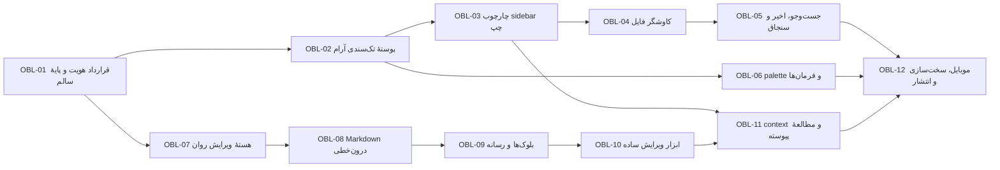

# برنامهٔ ۱۲ تسکی «راوی با الهام از Obsidian»

> تبدیل راوی به یک میز فارسیِ تک‌سندی، سریع و مستقل؛ با ناوبری و ویرایش آشناتر، بدون تبدیل‌شدن به نسخهٔ کوچک Obsidian

## شناسنامهٔ تصمیم

- branch اجرا: `codex/obsiadian-like`
- تاریخ تدوین: ۱۴ اوت ۲۰۲۶
- حالت محصول: `Operate` با حالت ثانویهٔ `Read`
- اسناد مبنا:
  - `obssidian benchmark.md`
  - `obs ui benchmark.md`
  - `ravi ui benchmark.md`
- دامنهٔ این سند: معماری محصول، رابط، ویرایشگر، ناوبری محلی، موبایل، دسترس‌پذیری و معیار تحویل
- نوع backlog: ۱۲ epic عمودی؛ هر epic باید به یک خروجی قابل نمایش و قابل آزمون برسد
- وضعیت کد: OBL-01 تا OBL-05 روی branch مسیر اجرا تحویل و gateهای مربوط به هرکدام تثبیت شده‌اند

## خلاصهٔ تصمیم طراحی

1. راوی **یک سند فعال** دارد؛ sidebar فقط پیدا‌کردن و فراهم‌کردن context است، نه ساخت workspace چندتب و چندابزاری.
2. نمای اصلی همچنان «برگهٔ زندهٔ نمونه‌خوانی» است؛ کاغذ سرد، مرکب، آبی proof، تایپوگرافی فارسی، spine و حالت مطالعه حفظ می‌شوند.
3. از Obsidian چهار اصل گرفته می‌شود: **content-first shell، sidebar پایدار، فرمان‌های قابل جست‌وجو و Live Preview مبتنی بر source واحد**.
4. ویرایشگر جدید از صفر روی primitives و state خود راوی ساخته می‌شود؛ هیچ کد، asset، نام‌گذاری یا ظاهر pixel-level از Obsidian کپی نمی‌شود.
5. split فعلی حذف نمی‌شود: «ویرایش روان» حالت پیش‌فرض و «نمونه‌خوانی دوبرگی» حالت دقیق مقایسهٔ source/result خواهد بود.

## چیزهایی که عمداً منتقل نمی‌شوند

- tab bar، tab stacking، چند سند هم‌زمان و workspace قابل مونتاژ
- ribbon عمومی و محل نصب action افزونه‌ها
- plugin marketplace، theme marketplace و تنظیمات پراکندهٔ افزونه‌ها
- Graph، Canvas، Bases، backlinks و مدل شبکهٔ دانش در مسیر اصلی
- واژه‌های `vault`، `leaf`، `backlink` و اصطلاحات فنی Obsidian در تجربهٔ عمومی
- accent بنفش، chrome خاکستری یا تقلید اندازه و شکل دقیق کنترل‌های Obsidian
- کنترل حیاتی فقط با icon، hover، right-click یا target کوچک

## تعریف تجربهٔ مقصد

کاربر یک پوشهٔ محلی را به‌عنوان «قفسه» معرفی می‌کند، فایل را از sidebar باریک سمت چپ پیدا می‌کند، با یک جست‌وجوی سریع یا palette به فایل/فرمان می‌رسد و همان یک سند در مرکز باز می‌شود. در حالت «ویرایش روان»، نتیجهٔ بیشتر Markdown همان‌جا دیده می‌شود و syntax فقط نزدیک cursor آشکار می‌گردد. هر زمان مقایسهٔ دقیق لازم باشد، کاربر «نمونه‌خوانی دوبرگی» را فعال می‌کند و editor و preview هم‌زمان و syncشده نمایش داده می‌شوند. حالت مطالعه chrome را عقب می‌برد و برگه، outline و annotation را آرام و دسترس‌پذیر نگه می‌دارد.

## معماری وابستگی تسک‌ها

## موج‌های تحویل

| موج | تسک‌ها | خروجی قابل ارائه |
|---|---|---|
| صفر — قرارداد و سلامت | OBL-01 | baseline سبز و مرز هویت غیرقابل تفسیر |
| یک — محیط آشنا و آرام | OBL-02 تا OBL-06 | shell تک‌سندی با sidebar، فایل‌یابی و فرمان سریع |
| دو — ادیتور مستقل راوی | OBL-07 تا OBL-10 | Live Edit واقعی با source واحد و ابزار ساده |
| سه — تداوم و انتشار | OBL-11 و OBL-12 | preview/read/context هماهنگ، موبایل و release gate |

---

## OBL-01 — تثبیت قرارداد هویت، baseline و quality gate

**وضعیت:** انجام‌شده در ۱۴ اوت ۲۰۲۶؛ ADR، utility مشترک جهت، tokenها، corpus و baseline تصویری اضافه و gateهای فایل‌های touched سبز شدند.

**هدف:** پیش از تغییر shell و editor، یک پایهٔ سالم و یک قرارداد صریح بسازیم تا هیچ تسک بعدی راوی را ناخواسته به IDE یا clone تبدیل نکند.

**الهام درست از Obsidian:** source قابل‌حمل، round-trip امن، semantic tokens و اعتماد به وضعیت ذخیره.

**بازتفسیر در راوی:** یک سند فعال، زبان فارسی، برگهٔ نمونه‌خوانی، preview مستقل و local-first غیرقابل مذاکره‌اند.

**دامنهٔ اجرا:**

- افزودن ADR/brief مسیر `Obsidian-inspired` با invariants و anti-goalهای همین سند
- استخراج utility مشترک تشخیص جهت برای editor و preview با آستانهٔ واحد ۷۰٪
- رفع سه شکست کنتراست تم روشن و تعریف کف تایپ: ۱۲px دسکتاپ، ۱۳px موبایل برای label تعاملی
- ثبت tokenهای جاافتادهٔ mono font، type-10 در صورت باقی‌ماندن فقط برای decorative text، pill و رنگ‌های print/shadow
- رفع خطاهای مستقیم lint/typecheck سطح اصلی که تغییرات بعدی را ناامن می‌کنند
- ایجاد fixtureهای Markdown فارسی/انگلیسی/ترکیبی و baseline تصویری light/dark

**خارج از دامنه:** بازطراحی shell، افزودن feature جدید، بازنویسی یک‌بارهٔ `page.tsx` یا `globals.css`.

**فایل‌های محتمل:** `PRODUCT.md`، `DESIGN.md`، یک ADR جدید، `app/page.tsx`، `app/components/markdown-code-editor.tsx`، utility جدید در `app/markdown/`، `app/globals.css` و تست‌ها.

**معیار پذیرش:**

- editor و preview برای نسبت‌های ۶۹٪، ۷۰٪ و ۷۱٪ لاتین نتیجهٔ یکسان دارند
- تمام متن‌های تعاملی light/dark حداقل `4.5:1` کنتراست دارند
- هیچ label تعاملی زیر کف تایپ مصوب نیست
- lint و typecheck برای فایل‌های touched صفر error دارند
- corpus baseline بدون تغییر ناخواسته round-trip می‌شود
- ADR صریحاً tab، plugin shell، graph و تقلید بصری Obsidian را ممنوع می‌کند

**وابستگی:** ندارد  
**اندازه:** M  
**ریسک اصلی:** اصلاح baseline نباید تغییرات ثبت‌نشدهٔ فعلی را overwrite کند.

---

## OBL-02 — ساخت پوستهٔ تک‌سندی آرام و نوار ابزار متراکمِ دسترس‌پذیر

**وضعیت:** انجام‌شده در ۱۴ اوت ۲۰۲۶؛ chrome سه‌ناحیه‌ای، پنج عمل اصلی desktop، overflow تطبیقی، status strip محدود و gateهای ۳۲۰px/zoom 200٪ تحویل شدند.

**هدف:** header فعلی از هشت‌+ action به یک chrome آرام تبدیل شود تا متن دوباره مهم‌ترین سطح باشد.

**الهام درست از Obsidian:** کنترل‌های desktop کم‌حجم، accent محدود، status کم‌صدا و انتقال فرمان‌های ثانویه به menu/palette.

**بازتفسیر در راوی:** کنترل‌ها visually compact هستند، اما target واقعی و accessible name قربانی نمی‌شود؛ کاغذ، برند و پیام محلی‌بودن باقی می‌مانند.

**دامنهٔ اجرا:**

- نوار اصلی با سه ناحیهٔ واضح: سند، عملیات اصلی، وضعیت
- نمایش دائمی فقط برای open/new، save، mode و بازکردن sidebar؛ export/support/about/theme در overflow یا palette
- iconهای ۱۶–۱۸px با hit area حداقل ۳۶px روی desktop و ۴۴px روی touch
- tooltip قابل focus، `aria-label` فارسی، active/pressed/dirty state غیررنگی
- حذف trigger منوی موبایل از desktop و حل override فعلی CSS
- status strip بسیار محدود: نام فایل، ذخیره، واژه و خطای مهم
- حفظ اکشن برچسب‌دار «باز کردن فایل» در first-run و موبایل

**خارج از دامنه:** افزودن ribbon، tab bar یا کنترل plugin.

**معیار پذیرش:**

- در حالت سند فعال حداکثر ۵ action سطح اول در header دیده می‌شود
- کاربر تازه‌کار open، save و تغییر mode را بدون tooltip تشخیص می‌دهد
- هیچ قابلیت حذف نمی‌شود؛ actionهای منتقل‌شده از overflow و palette قابل دسترس‌اند
- در عرض ۳۲۰px اکشن open از پشت menu قابل کشف‌تر است و target کمتر از ۴۴px وجود ندارد
- در zoom 200٪ header wrap مخرب یا overflow افقی ندارد

**وابستگی:** OBL-01  
**اندازه:** L  
**ریسک اصلی:** کوچک‌بودن بصری نباید به hit target کوچک و discoverability ضعیف Obsidian تبدیل شود.

---

## OBL-03 — چارچوب sidebar سمت چپ با حافظهٔ مکانی پایدار

**وضعیت:** انجام‌شده در ۱۴ اوت ۲۰۲۶؛ rail چهارحالتهٔ سمت چپ، pane مشترک، resize/collapse پایدار، drawer موبایل و gate مستقل OBL-03 تحویل شدند.

**هدف:** یک sidebar دائماً قابل اتکا برای فایل‌ها و context بسازیم، بدون شکستن تمرکز تک‌سندی.

**الهام درست از Obsidian:** file/search/outline در یک pane ثابت، collapse/resize، header محلی و spatial memory.

**بازتفسیر در راوی:** sidebar سمت چپ فقط چهار view محصولی دارد: «فایل‌ها»، «جست‌وجو»، «سنجاق‌ها/اخیر» و «فهرست سند». هیچ view افزونه‌ای پذیرفته نمی‌شود.

**دامنهٔ اجرا:**

- rail باریک با چهار icon و active state واضح
- pane قابل collapse و resize با حداقل/حداکثر منطقی و separator keyboard-accessible
- grammar واحد pane: عنوان، actionهای محلی، search/filters و overflow
- persistence برای view فعال، عرض pane و collapsed state به‌صورت local
- هنگام بسته‌شدن sidebar، عرض و scroll سند بدون jump محسوس حفظ شود
- سمت چپ فیزیکی در desktop حفظ شود؛ محتوا و rowها داخل آن RTL/LTR صحیح داشته باشند
- API کامپوننتی مشترک برای `Sidebar`, `SidebarRail`, `SidebarPaneHeader`, `SidebarRow`

**خارج از دامنه:** drag کردن view به main area، split کردن sidebar، نصب view خارجی.

**معیار پذیرش:**

- collapse/expand/resize با mouse و keyboard انجام و پس از reload بازیابی می‌شود
- active view فقط با رنگ متمایز نیست
- تغییر view سند فعال را عوض یا editor را remount نمی‌کند
- در عرض زیر ۸۲۰px sidebar به drawer با scrim، focus containment، Escape/Back و focus restoration تبدیل می‌شود
- screen reader نام view، باز/بسته‌بودن و عنوان pane را اعلام می‌کند

**وابستگی:** OBL-02  
**اندازه:** L  
**ریسک اصلی:** sidebar نباید به دومین مرکز توجه یا workspace چندپنلی تبدیل شود.

---

## OBL-04 — ارتقای کتابخانه به کاوشگر فایل محلی سریع و امن

**وضعیت:** انجام‌شده در ۱۴ اوت ۲۰۲۶؛ tree مجازی‌شده، reveal و dirty/pin، قرارداد مشترک Web/Electron/Tauri، عملیات امن فایل، پایش تغییر بیرونی و حذف قابل‌بازگشت تحویل شدند.

**هدف:** کاربر فایل‌ها و پوشه‌های Markdown را با مدل آشنای tree پیدا و مدیریت کند، اما همچنان فقط یک سند در مرکز باز باشد.

**الهام درست از Obsidian:** tree، active file reveal، عملیات فایل متمرکز و stateهای dirty/pinned.

**بازتفسیر در راوی:** نام عمومی «قفسه» یا «فایل‌ها» باقی می‌ماند؛ root یک پوشهٔ محلی انتخابی است، نه vault با metadata و شبکهٔ دانش.

**دامنهٔ اجرا:**

- tree پوشه/فایل با expand/collapse، indent کم‌عمق، icon و truncation همراه tooltip
- open با click/Enter؛ فعال‌بودن فایل، dirty state و pin قابل تشخیص
- ساخت فایل/پوشه، rename، move و delete با قواعد سیستم‌عامل
- confirm یا undo برای عملیات مخرب و جلوگیری از overwrite/path traversal
- مدیریت تغییرات بیرونی filesystem، فایل حذف‌شده و permission error
- reveal فایل فعال و حفظ scroll tree هنگام بازکردن فایل دیگر
- virtualization یا incremental rendering برای treeهای بزرگ
- حفظ compatibility فعلی history، version و فایل `.ravi`

**خارج از دامنه:** tab چندفایل، backlink index، attachment manager عمومی یا sync cloud.

**معیار پذیرش:**

- tree با ۱۰۰۰ فایل بدون freeze محسوس scan و scroll می‌شود
- rename/move/delete در حالت dirty از کاربر محافظت می‌کند و هیچ داده‌ای بی‌صدا از بین نمی‌رود
- فایل فعال پس از بازشدن reveal می‌شود و تنها یک سند در editor وجود دارد
- filename فارسی، Unicode، فاصله و path انگلیسی بدون bidi corruption نمایش داده می‌شوند
- خطاهای permission/missing file actionable و متن فعلی کاربر محفوظ‌اند

**وابستگی:** OBL-03  
**اندازه:** XL  
**ریسک اصلی:** API فایل در web، Electron و Tauri باید یک contract مشترک داشته باشد.

---

## OBL-05 — لایهٔ بازیابی: جست‌وجو، فایل‌های اخیر، سنجاق‌ها و Quick Open

**وضعیت:** انجام‌شده در ۱۴ اوت ۲۰۲۶؛ نمایهٔ محلی افزایشی/قابل‌لغو، جست‌وجوی نام و متن با snippet و line، فیلتر و sort ساده، recent/pinned مشترک، Quick Open صفحه‌کلیدی و gate واقعی ۱۰۰۰ فایل تحویل شدند.

**هدف:** کاربر بدون گشتن در tree عمیق، فایل یا بخش مورد نیاز را در چند keystroke پیدا کند.

**الهام درست از Obsidian:** Search Pane، Quick Switcher، recent ranking، snippet و حفظ context نتیجه.

**بازتفسیر در راوی:** دو مسیر محدود و قابل فهم داریم: «جست‌وجو در قفسه» برای محتوا و `Quick Open` برای نام فایل؛ operator پیچیده و زبان query وارد نسخهٔ اول نمی‌شود.

**دامنهٔ اجرا:**

- search pane در sidebar با debounce، cancel و stateهای indexing/loading/empty/error
- جست‌وجوی filename و full text با highlight و snippet گروه‌شده بر اساس فایل
- filter ساده: فقط نام فایل / متن / پوشهٔ فعلی؛ sort بر اساس ارتباط، نام یا آخرین تغییر
- recent و pinned با یک grammar مشترک row
- Quick Open مرکزی با fuzzy matching، recent/frequency ranking، Arrow/Enter/Escape
- بازشدن نتیجه در همان سند فعال و رفتن به line/block در صورت امکان
- index افزایشی و local؛ بدون ارسال نام یا محتوای فایل به server

**خارج از دامنه:** regex عمومی، operatorهای Obsidian، search embed، backlink یا semantic/AI search.

**معیار پذیرش:**

- جست‌وجوی ۱۰۰۰ فایل UI thread را قفل نمی‌کند و query قبلی قابل لغو است
- نتیجه title، path، snippet و match highlight خوانا دارد
- Quick Open کاملاً keyboard-first است و در کمتر از سه interaction فایل اخیر را باز می‌کند
- بازکردن نتیجه سند جدیدی/tab جدیدی ایجاد نمی‌کند
- index و recent با rename/delete بیرونی سازگار می‌مانند

**وابستگی:** OBL-04  
**اندازه:** XL  
**ریسک اصلی:** indexing نباید اصل local-first و startup سریع را تضعیف کند.

---

## OBL-06 — Command Palette فارسی و معماری واحد فرمان‌ها

**وضعیت:** انجام‌شده در ۱۴ اوت ۲۰۲۶؛ registry دارای metadata کامل و executor واحد شد، Palette فارسی/انگلیسی با دلیل غیرفعال‌بودن و recent محلی تحویل شد و همان فرمان‌ها از header، overflow، toolbar، میان‌بر و `/` ویرایشگر اجرا می‌شوند. Quick Open مستقل ماند اما primitive ردیف پیشنهاد میان هر دو مشترک است.

**هدف:** قدرت راوی پشت یک مسیر جست‌وجوپذیر قرار گیرد تا header و toolbar خلوت شوند و کاربر حرفه‌ای سرعت بگیرد.

**الهام درست از Obsidian:** command palette، hotkey hint و یک registry مرکزی.

**بازتفسیر در راوی:** palette محدود، فارسی و taskمحور است؛ صدها command یا API عمومی plugin ندارد.

**دامنهٔ اجرا:**

- توسعهٔ `command-registry` به منبع واحد label، description، icon، shortcut، availability و handler
- palette با جست‌وجوی fuzzy فارسی/انگلیسی، گروه‌های فایل/ویرایش/نما/خواندن و recent commands
- disabled state همراه دلیل؛ مثال: «پس از بازکردن فایل فعال می‌شود»
- shortcutهای مستقل از layout فارسی/انگلیسی و نمایش label متناسب Windows/macOS
- امکان اجرای command از header، menu، slash و palette بدون منطق تکراری
- مسیر Quick Open جدا اما با component suggestion مشترک
- telemetry فقط محلی و اختیاری در صورت نیاز ranking؛ پیش‌فرض بدون ارسال داده

**خارج از دامنه:** command API برای plugin خارجی، macro پیچیده یا اجرای shell.

**معیار پذیرش:**

- همهٔ actionهای قابل کلیک اصلی یک command ID یکتا دارند
- conflict فعال shortcut صفر است
- palette با keyboard باز، جست‌وجو، اجرا و بسته می‌شود و focus را بازمی‌گرداند
- command غیرفعال علت انسانی و قابل اقدام دارد
- حذف یک دکمه از header قابلیت را حذف نمی‌کند، چون palette مسیر جایگزین معتبر دارد

**وابستگی:** OBL-02 و OBL-01  
**اندازه:** L  
**ریسک اصلی:** palette نباید تنها راه کشف کارهای پایه برای کاربر تازه‌کار شود.

---

## OBL-07 — ساخت هستهٔ مستقل «ویرایش روان» روی Markdown واحد

**هدف:** یک editing mode تازه بسازیم که نتیجه را در همان سطح editor نشان دهد و syntax را نزدیک cursor آشکار کند؛ بدون WYSIWYG بسته و بدون وابستگی به preview جدا.

**الهام درست از Obsidian:** Live Preview، source واحد، local syntax reveal، selection/cursor پایدار و round-trip امن.

**بازتفسیر در راوی:** نام کاربرپسند «ویرایش روان»؛ حالت «متن خام» و «نمونه‌خوانی دوبرگی» همچنان در دسترس‌اند. موتور با extensionهای CodeMirror و parser خود راوی ساخته می‌شود.

**دامنهٔ اجرا:**

- تعریف سه mode روشن: ویرایش روان، متن خام، نمونه‌خوانی دوبرگی
- source Markdown تنها منبع حقیقت و transactionهای CodeMirror تنها مسیر تغییر
- parse/decorate افزایشی برای viewport و ناحیهٔ نزدیک selection
- پنهان‌سازی delimiter فقط خارج از block/span فعال؛ reveal بدون تغییر source
- mapping دقیق selection، IME، composition، undo/redo و history
- حفظ scroll/cursor هنگام تعویض mode
- استفاده از utility مشترک bidi و forced LTR برای fenced code
- feature flag و fallback امن به Source در صورت خطای decoration

**خارج از دامنه:** `contenteditable` مستقل، تبدیل Markdown به HTML به‌عنوان source، کپی engine Obsidian یا حذف preview راوی.

**معیار پذیرش:**

- diff فایل پس از باز/تعویض mode/ذخیره بدون edit برابر صفر است
- undo/redo، IME فارسی، paste، چندخطی و selection با decoration داده از دست نمی‌دهند
- cursor با آشکارشدن syntax نمی‌پرد و scroll بیش از tolerance تعریف‌شده جابه‌جا نمی‌شود
- document بزرگ فقط viewport را decorate می‌کند و typing lag قابل احساس ایجاد نمی‌کند
- شکست parser editor را از کار نمی‌اندازد و Source fallback در دسترس است

**وابستگی:** OBL-01  
**اندازه:** XL  
**ریسک اصلی:** این تسک زیرساختی‌ترین بخش برنامه است؛ نباید همراه تمام syntaxها در یک PR ساخته شود.

---

## OBL-08 — رندر و ویرایش سادهٔ Markdown درون‌خطی

**هدف:** ۸۰٪ کار روزانهٔ ویرایش با متن نتیجه‌مانند انجام شود، در حالی که Markdown معتبر و قابل حمل باقی می‌ماند.

**الهام درست از Obsidian:** heading و emphasis رندرشده، task تعاملی، link readable و reveal محلی syntax.

**بازتفسیر در راوی:** تایپوگرافی و وزن‌ها از برگهٔ راوی می‌آیند؛ syntax در زمان نیاز با آبی proof و نشانهٔ نمونه‌خوانی آشکار می‌شود.

**دامنهٔ اجرا:**

- headingهای ۱ تا ۶، bold، italic، bold+italic، strike، highlight و inline code
- ordered/unordered/nested list، task list و quote
- link بیرونی با متن نمایشی، URL tooltip و edit popover؛ image syntax در این مرحله placeholder خوانا
- horizontal rule، comment و escape با رفتار قابل پیش‌بینی
- آشکارسازی delimiters در span فعال و block فعال، نه کل سند
- folding heading/list با state مستقل از فایل
- clipboard خروجی plain Markdown و copy متن رندرشده با قرارداد روشن
- تست RTL/LTR برای punctuation، URL، emoji، عدد و inline code

**خارج از دامنه:** table، Mermaid، media کامل و block widgetهای سنگین؛ آن‌ها در OBL-09 هستند.

**معیار پذیرش:**

- تمام syntaxهای scope در Source، Live Edit و Preview round-trip یکسان دارند
- کلیک task تنها marker مربوط را در source تغییر می‌دهد و undo یک‌مرحله‌ای است
- ورود cursor به bold/link/code فقط همان span را reveal می‌کند
- ارتفاع خط در reveal تا حد ممکن ثابت و بدون پرش محسوس است
- navigation با Arrow/Home/End و screen reader در decoration گیر نمی‌کند

**وابستگی:** OBL-07  
**اندازه:** XL  
**ریسک اصلی:** ترکیب decoration و bidi ممکن است cursor mapping را شکننده کند؛ corpus فارسی اجباری است.

---

## OBL-09 — بلوک‌های غنی، جدول، تصویر، Callout و Mermaid در Live Edit

**هدف:** قابلیت‌های سنگین را به widgetهای قابل مشاهده و قابل برگشت به source تبدیل کنیم تا ویرایشگر واقعاً کامل باشد.

**الهام درست از Obsidian:** widget/decorations برای blockهای نتیجه‌محور و بازگشت به syntax هنگام focus.

**بازتفسیر در راوی:** هر widget یک «نمونهٔ چاپی» از source است؛ کنترل ویرایش آن کوچک، روشن و با آبی proof است و از استودیوی تخصصی راوی استفاده می‌کند.

**دامنهٔ اجرا:**

- fenced code با language label، copy و edit source؛ LTR اجباری و scroll افقی کنترل‌شده
- GFM table با preview پایدار و ورود به source block یا helper ساختاری
- تصویر local/remote با loading/error/blocked state، alt و اندازهٔ ایمن
- calloutهای محدود و سازگار با Markdown راوی
- footnote reference/definition و jump رفت‌وبرگشت
- Mermaid با lazy render، آخرین نسخهٔ سالم، edit درجا و ورود به Studio
- placeholder سبک خارج viewport و teardown امن object URL/renderer
- keyboard path و representation متنی جایگزین برای widgetهای غیرمتنی

**خارج از دامنه:** اجرای HTML ناامن، iframe عمومی، plugin widget یا فرمت اختصاصی بسته.

**معیار پذیرش:**

- focus روی هر widget راه روشن «ویرایش متن Markdown» دارد
- widget در selection، copy، undo و ذخیره source را corrupt نمی‌کند
- تصویر و Mermaid خارج viewport بار غیرضروری ایجاد نمی‌کنند
- خطای Mermaid آخرین SVG سالم و پیام فارسی actionable را نگه می‌دارد
- table، code و diagram در zoom 200٪ و عرض ۳۲۰px راه scroll/reflow کنترل‌شده دارند

**وابستگی:** OBL-08  
**اندازه:** XL  
**ریسک اصلی:** widgetهای سنگین نباید typing و accessibility tree را آلوده کنند.

---

## OBL-10 — ابزار ویرایش ساده، contextual و قابل کشف

**هدف:** کاربر بدون حفظ syntax یا مواجهه با ۱۸ icon، فرمت و ساختار مورد نیاز را سریع اعمال کند.

**الهام درست از Obsidian:** toolbar کم‌صدا، context menu، autocomplete، slash command و keyboard acceleration.

**بازتفسیر در راوی:** پنج تا هفت فرمان پرتکرار همیشه نزدیک‌اند؛ بقیه بر اساس selection/block و با label فارسی آشکار می‌شوند.

**دامنهٔ اجرا:**

- toolbar اصلی: heading، bold، italic، link، list/task و overflow
- mini toolbar selection برای emphasis/link/note با position collision-safe
- block menu روی خط فعال برای heading/list/quote/code/callout/table/image/Mermaid
- slash command فارسی/انگلیسی با fuzzy suggestion و preview کوتاه
- helperهای کوچک برای link، table و image؛ بدون modal سنگین برای عمل ساده
- active state از AST/selection، نه حدس CSS
- commandهای یکسان با OBL-06 و transactionهای یکسان با editor
- حذف duplicate routeهای فعلی و گروه‌بندی File / Edit / View

**خارج از دامنه:** نمایش هم‌زمان تمام commandها، toolbar قابل نصب افزونه یا hover-only action حیاتی.

**معیار پذیرش:**

- toolbar دائم بیش از هفت action نشان نمی‌دهد
- همهٔ قابلیت‌های قبلی از toolbar، overflow، slash، palette یا shortcut قابل دسترس‌اند
- اعمال format چندخطی و undo/redo source را درست نگه می‌دارد
- menu و popover با keyboard، Escape، collision و focus restoration صحیح‌اند
- کاربر باراول برای bold، link، task و image نیاز به دانستن syntax ندارد

**وابستگی:** OBL-09 و OBL-06  
**اندازه:** L  
**ریسک اصلی:** progressive disclosure نباید قابلیت‌ها را به رازهای کشف‌نشدنی تبدیل کند.

---

## OBL-11 — هماهنگی context، preview، outline، annotation و مطالعه

**هدف:** مزیت اصلی راوی—نمونه‌خوانی و مطالعه—با editor جدید یک جریان پیوسته بماند، نه مجموعه‌ای از modeهای جدا.

**الهام درست از Obsidian:** linked view، حفظ context، outline جانبی، scroll/cursor continuity و chrome عقب‌نشسته در Reading.

**بازتفسیر در راوی:** outline داخل sidebar قرار می‌گیرد، split دوبرگی یک حالت نمونه‌خوانی ممتاز باقی می‌ماند و annotation ویژگی اختصاصی راوی است.

**دامنهٔ اجرا:**

- sync mapping ساختاری میان Source/Live Edit/Preview به‌جای صرفاً درصد scroll
- کلیک heading در outline به block درست در mode فعال برود
- تعویض ویرایش روان ↔ دوبرگی ↔ مطالعه cursor/scroll/selection و reading position را حفظ کند
- outline desktop در sidebar و mobile در drawer پیش‌فرض بسته با scrim/focus صحیح
- ساده‌سازی Reading chrome به back، filename، outline و یک reveal برای فونت/annotation
- resume notice کوچک و nonblocking
- soft-delete annotation با Undo هشت تا ده ثانیه‌ای و حفظ focus/position
- یکسان‌سازی نام modeها و copy آموزشی ساده

**خارج از دامنه:** right sidebar دوم، backlinks، graph یا چند preview هم‌زمان.

**معیار پذیرش:**

- تغییر mode موقعیت معنایی نزدیک همان heading/block را نگه می‌دارد
- outline موبایل هیچ focusable پنهان پشت خود ندارد و بستن آن focus را restore می‌کند
- viewport اول Reading در موبایل عمدتاً مقاله است، نه دو ردیف toolbar
- حذف annotation قابل Undo است و position نمی‌پرد
- split collapse/resize و scroll sync فعلی بدون regression باقی می‌مانند

**وابستگی:** OBL-03 و OBL-10  
**اندازه:** XL  
**ریسک اصلی:** سه renderer باید یک مدل anchor مشترک داشته باشند؛ sync درصدی برای سند ناهمگن کافی نیست.

---

## OBL-12 — انطباق موبایل، دسترس‌پذیری، کارایی و release gate

**هدف:** تمام مسیر جدید روی web، Windows desktop و viewport موبایل قابل اعتماد باشد و با تست واقعی از regression محافظت شود.

**الهام درست از Obsidian:** desktop composition در موبایل به surface/drawer/sheet تبدیل می‌شود، نه اینکه فقط فشرده شود.

**بازتفسیر در راوی:** موبایل همچنان تک‌سندی و touch-first است؛ open/edit/save در thumb zone و sidebar به drawer امن تبدیل می‌شود.

**دامنهٔ اجرا:**

- layoutهای ۳۲۰، ۳۷۵، ۵۰۰، ۸۲۰، ۱۰۲۴ و ۱۴۴۰px با desktop/mobile density جدا
- bottom editor bar بالای keyboard مجازی برای پنج عمل پرتکرار
- primary open همیشه در first-run و empty state قابل مشاهده
- sidebar/outline drawer با back-stack مشترک، safe area و keyboard avoidance
- حذف file inputهای انگلیسی تکراری از accessibility tree
- reduced-motion هدفمند به‌جای duration kill سراسری
- تست NVDA/VoiceOver contract، 200% zoom، high contrast، focus order و contrast
- performance budget برای startup، ۱۰۰۰ فایل، سند بزرگ، تصویر و Mermaid
- E2E برای open → search → edit → preview → read → save/export و interruption/recovery
- migration stateهای قدیمی layout/library بدون از دست رفتن فایل یا تنظیمات مهم
- packaging smoke test برای web، Electron/Windows و Tauri در صورت باقی‌ماندن هر دو مسیر

**خارج از دامنه:** sync cloud، حساب کاربری، collaboration و پلتفرم plugin.

**معیار پذیرش:**

- open/edit/save با یک دست و بدون بازکردن menu در موبایل ممکن است
- keyboard مجازی cursor، suggestion و toolbar را نمی‌پوشاند
- WCAG AA برای مسیرهای اصلی، focus visible و screen reader announcement برقرار است
- هیچ state حیاتی فقط با رنگ، hover یا right-click منتقل نمی‌شود
- budgetهای performance مصوب پاس می‌شوند و console runtime error صفر است
- lint، typecheck، unit، integration، Playwright و desktop smoke همگی سبز هستند
- corpus Markdown پس از تمام modeها و export بدون corruption باقی می‌ماند

**وابستگی:** OBL-05، OBL-06 و OBL-11؛ release gate تمام تسک‌ها  
**اندازه:** XL  
**ریسک اصلی:** سخت‌سازی نباید به انتهای کار موکول شود؛ تست‌ها در هر epic افزوده می‌شوند و این تسک gate نهایی است.

---

## Definition of Done مشترک برای هر ۱۲ تسک

- feature پشت مسیر قابل برگشت یا feature flag توسعه‌ای وارد شود تا دادهٔ کاربر به خطر نیفتد
- source Markdown و فایل محلی منبع حقیقت باقی بماند
- هیچ command یا control بدون accessible name، focus state و keyboard path تحویل نشود
- light/dark، RTL/LTR، zoom 200٪ و عرض ۳۲۰px در همان PR بررسی شوند
- هر رفتار جدید حداقل unit/integration test و برای مسیر کاربر Playwright coverage داشته باشد
- UI جدید از tokenها و component contract استفاده کند؛ رنگ/spacing/typography پراکنده وارد نشود
- خطا، empty، loading، permission، cancellation و recovery همان feature طراحی شوند
- copy عمومی فارسی و ساده باشد؛ اصطلاح فنی همراه توضیح یا در مسیر پیشرفته قرار گیرد
- هیچ کد یا asset متعلق به Obsidian وارد repository نشود

## ماتریس ردیابی سه سند به backlog

| منبع | یافتهٔ مبنا | تسک‌های پاسخ‌دهنده |
|---|---|---|
| `obssidian benchmark.md` بخش ۲ | Source، Live Preview، Reading و round-trip | OBL-01، 07، 08، 09، 11، 12 |
| همان، بخش ۵ و ۶ | Search، Quick Switcher، sidebar و command | OBL-03، 04، 05، 06 |
| `obs ui benchmark.md` بخش ۱۸ | content-first، progressive disclosure، spatial memory | OBL-02، 03، 06، 10 |
| همان، بخش ۱۹ | icon-only، target کوچک، plugin sprawl و mode jargon | anti-goalها، OBL-02، 06، 10، 12 |
| همان، بخش ۲۱ | بازتفسیر Obsidian برای راوی | کل معماری این برنامه |
| `ravi ui benchmark.md` P1 | drawer، bidi، CTA، type، contrast و quality gate | OBL-01، 02، 11، 12 |
| همان، P2 | chrome مطالعه، undo annotation، input و reduced motion | OBL-11 و 12 |
| همان، بار شناختی | header/toolbar شلوغ و grouping ضعیف | OBL-02، 06 و 10 |

## معیار موفقیت کل برنامه

پس از پایان ۱۲ تسک، یک کاربر فارسی باید بتواند بدون آشنایی با Markdown:

1. پوشه و فایل خود را از sidebar یا Quick Open پیدا کند.
2. همان یک سند را بدون tab و workspace پیچیده باز کند.
3. در «ویرایش روان» عنوان، تأکید، لینک، فهرست، جدول، تصویر و نمودار را با نتیجهٔ قابل مشاهده و ابزار ساده ویرایش کند.
4. هر لحظه به Source معتبر یا نمونه‌خوانی دوبرگی برگردد، بدون پرش cursor/scroll یا تغییر ناخواستهٔ فایل.
5. با یک فرمان به حالت مطالعه برود و outline/annotation را بدون مزاحمت استفاده کند.
6. همان جریان را با keyboard، screen reader یا موبایل انجام دهد.

نشانهٔ شکست برنامه این است که راوی برای رسیدن به سرعت Obsidian، هویت برگه‌ای خود را از دست بدهد، چندسندی و pluginمحور شود، یا قابلیت‌های اصلی را پشت iconهای نامفهوم و targetهای کوچک پنهان کند.
