<!--
  MERMAID ULTIMATE STRESS TEST
  هدف: فشار هم‌زمان روی Markdown parser، Mermaid parser، renderer، sanitizer،
  تم روشن/تیره، متن راست‌به‌چپ، چاپ، export و viewportهای کوچک.
-->

# آزمایشگاه نهایی Markdown + Mermaid[^purpose]

> [!IMPORTANT]
> این فایل عمداً **بزرگ، چندزبانه و پیچیده** است. بخش «هستهٔ پایدار» باید در اغلب
> رندرکننده‌های جدید کار کند؛ بخش «آزمایشی» به Mermaid `11.16.0+` نیاز دارد.

<p align="center" dir="rtl">
  <kbd>Markdown</kbd> + <kbd>Mermaid</kbd> + <kbd>RTL</kbd> + <kbd>Unicode</kbd>
  = آزمون فشار واقعی
</p>

---

## فهرست سریع

1. [آزمون‌های Markdown](#آزمونهای-markdown)
2. [معماری کل سامانه](#۱-فلوچارت-معماری-کل-سامانه)
3. [توالی تراکنش توزیع‌شده](#۲-توالی-تراکنش-توزیعشده)
4. [ماشین حالت مرکب](#۳-ماشین-حالت-مرکب)
5. [مدل دامنه و داده](#۴-مدل-کلاس-دامنه)
6. [برنامه، تجربه و تاریخچه](#۶-برنامهریزی-و-تاریخچه)
7. [تحلیل داده](#۱۰-تحلیل-داده)
8. [مهندسی سامانه](#۱۴-مهندسی-سامانه)
9. [نمودارهای آزمایشی Mermaid 11](#۱۹-نمودارهای-آزمایشی-mermaid-11)
10. [چک‌لیست پذیرش](#چکلیست-پذیرش)

## شناسنامهٔ آزمون

| بُعد آزمون | ورودی چالش‌برانگیز | انتظار | شدت |
|:--|:--|:--:|--:|
| متن | فارسی، English، `code`، اعداد ۱۲۳ و 123 | بدون جابه‌جایی ناخواسته | 5/5 |
| ساختار | heading، table، list، details، footnote | حفظ سلسله‌مراتب | 5/5 |
| Mermaid | هسته + نمودارهای beta | بدون خطای parser | 5/5 |
| دسترس‌پذیری | عنوان، شرح، کنتراست و زوم | خوانا در 200٪ | 4/5 |
| خروجی | HTML، PDF، تصویر و clipboard | نتیجهٔ قابل استفاده | 4/5 |

### وضعیت اجرای نمونه

- [x] فایل با UTF-8 ذخیره شده است.
- [x] جداکننده‌ها و fenceها بسته شده‌اند.
- [ ] همهٔ نمودارها در تم روشن بررسی شوند.
- [ ] همهٔ نمودارها در تم تیره بررسی شوند.
- [ ] خروجی PDF در قطع A4 بررسی شود.
  - [ ] شکست صفحه وسط نمودار رخ ندهد.
  - [ ] متن فارسی به مربع توخالی تبدیل نشود.
- [ ] نمای موبایل در عرض‌های `320px`، `375px` و `430px` بررسی شود.

> نقل‌قول چندلایه
>
> > «پیچیدگی زمانی مفید است که خطاهای واقعی را آشکار کند.»
> >
> > — واحد کیفیت، نسخهٔ `v1.0.0-rc.7+build.42`

<details>
<summary><strong>آزمون عناصر تودرتو و متن ترکیبی</strong></summary>

داخل این بخش، عبارت `SELECT * FROM documents WHERE lang = 'fa-IR';` باید چپ‌به‌راست
بماند، اما جملهٔ فارسی پیرامون آن راست‌به‌چپ دیده شود.

1. سطح اول
   1. سطح دوم با **Bold** و _Italic_ و ~~حذف‌شده~~
      - سطح سوم با لینک نسبی: [README](../README.md)
      - کاراکترها: `& < > " ' / \ | { } [ ] ( ) # @ ! ?`

```json
{
  "message": "سلام دنیا 👋",
  "direction": "rtl",
  "limits": { "nodes": 500, "edges": 1000 },
  "dangerous-looking-but-plain": "</script><script>alert('no')</script>"
}
```

</details>

فرمول درون‌خطی: $E = mc^2$ و فرمول نمایشی:

$$
\operatorname{score}(G)=\alpha |V|+\beta |E|+\gamma\sum_{v\in V}\operatorname{depth}(v)
$$

نمونهٔ پیوند خودکار: <https://mermaid.js.org/> و ایمیل ساختگی
<qa+mermaid@example.invalid>.

---

## آزمون‌های Markdown

### کدِ حاوی fence تو‌در‌تو

````markdown
### نمونه‌ای که نباید زود بسته شود

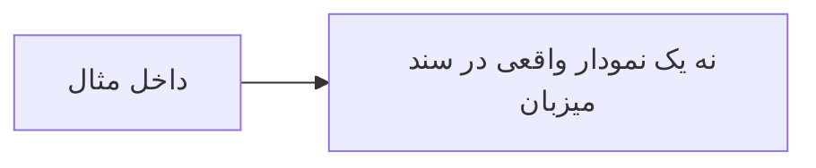
```mermaid
flowchart LR
  A["داخل مثال"] --> B["نه یک نمودار واقعی در سند میزبان"]
```
````

### جدول عریض با ترازهای متفاوت

| شناسه | نام سرویس | نسخه | SLO | تأخیر p95 | مالک | وضعیت | توضیح فنی |
|---:|:---|:---:|---:|---:|:---|:---:|:---|
| 101 | درگاه API | `2026.08.3` | 99.95٪ | 180ms | تیم لبه | 🟢 | Rate limit + WAF + OAuth 2.1 |
| 202 | موتور گردش‌کار | `7.14.0-rc.2` | 99.90٪ | 420ms | تیم هسته | 🟡 | Saga / Outbox / Idempotency |
| 303 | انبار تحلیلی | `11.2.5` | 99.50٪ | 2.4s | تیم داده | 🔵 | CDC → Lakehouse → Semantic layer |

---

## ۱. فلوچارت معماری کل سامانه

این نمودار مسیر کامل از کاربر تا زیرساخت، شاخه‌های خطا، صف، کش، پایگاه داده و
مشاهده‌پذیری را در چند `subgraph` آزمایش می‌کند.

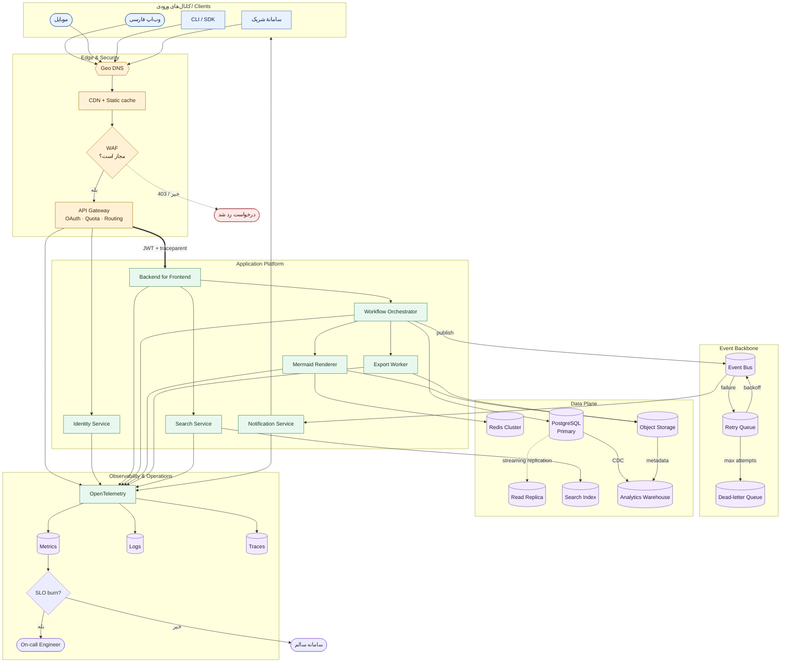
```mermaid
%%{init: {"flowchart": {"curve": "basis", "htmlLabels": false}, "themeVariables": {"fontFamily": "Vazirmatn, Segoe UI, sans-serif"}}}%%
flowchart TB
  accTitle: معماری چندلایهٔ سکوی پردازش سند
  accDescr: جریان درخواست از کاربران تا لبه، سرویس‌ها، داده و مشاهده‌پذیری

  subgraph Clients["کانال‌های ورودی / Clients"]
    direction LR
    Web(["وب‌اپ فارسی"])
    Mobile(["موبایل"])
    CLI["CLI / SDK"]
    Partner["سامانهٔ شریک"]
  end

  subgraph Edge["Edge & Security"]
    direction LR
    DNS{{"Geo DNS"}}
    CDN["CDN + Static cache"]
    WAF{"WAF<br/>مجاز است؟"}
    Gateway["API Gateway<br/>OAuth · Quota · Routing"]
  end

  subgraph Platform["Application Platform"]
    direction LR
    Auth["Identity Service"]
    BFF["Backend for Frontend"]
    Workflow["Workflow Orchestrator"]
    Renderer["Mermaid Renderer"]
    Exporter["Export Worker"]
    Search["Search Service"]
    Notify["Notification Service"]
  end

  subgraph Async["Event Backbone"]
    direction TB
    Bus[("Event Bus")]
    Retry[("Retry Queue")]
    DLQ[("Dead-letter Queue")]
  end

  subgraph Data["Data Plane"]
    direction LR
    Redis[("Redis Cluster")]
    PG[("PostgreSQL<br/>Primary")]
    Replica[("Read Replica")]
    S3[("Object Storage")]
    Index[("Search Index")]
    Warehouse[("Analytics Warehouse")]
  end

  subgraph Ops["Observability & Operations"]
    direction LR
    OTEL["OpenTelemetry"]
    Metrics[("Metrics")]
    Logs[("Logs")]
    Traces[("Traces")]
    Alert{"SLO burn?"}
    OnCall(["On-call Engineer"])
  end

  Web & Mobile & CLI & Partner --> DNS
  DNS --> CDN --> WAF
  WAF -->|"بله"| Gateway
  WAF -.->|"خیر / 403"| Denied(["درخواست رد شد"])
  Gateway ==>|"JWT + traceparent"| BFF
  Gateway --> Auth
  BFF --> Workflow
  BFF --> Search
  Workflow --> Renderer
  Workflow --> Exporter
  Workflow -->|"publish"| Bus
  Renderer --> Redis
  Renderer --> S3
  Exporter --> S3
  Search --> Index
  Bus --> Notify
  Bus -->|"failure"| Retry
  Retry -->|"backoff"| Bus
  Retry -->|"max attempts"| DLQ
  Workflow --> PG
  PG -.->|"streaming replication"| Replica
  PG -->|"CDC"| Warehouse
  S3 -->|"metadata"| Warehouse
  Notify --> Clients

  Gateway & Auth & BFF & Workflow & Renderer & Exporter & Search & Notify --> OTEL
  OTEL --> Metrics & Logs & Traces
  Metrics --> Alert
  Alert -->|"بله"| OnCall
  Alert -->|"خیر"| Healthy(["سامانه سالم"])

  classDef client fill:#e8f1ff,stroke:#3568a8,color:#10233f;
  classDef security fill:#fff1d6,stroke:#a66b00,color:#3b2900;
  classDef service fill:#e9f8ee,stroke:#2f7d4a,color:#12351f;
  classDef data fill:#f3eaff,stroke:#7650a8,color:#28183d;
  classDef danger fill:#ffe8e8,stroke:#a43c3c,color:#441515;
  class Web,Mobile,CLI,Partner client;
  class DNS,CDN,WAF,Gateway security;
  class Auth,BFF,Workflow,Renderer,Exporter,Search,Notify,OTEL service;
  class Redis,PG,Replica,S3,Index,Warehouse,Bus,Retry,DLQ,Metrics,Logs,Traces data;
  class Denied danger;
```

## ۲. توالی تراکنش توزیع‌شده

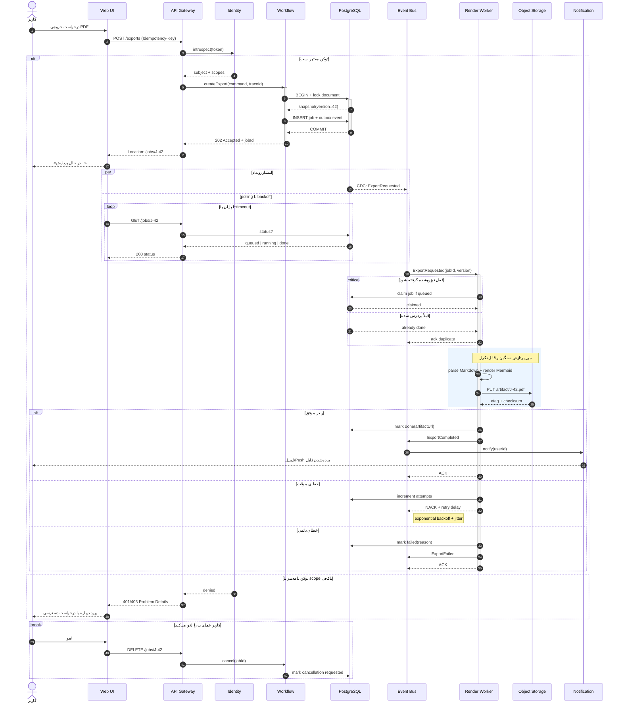
```mermaid
sequenceDiagram
  autonumber
  actor U as کاربر
  participant UI as Web UI
  participant GW as API Gateway
  participant ID as Identity
  participant WF as Workflow
  participant DB as PostgreSQL
  participant MQ as Event Bus
  participant WK as Render Worker
  participant OS as Object Storage
  participant NT as Notification

  U->>UI: درخواست خروجی PDF
  UI->>GW: POST /exports (Idempotency-Key)
  GW->>ID: introspect(token)
  alt توکن معتبر است
    ID-->>GW: subject + scopes
    GW->>+WF: createExport(command, traceId)
    WF->>+DB: BEGIN + lock document
    DB-->>WF: snapshot(version=42)
    WF->>DB: INSERT job + outbox event
    DB-->>-WF: COMMIT
    WF-->>-GW: 202 Accepted + jobId
    GW-->>UI: Location: /jobs/J-42
    UI-->>U: «در حال پردازش…»

    par انتشار رویداد
      DB-->>MQ: CDC: ExportRequested
    and polling با backoff
      loop تا پایان یا timeout
        UI->>GW: GET /jobs/J-42
        GW->>DB: status?
        DB-->>GW: queued | running | done
        GW-->>UI: 200 status
      end
    end

    MQ->>+WK: ExportRequested(jobId, version)
    critical قفل توزیع‌شده گرفته شود
      WK->>DB: claim job if queued
      DB-->>WK: claimed
    option قبلاً پردازش شده
      DB-->>WK: already done
      WK-->>MQ: ack duplicate
    end

    rect rgb(235, 245, 255)
      Note over WK,OS: مرز پردازش سنگین و قابل تکرار
      WK->>WK: parse Markdown + render Mermaid
      WK->>OS: PUT artifact/J-42.pdf
      OS-->>WK: etag + checksum
    end

    alt رندر موفق
      WK->>DB: mark done(artifactUrl)
      WK->>MQ: ExportCompleted
      MQ->>NT: notify(userId)
      NT-->>U: ایمیل/Push آماده‌شدن فایل
      WK-->>MQ: ACK
    else خطای موقت
      WK->>DB: increment attempts
      WK-->>MQ: NACK + retry delay
      Note right of MQ: exponential backoff + jitter
    else خطای دائمی
      WK->>DB: mark failed(reason)
      WK->>MQ: ExportFailed
      WK-->>MQ: ACK
    end
    deactivate WK
  else توکن نامعتبر یا scope ناکافی
    ID-->>GW: denied
    GW-->>UI: 401/403 Problem Details
    UI-->>U: ورود دوباره یا درخواست دسترسی
  end

  break کاربر عملیات را لغو می‌کند
    U->>UI: لغو
    UI->>GW: DELETE /jobs/J-42
    GW->>WF: cancel(jobId)
    WF->>DB: mark cancellation requested
  end
```

## ۳. ماشین حالت مرکب

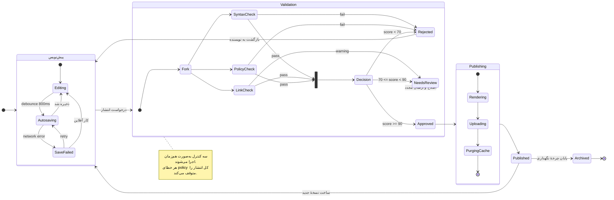
```mermaid
stateDiagram-v2
  direction LR
  [*] --> Draft

  state "پیش‌نویس" as Draft {
    [*] --> Editing
    Editing --> Autosaving : debounce 800ms
    Autosaving --> Editing : ذخیره شد
    Autosaving --> SaveFailed : network error
    SaveFailed --> Autosaving : retry
    SaveFailed --> Editing : کار آفلاین
  }

  Draft --> Validation : درخواست انتشار

  state Validation {
    [*] --> Fork
    state Fork <<fork>>
    state Join <<join>>
    Fork --> SyntaxCheck
    Fork --> LinkCheck
    Fork --> PolicyCheck
    SyntaxCheck --> Join : pass
    LinkCheck --> Join : pass
    PolicyCheck --> Join : pass
    SyntaxCheck --> Rejected : fail
    LinkCheck --> NeedsReview : warning
    PolicyCheck --> Rejected : fail
    Join --> Decision
    state Decision <<choice>>
    Decision --> Approved : score >= 90
    Decision --> NeedsReview : 70 <= score < 90
    Decision --> Rejected : score < 70
  }

  NeedsReview --> Validation : اصلاح و ارسال مجدد
  Rejected --> Draft : بازگشت به نویسنده
  Approved --> Publishing

  state Publishing {
    [*] --> Rendering
    Rendering --> Uploading
    Uploading --> PurgingCache
    PurgingCache --> [*]
  }

  Publishing --> Published
  Published --> Archived : پایان چرخهٔ نگهداری
  Published --> Draft : ساخت نسخهٔ جدید
  Archived --> [*]

  note right of Validation
    سه کنترل به‌صورت هم‌زمان اجرا می‌شوند.
    هر خطای policy کل انتشار را متوقف می‌کند.
  end note
```

## ۴. مدل کلاس دامنه

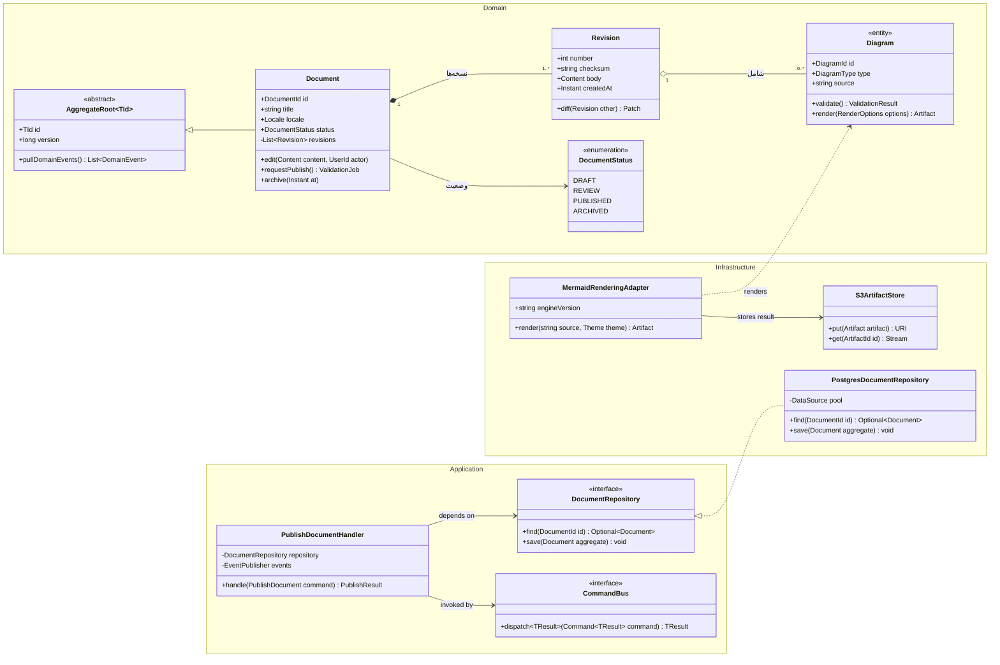
```mermaid
classDiagram
  direction LR

  namespace Domain {
    class AggregateRoot~TId~ {
      <<abstract>>
      +TId id
      +long version
      +pullDomainEvents() List~DomainEvent~
    }
    class Document {
      +DocumentId id
      +string title
      +Locale locale
      +DocumentStatus status
      -List~Revision~ revisions
      +edit(Content content, UserId actor)
      +requestPublish() ValidationJob
      +archive(Instant at)
    }
    class Revision {
      +int number
      +string checksum
      +Content body
      +Instant createdAt
      +diff(Revision other) Patch
    }
    class Diagram {
      <<entity>>
      +DiagramId id
      +DiagramType type
      +string source
      +validate() ValidationResult
      +render(RenderOptions options) Artifact
    }
    class DocumentStatus {
      <<enumeration>>
      DRAFT
      REVIEW
      PUBLISHED
      ARCHIVED
    }
  }

  namespace Application {
    class CommandBus {
      <<interface>>
      +dispatch~TResult~(Command~TResult~ command) TResult
    }
    class PublishDocumentHandler {
      -DocumentRepository repository
      -EventPublisher events
      +handle(PublishDocument command) PublishResult
    }
    class DocumentRepository {
      <<interface>>
      +find(DocumentId id) Optional~Document~
      +save(Document aggregate) void
    }
  }

  namespace Infrastructure {
    class PostgresDocumentRepository {
      -DataSource pool
      +find(DocumentId id) Optional~Document~
      +save(Document aggregate) void
    }
    class MermaidRenderingAdapter {
      +string engineVersion
      +render(string source, Theme theme) Artifact
    }
    class S3ArtifactStore {
      +put(Artifact artifact) URI
      +get(ArtifactId id) Stream
    }
  }

  AggregateRoot~TId~ <|-- Document
  Document "1" *-- "1..*" Revision : نسخه‌ها
  Revision "1" o-- "0..*" Diagram : شامل
  Document --> DocumentStatus : وضعیت
  PublishDocumentHandler --> DocumentRepository : depends on
  PublishDocumentHandler --> CommandBus : invoked by
  DocumentRepository <|.. PostgresDocumentRepository
  MermaidRenderingAdapter ..> Diagram : renders
  MermaidRenderingAdapter --> S3ArtifactStore : stores result
```

## ۵. مدل رابطه‌ای داده

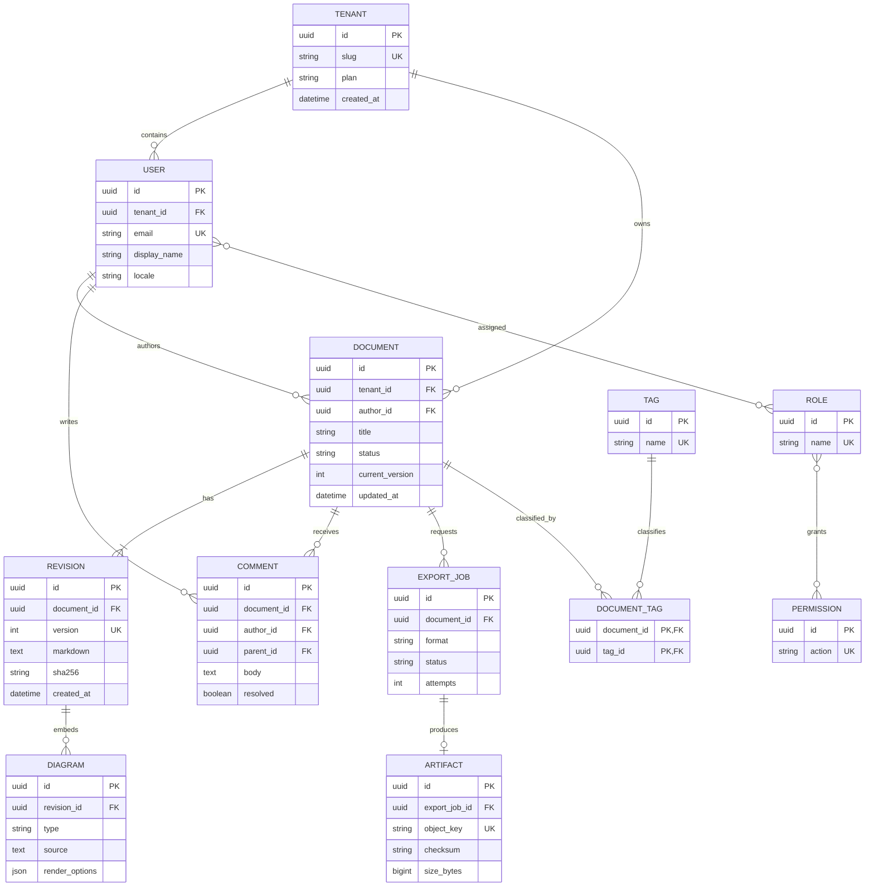
```mermaid
erDiagram
  TENANT ||--o{ USER : contains
  TENANT ||--o{ DOCUMENT : owns
  USER ||--o{ DOCUMENT : authors
  DOCUMENT ||--|{ REVISION : has
  REVISION ||--o{ DIAGRAM : embeds
  DOCUMENT ||--o{ COMMENT : receives
  USER ||--o{ COMMENT : writes
  DOCUMENT ||--o{ EXPORT_JOB : requests
  EXPORT_JOB ||--o| ARTIFACT : produces
  USER }o--o{ ROLE : assigned
  ROLE }o--o{ PERMISSION : grants
  DOCUMENT ||--o{ DOCUMENT_TAG : classified_by
  TAG ||--o{ DOCUMENT_TAG : classifies

  TENANT {
    uuid id PK
    string slug UK
    string plan
    datetime created_at
  }
  USER {
    uuid id PK
    uuid tenant_id FK
    string email UK
    string display_name
    string locale
  }
  DOCUMENT {
    uuid id PK
    uuid tenant_id FK
    uuid author_id FK
    string title
    string status
    int current_version
    datetime updated_at
  }
  REVISION {
    uuid id PK
    uuid document_id FK
    int version UK
    text markdown
    string sha256
    datetime created_at
  }
  DIAGRAM {
    uuid id PK
    uuid revision_id FK
    string type
    text source
    json render_options
  }
  COMMENT {
    uuid id PK
    uuid document_id FK
    uuid author_id FK
    uuid parent_id FK
    text body
    boolean resolved
  }
  EXPORT_JOB {
    uuid id PK
    uuid document_id FK
    string format
    string status
    int attempts
  }
  ARTIFACT {
    uuid id PK
    uuid export_job_id FK
    string object_key UK
    string checksum
    bigint size_bytes
  }
  ROLE {
    uuid id PK
    string name UK
  }
  PERMISSION {
    uuid id PK
    string action UK
  }
  TAG {
    uuid id PK
    string name UK
  }
  DOCUMENT_TAG {
    uuid document_id PK,FK
    uuid tag_id PK,FK
  }
```

## ۶. برنامه‌ریزی و تاریخچه

### ۶.۱ گانت انتشار

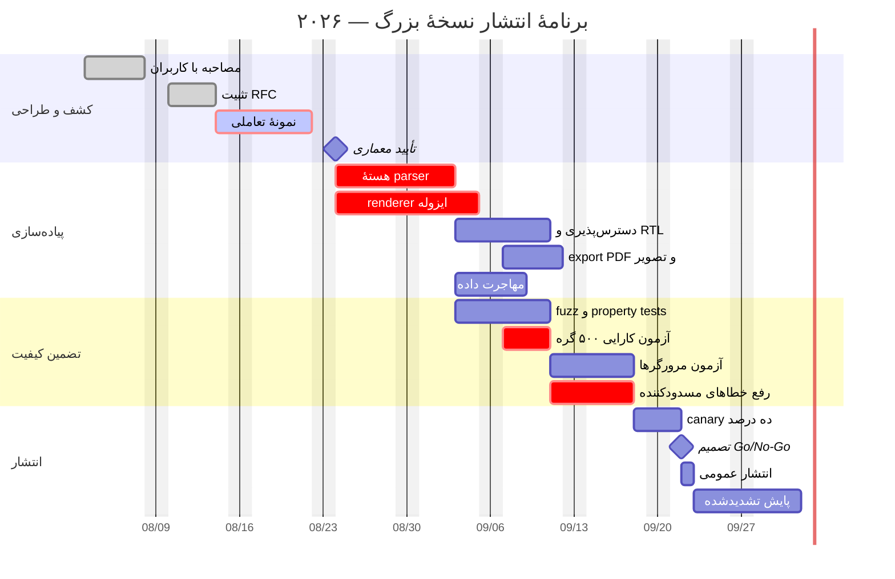
```mermaid
gantt
  title برنامهٔ انتشار نسخهٔ بزرگ — ۲۰۲۶
  dateFormat YYYY-MM-DD
  axisFormat %m/%d
  tickInterval 1week
  excludes weekends
  todayMarker stroke-width:3px,stroke:#d33,opacity:0.7

  section کشف و طراحی
  مصاحبه با کاربران           :done, discovery, 2026-08-03, 5d
  تثبیت RFC                    :done, rfc, after discovery, 4d
  نمونهٔ تعاملی                :crit, active, prototype, after rfc, 6d
  تأیید معماری                 :milestone, arch_ok, after prototype, 0d

  section پیاده‌سازی
  هستهٔ parser                 :crit, parser, after arch_ok, 8d
  renderer ایزوله              :crit, renderer, after arch_ok, 10d
  دسترس‌پذیری و RTL            :a11y, after parser, 6d
  export PDF و تصویر           :export, after renderer, 5d
  مهاجرت داده                  :migration, after parser, 4d

  section تضمین کیفیت
  fuzz و property tests        :qa1, after parser, 6d
  آزمون کارایی ۵۰۰ گره         :crit, qa2, after renderer, 4d
  آزمون مرورگرها               :qa3, after a11y, 5d
  رفع خطاهای مسدودکننده        :crit, fixes, after qa2, 5d

  section انتشار
  canary ده درصد               :canary, after fixes, 2d
  تصمیم Go/No-Go               :milestone, gate, after canary, 0d
  انتشار عمومی                 :release, after gate, 1d
  پایش تشدیدشده                :monitor, after release, 7d
```

### ۶.۲ سفر کاربر

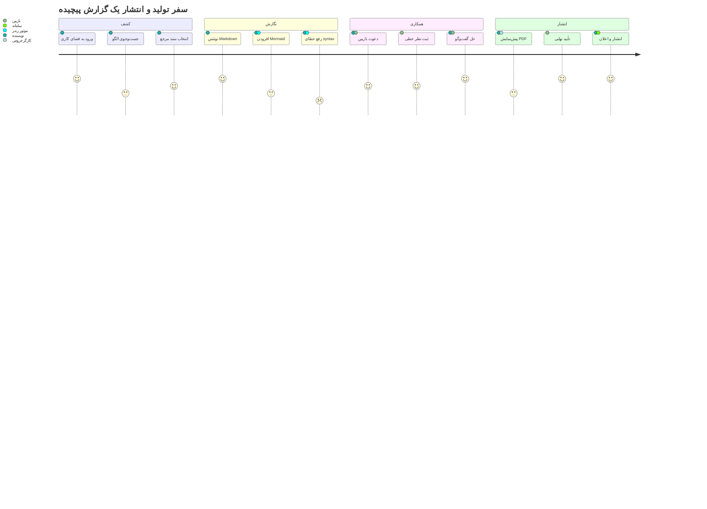
```mermaid
journey
  title سفر تولید و انتشار یک گزارش پیچیده
  section کشف
    ورود به فضای کاری: 5: نویسنده
    جست‌وجوی الگو: 3: نویسنده
    انتخاب سند مرجع: 4: نویسنده
  section نگارش
    نوشتن Markdown: 5: نویسنده
    افزودن Mermaid: 3: نویسنده, موتور رندر
    رفع خطای syntax: 2: نویسنده, موتور رندر
  section همکاری
    دعوت بازبین: 4: نویسنده, بازبین
    ثبت نظر خطی: 4: بازبین
    حل گفت‌وگو: 5: نویسنده, بازبین
  section انتشار
    پیش‌نمایش PDF: 3: نویسنده, کارگر خروجی
    تأیید نهایی: 5: بازبین
    انتشار و اعلان: 5: نویسنده, سامانه
```

### ۶.۳ تاریخچهٔ Git

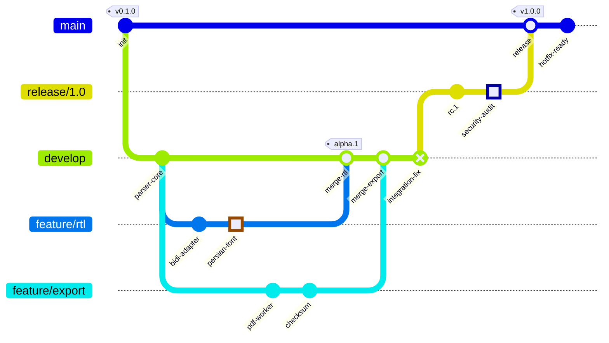
```mermaid
gitGraph LR:
  commit id: "init" tag: "v0.1.0"
  branch develop order: 2
  checkout develop
  commit id: "parser-core"
  branch feature/rtl order: 3
  checkout feature/rtl
  commit id: "bidi-adapter"
  commit id: "persian-font" type: HIGHLIGHT
  checkout develop
  branch feature/export order: 4
  checkout feature/export
  commit id: "pdf-worker"
  commit id: "checksum"
  checkout develop
  merge feature/rtl id: "merge-rtl" tag: "alpha.1"
  merge feature/export id: "merge-export"
  commit id: "integration-fix" type: REVERSE
  branch release/1.0 order: 1
  checkout release/1.0
  commit id: "rc.1"
  commit id: "security-audit" type: HIGHLIGHT
  checkout main
  merge release/1.0 id: "release" tag: "v1.0.0"
  commit id: "hotfix-ready"
```

## ۷. نقشهٔ ذهنی محصول

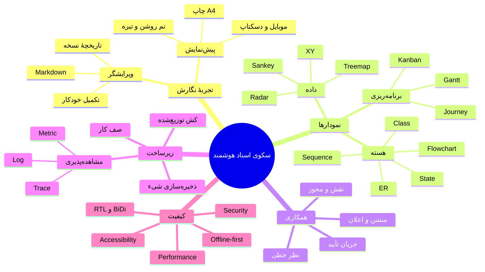
```mermaid
mindmap
  root((سکوی اسناد هوشمند))
    تجربهٔ نگارش
      ویرایشگر
        Markdown
        تکمیل خودکار
        تاریخچهٔ نسخه
      پیش‌نمایش
        تم روشن و تیره
        موبایل و دسکتاپ
        چاپ A4
    نمودارها
      هسته
        Flowchart
        Sequence
        State
        Class
        ER
      برنامه‌ریزی
        Gantt
        Journey
        Kanban
      داده
        XY
        Sankey
        Radar
        Treemap
    همکاری
      نظر خطی
      منشن و اعلان
      نقش و مجوز
      جریان تأیید
    زیرساخت
      صف کار
      ذخیره‌سازی شیء
      کش توزیع‌شده
      مشاهده‌پذیری
        Metric
        Log
        Trace
    کیفیت
      Accessibility
      RTL و BiDi
      Security
      Performance
      Offline-first
```

## ۸. خط زمانی تکامل محصول

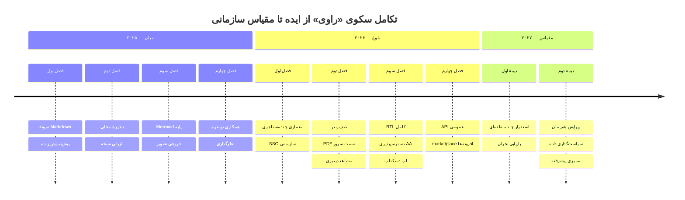
```mermaid
timeline
  title تکامل سکوی «راوی» از ایده تا مقیاس سازمانی
  section ۲۰۲۵ — بنیان
    فصل اول : نمونهٔ Markdown : پیش‌نمایش زنده
    فصل دوم : ذخیرهٔ محلی : بازیابی نسخه
    فصل سوم : Mermaid پایه : خروجی تصویر
    فصل چهارم : همکاری دونفره : نظرگذاری
  section ۲۰۲۶ — بلوغ
    فصل اول : معماری چندمستاجری : SSO سازمانی
    فصل دوم : صف رندر : PDF سمت سرور : مشاهده‌پذیری
    فصل سوم : RTL کامل : دسترس‌پذیری AA : اپ دسکتاپ
    فصل چهارم : API عمومی : marketplace افزونه‌ها
  section ۲۰۲۷ — مقیاس
    نیمهٔ اول : استقرار چندمنطقه‌ای : بازیابی بحران
    نیمهٔ دوم : ویرایش هم‌زمان : سیاست‌گذاری داده : ممیزی پیشرفته
```

## ۹. نیازمندی‌ها و ردیابی

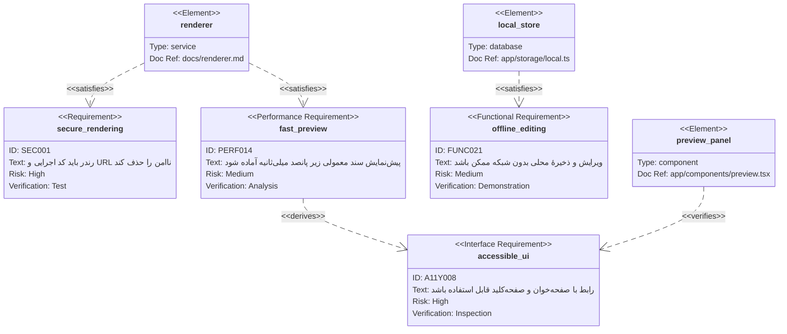
```mermaid
requirementDiagram
  requirement secure_rendering {
    id: SEC001
    text: "رندر باید کد اجرایی و URL ناامن را حذف کند"
    risk: high
    verifymethod: test
  }

  performanceRequirement fast_preview {
    id: PERF014
    text: "پیش‌نمایش سند معمولی زیر پانصد میلی‌ثانیه آماده شود"
    risk: medium
    verifymethod: analysis
  }

  functionalRequirement offline_editing {
    id: FUNC021
    text: "ویرایش و ذخیرهٔ محلی بدون شبکه ممکن باشد"
    risk: medium
    verifymethod: demonstration
  }

  interfaceRequirement accessible_ui {
    id: A11Y008
    text: "رابط با صفحه‌خوان و صفحه‌کلید قابل استفاده باشد"
    risk: high
    verifymethod: inspection
  }

  element renderer {
    type: service
    docref: docs/renderer.md
  }

  element preview_panel {
    type: component
    docref: app/components/preview.tsx
  }

  element local_store {
    type: database
    docref: app/storage/local.ts
  }

  renderer - satisfies -> secure_rendering
  renderer - satisfies -> fast_preview
  preview_panel - verifies -> accessible_ui
  local_store - satisfies -> offline_editing
  fast_preview - derives -> accessible_ui
```

## ۱۰. تحلیل داده

### ۱۰.۱ ماتریس اولویت

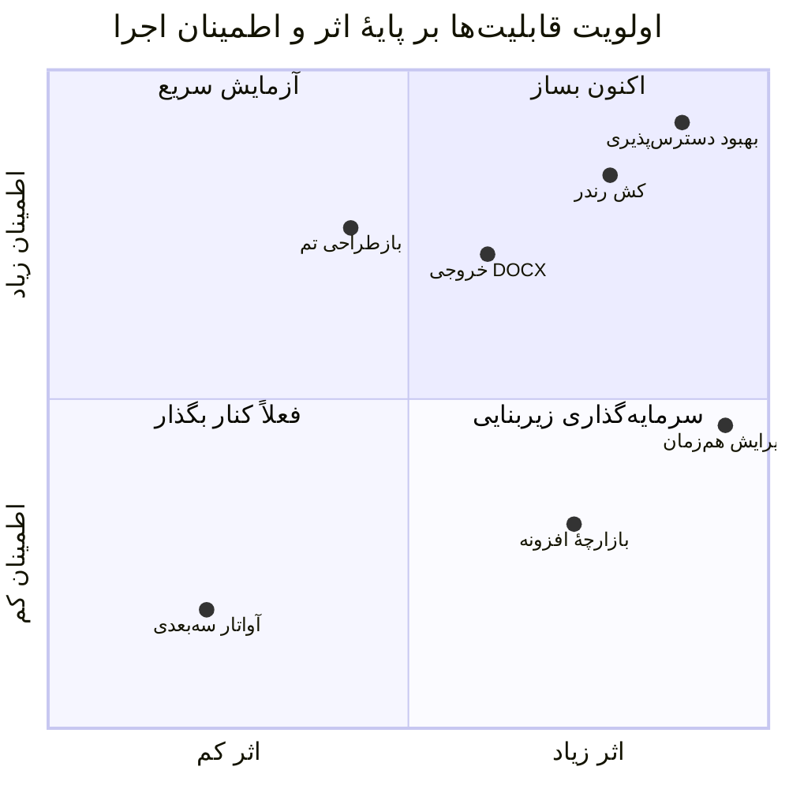
```mermaid
quadrantChart
  title اولویت قابلیت‌ها بر پایهٔ اثر و اطمینان اجرا
  x-axis اثر کم --> اثر زیاد
  y-axis اطمینان کم --> اطمینان زیاد
  quadrant-1 اکنون بساز
  quadrant-2 آزمایش سریع
  quadrant-3 فعلاً کنار بگذار
  quadrant-4 سرمایه‌گذاری زیربنایی
  "بهبود دسترس‌پذیری": [0.88, 0.92]
  "کش رندر": [0.78, 0.84]
  "ویرایش هم‌زمان": [0.94, 0.46]
  "خروجی DOCX": [0.61, 0.72]
  "بازطراحی تم": [0.42, 0.76]
  "بازارچهٔ افزونه": [0.73, 0.31]
  "آواتار سه‌بعدی": [0.22, 0.18]
```

### ۱۰.۲ روند و حجم

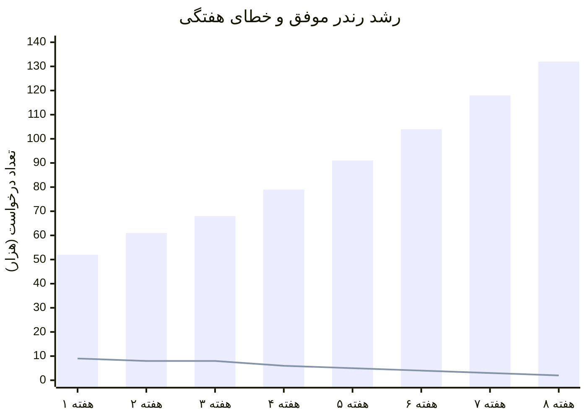
```mermaid
xychart-beta
  title "رشد رندر موفق و خطای هفتگی"
  x-axis ["هفته ۱", "هفته ۲", "هفته ۳", "هفته ۴", "هفته ۵", "هفته ۶", "هفته ۷", "هفته ۸"]
  y-axis "تعداد درخواست (هزار)" 0 --> 140
  bar [52, 61, 68, 79, 91, 104, 118, 132]
  line [9, 8, 8, 6, 5, 4, 3, 2]
```

### ۱۰.۳ جریان ارزش

```mermaid
sankey-beta

ورودی درخواست,پیش‌نمایش,720
ورودی درخواست,خروجی فایل,210
ورودی درخواست,اشتراک‌گذاری,70
پیش‌نمایش,موفق,680
پیش‌نمایش,خطای syntax,40
خطای syntax,اصلاح خودکار,26
خطای syntax,اصلاح دستی,14
خروجی فایل,PDF,145
خروجی فایل,PNG,45
خروجی فایل,SVG,20
PDF,موفق,138
PDF,Retry,7
Retry,موفق,6
Retry,ناموفق نهایی,1
```

### ۱۰.۴ سهم زمان

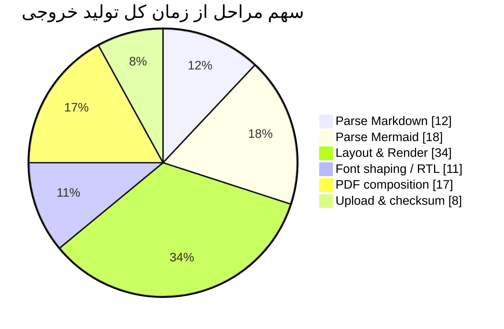
```mermaid
pie showData
  title سهم مراحل از زمان کل تولید خروجی
  "Parse Markdown" : 12
  "Parse Mermaid" : 18
  "Layout & Render" : 34
  "Font shaping / RTL" : 11
  "PDF composition" : 17
  "Upload & checksum" : 8
```

## ۱۱. کانبان تحویل نسخه

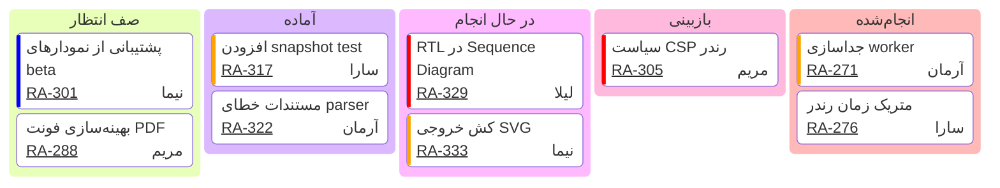
```mermaid
---
config:
  kanban:
    ticketBaseUrl: "https://example.invalid/tickets/#TICKET#"
---
kanban
  backlog[صف انتظار]
    b1[پشتیبانی از نمودارهای beta]@{ ticket: RA-301, assigned: نیما, priority: Low }
    b2[بهینه‌سازی فونت PDF]@{ ticket: RA-288, assigned: مریم, priority: Medium }
  ready[آماده]
    r1[افزودن snapshot test]@{ ticket: RA-317, assigned: سارا, priority: High }
    r2[مستندات خطای parser]@{ ticket: RA-322, assigned: آرمان, priority: Medium }
  doing[در حال انجام]
    d1[RTL در Sequence Diagram]@{ ticket: RA-329, assigned: لیلا, priority: Very High }
    d2[کش خروجی SVG]@{ ticket: RA-333, assigned: نیما, priority: High }
  review[بازبینی]
    v1[سیاست CSP رندر]@{ ticket: RA-305, assigned: مریم, priority: Very High }
  done[انجام‌شده]
    x1[جداسازی worker]@{ ticket: RA-271, assigned: آرمان, priority: High }
    x2[متریک زمان رندر]@{ ticket: RA-276, assigned: سارا, priority: Medium }
```

## ۱۲. سناریوی C4 — زمینهٔ سامانه

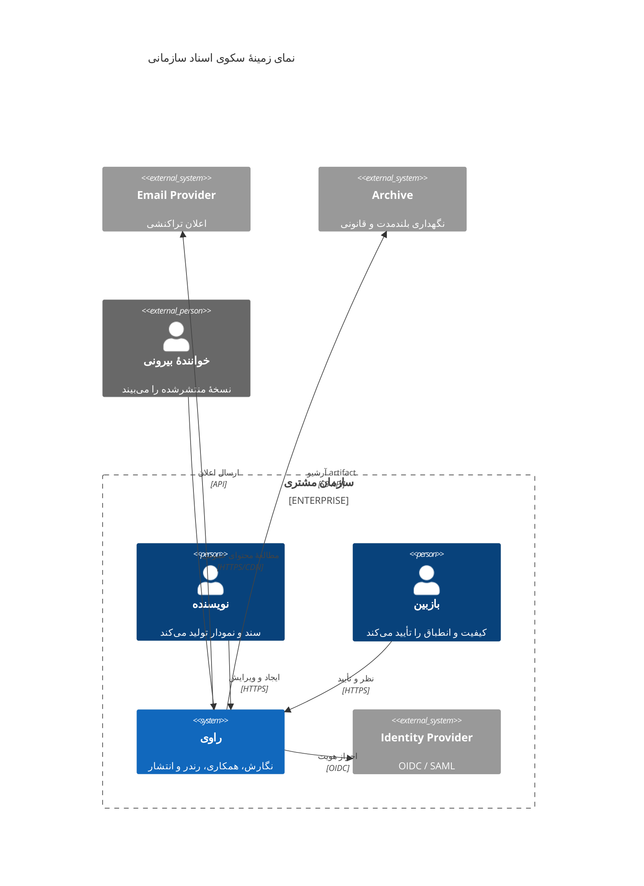
```mermaid
C4Context
  title نمای زمینهٔ سکوی اسناد سازمانی
  Enterprise_Boundary(org, "سازمان مشتری") {
    Person(author, "نویسنده", "سند و نمودار تولید می‌کند")
    Person(reviewer, "بازبین", "کیفیت و انطباق را تأیید می‌کند")
    System(raavi, "راوی", "نگارش، همکاری، رندر و انتشار")
    System_Ext(idp, "Identity Provider", "OIDC / SAML")
  }
  System_Ext(email, "Email Provider", "اعلان تراکنشی")
  System_Ext(storage, "Archive", "نگهداری بلندمدت و قانونی")
  Person_Ext(visitor, "خوانندهٔ بیرونی", "نسخهٔ منتشرشده را می‌بیند")

  Rel(author, raavi, "ایجاد و ویرایش", "HTTPS")
  Rel(reviewer, raavi, "نظر و تأیید", "HTTPS")
  Rel(raavi, idp, "احراز هویت", "OIDC")
  Rel(raavi, email, "ارسال اعلان", "API")
  Rel(raavi, storage, "آرشیو artifact", "S3 API")
  Rel(visitor, raavi, "مطالعهٔ محتوای عمومی", "HTTPS/CDN")
```

## ۱۳. بلوک‌های منطقی سامانه

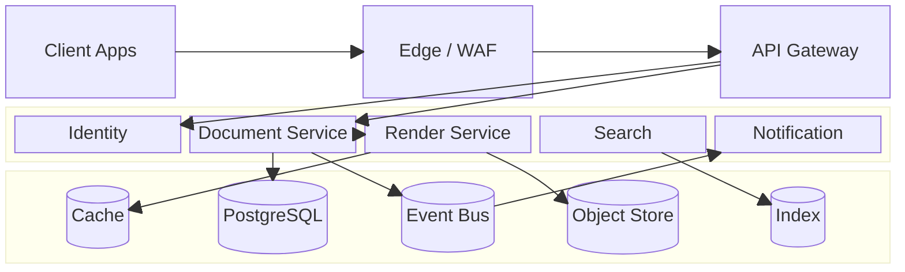
```mermaid
block-beta
  columns 5
  client["Client Apps"]:1
  space:1
  edge["Edge / WAF"]:1
  space:1
  api["API Gateway"]:1

  block:services:5
    columns 5
    auth["Identity"]
    docs["Document Service"]
    render["Render Service"]
    search["Search"]
    notify["Notification"]
  end

  block:data:5
    columns 5
    cache[("Cache")]
    db[("PostgreSQL")]
    queue[("Event Bus")]
    object[("Object Store")]
    index[("Index")]
  end

  client --> edge
  edge --> api
  api --> auth
  api --> docs
  docs --> render
  docs --> db
  docs --> queue
  render --> cache
  render --> object
  search --> index
  queue --> notify
```

## ۱۴. مهندسی سامانه

### ۱۴.۱ معماری زیرساخت

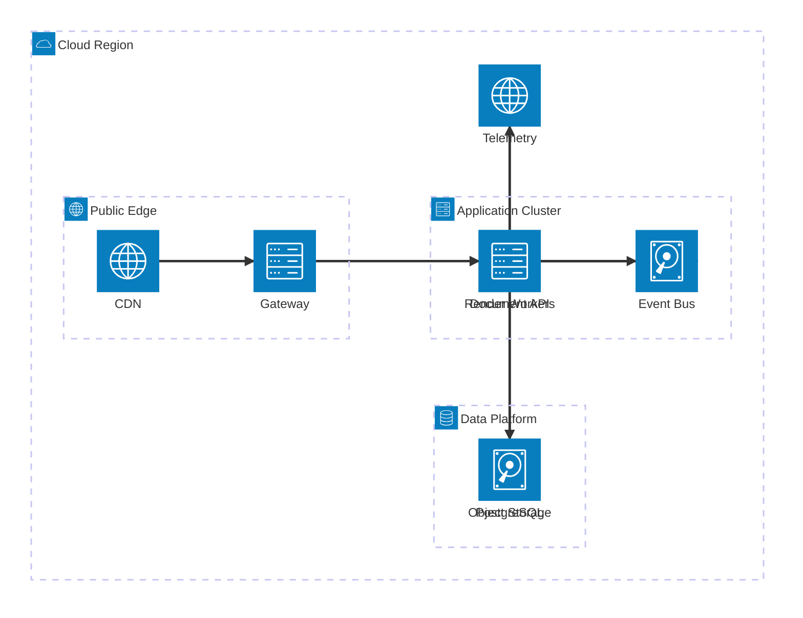
```mermaid
architecture-beta
  group cloud(cloud)["Cloud Region"]
  group edge(internet)["Public Edge"] in cloud
  group apps(server)["Application Cluster"] in cloud
  group data(database)["Data Platform"] in cloud

  service cdn(internet)["CDN"] in edge
  service gateway(server)["Gateway"] in edge
  service api(server)["Document API"] in apps
  service worker(server)["Render Workers"] in apps
  service bus(disk)["Event Bus"] in apps
  service postgres(database)["PostgreSQL"] in data
  service objects(disk)["Object Storage"] in data
  service telemetry(internet)["Telemetry"] in cloud

  cdn:R --> L:gateway
  gateway:R --> L:api
  api:B --> T:postgres
  api:R --> L:bus
  bus:R --> L:worker
  worker:B --> T:objects
  api:T --> B:telemetry
  worker:T --> B:telemetry
```

### ۱۴.۲ چیدمان یک بستهٔ شبکه

```mermaid
---
config:
  packet:
    bitsPerRow: 32
---
packet-beta
  title قاب پیام رندر نسخهٔ ۲
  0-3: "نسخه"
  4-7: "پرچم‌ها"
  8-15: "نوع پیام"
  16-31: "طول payload"
  32-63: "Correlation ID"
  64-95: "Tenant hash"
  96-127: "Document hash"
  128-159: "CRC-32"
```

## ۱۵. مقایسهٔ چندمحوره

```mermaid
radar-beta
  title مقایسهٔ نسخهٔ فعلی، هدف و رقیب فرضی
  axis speed["سرعت"], quality["کیفیت"], a11y["دسترس‌پذیری"], rtl["RTL"], export["خروجی"], security["امنیت"]
  curve current["نسخهٔ فعلی"] { speed: 72, quality: 84, a11y: 76, rtl: 91, export: 79, security: 88 }
  curve target["هدف Q4"] { speed: 92, quality: 94, a11y: 95, rtl: 97, export: 92, security: 96 }
  curve benchmark["معیار بازار"] { speed: 86, quality: 88, a11y: 82, rtl: 61, export: 90, security: 85 }
  showLegend true
  min 0
  max 100
  graticule polygon
  ticks 5
```

## ۱۶. نقشهٔ درختی ظرفیت

```mermaid
---
title: "توزیع هزینهٔ ماهانهٔ زیرساخت"
config:
  treemap:
    showValues: true
---
treemap-beta
  "Compute"
    "API Pods": 18400
    "Render Workers": 32600
    "Cron & Jobs": 4200
  "Data"
    "PostgreSQL": 21700
    "Redis": 6300
    "Search": 12800
    "Warehouse": 9900
  "Storage & Network"
    "Object Storage": 7400
    "CDN Egress": 11300
    "Backups": 3900
  "Operations"
    "Logs": 6800
    "Metrics": 4100
    "Traces": 5200
```

## ۱۷. هم‌پوشانی قابلیت‌ها

```mermaid
venn-beta
  title هم‌پوشانی مهارت‌های تیم تحویل
  set frontend["Frontend"]: 28
  set backend["Backend"]: 31
  set platform["Platform"]: 19
  union frontend,backend["Full-stack"]: 12
  union backend,platform["Distributed systems"]: 9
  union frontend,platform["Performance UI"]: 5
  union frontend,backend,platform["Tech leads"]: 3
```

## ۱۸. مسیر مسئولیت‌ها

```mermaid
swimlane-beta LR
  accTitle: رسیدگی انتها‌به‌انتهای یک خطای رندر
  subgraph user["کاربر"]
    report(["گزارش خطا"])
    verify(["تأیید رفع خطا"])
  end
  subgraph support["پشتیبانی"]
    triage["جمع‌آوری نمونه و محیط"]
    communicate["اطلاع‌رسانی وضعیت"]
  end
  subgraph engineering["مهندسی"]
    reproduce["بازتولید"]
    diagnose{"علت مشخص شد؟"}
    fix["اصلاح + regression test"]
  end
  subgraph release["انتشار"]
    canary["Canary 10%"]
    rollout["Rollout 100%"]
  end

  report --> triage
  triage --> reproduce
  reproduce --> diagnose
  diagnose -->|"خیر"| triage
  diagnose -->|"بله"| fix
  fix --> canary
  canary --> rollout
  rollout --> communicate
  communicate --> verify
```

## ۱۹. نمودارهای آزمایشی Mermaid 11

> [!WARNING]
> اگر renderer شما قدیمی باشد، ممکن است این بخش‌ها به‌درستی رندر نشوند. شکست
> کنترل‌شده و نمایش پیام خطای قابل‌فهم نیز بخشی از آزمون است.

### ۱۹.۱ معماری رویدادمحور با Event Modeling

```mermaid
---
title: "ثبت و آماده‌سازی خروجی سند"
---
eventmodeling
  tf 01 ui DOC.REQUEST
  tf 02 cmd DOC.CREATE_EXPORT
  tf 03 evt DOC.EXPORT_REQUESTED
  tf 04 rmo DOC.JOB_STATUS
  tf 05 ui DOC.PROGRESS
  tf 06 cmd DOC.RENDER
  tf 07 evt DOC.EXPORT_COMPLETED
  tf 08 rmo DOC.ARTIFACT
  tf 09 ui DOC.DOWNLOAD
```

### ۱۹.۲ استخوان ماهیِ تحلیل خطا

```mermaid
ishikawa-beta
  "خطای رندر در تولید"
    "ورودی"
      "syntax نامعتبر"
      "فایل بسیار بزرگ"
      "Unicode کنترل‌نشده"
    "نرم‌افزار"
      "ناسازگاری نسخه"
      "race condition"
      "نشت حافظه"
    "زیرساخت"
      "کمبود CPU"
      "timeout شبکه"
      "خرابی فونت"
    "فرایند"
      "نبود canary"
      "پوشش تست ناکافی"
      "runbook قدیمی"
    "انسان"
      "تنظیم اشتباه"
      "دسترسی ناکافی"
```

## ۲۰. آزمون‌های لبه‌ای متن و parser

### شناسه‌ها، escape و جهت نوشتار

- فارسی + English + 日本語 + العربية + हिन्दी + Emoji: 🧪🚀✅⚠️
- ترکیب شناسه و جمله: `requestId=01J4Z6M2N7V8R9T0` در ساعت ۱۴:۳۱ ثبت شد.
- Zero-width joiner: «می‌روم»، نیم‌فاصله: `U+200C`، جهت: `RTL/LTR`.
- URL با query: `https://example.invalid/a?x=1&y=%D8%B3%D9%84%D8%A7%D9%85#frag`
- نسخه‌ها: `1.0.0-alpha.1+build.20260803`، بازه: `>=11.16.0 <12`.

```text
این بلوک عمداً Mermaid نیست:
graph TD
  A --> B
پس renderer نباید آن را به نمودار تبدیل کند.
```

---

## چک‌لیست پذیرش

| # | معیار | روش بررسی | نتیجه |
|--:|:--|:--|:--:|
| 1 | تمام fenceها درست بسته شوند | شمارش blockهای Markdown | ☐ |
| 2 | خطای یک نمودار بقیهٔ سند را نشکند | خراب‌سازی کنترل‌شده یک block | ☐ |
| 3 | pan/zoom یا fit-to-width قابل استفاده باشد | viewport کوچک | ☐ |
| 4 | متن فارسی در SVG و PDF سالم بماند | مقایسهٔ تصویری | ☐ |
| 5 | تم روشن/تیره کنتراست کافی داشته باشد | WCAG contrast check | ☐ |
| 6 | نمودارهای بزرگ UI را قفل نکنند | Performance trace | ☐ |
| 7 | SVG خروجی script و handler نداشته باشد | sanitizer test | ☐ |
| 8 | کپی source دقیق و بدون تغییر باشد | round-trip test | ☐ |
| 9 | چاپ A4 بخش‌های Markdown را حفظ کند | print preview | ☐ |
| 10 | خطا دارای شماره خط و پیام عملی باشد | syntax error test | ☐ |

### نتیجهٔ مورد انتظار

```yaml
document:
  encoding: UTF-8
  direction: rtl
  markdown_features: pass
mermaid:
  stable_diagrams: pass
  beta_diagrams: pass-or-graceful-error
security:
  executable_html: stripped
performance:
  ui_thread: responsive
```

---

[^purpose]: این سند دادهٔ واقعی یا معماری نهایی محصول نیست؛ یک fixture نمایشی و آزمون فشار است.

<!-- EOF: اگر این کامنت دیده می‌شود، فایل تا انتها خوانده شده است. -->
