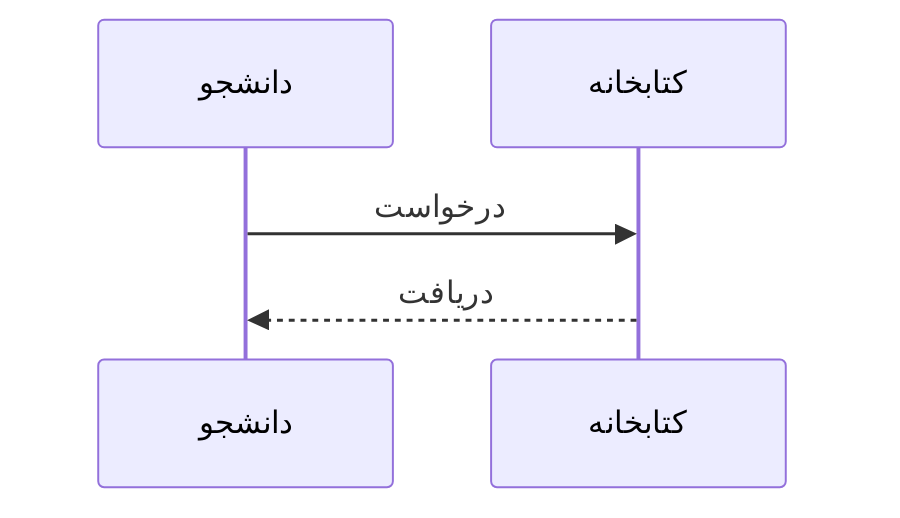
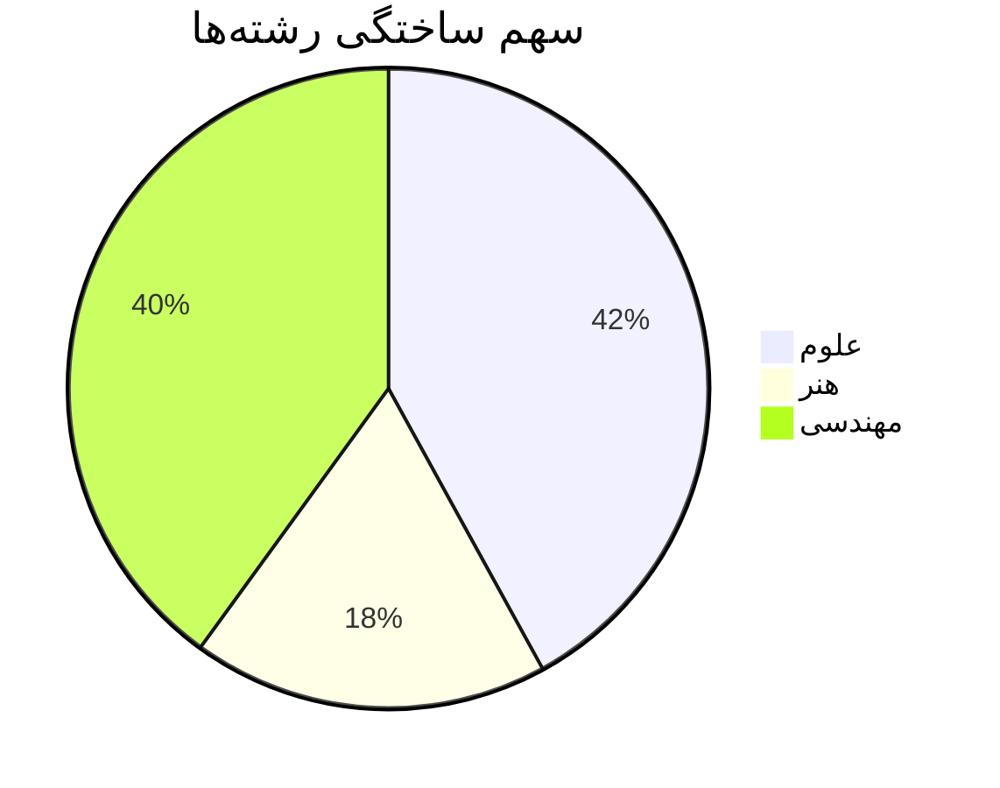
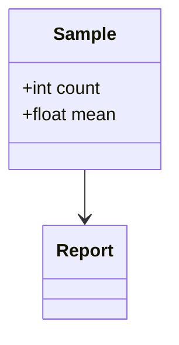
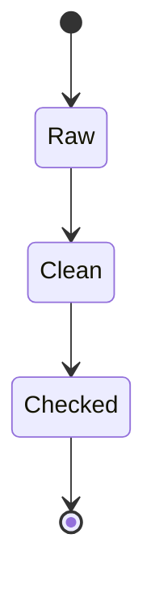
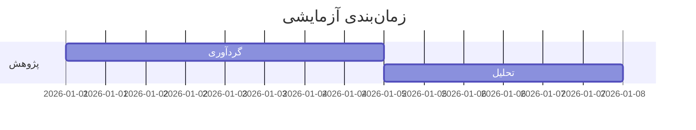
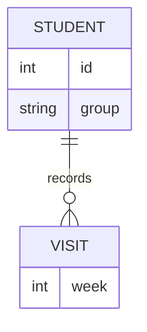
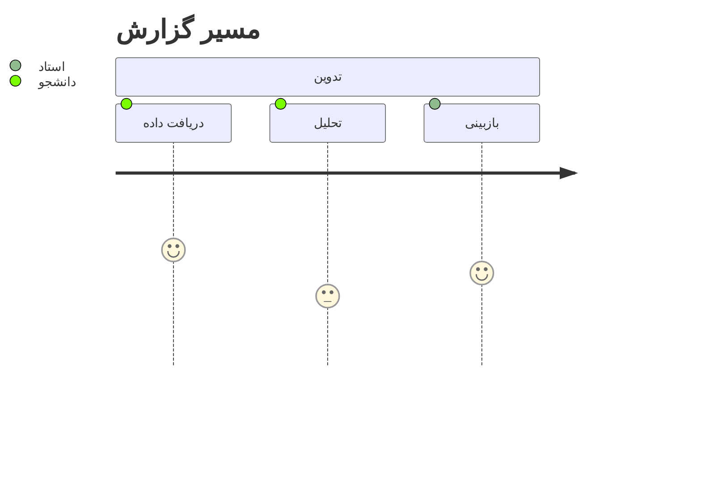
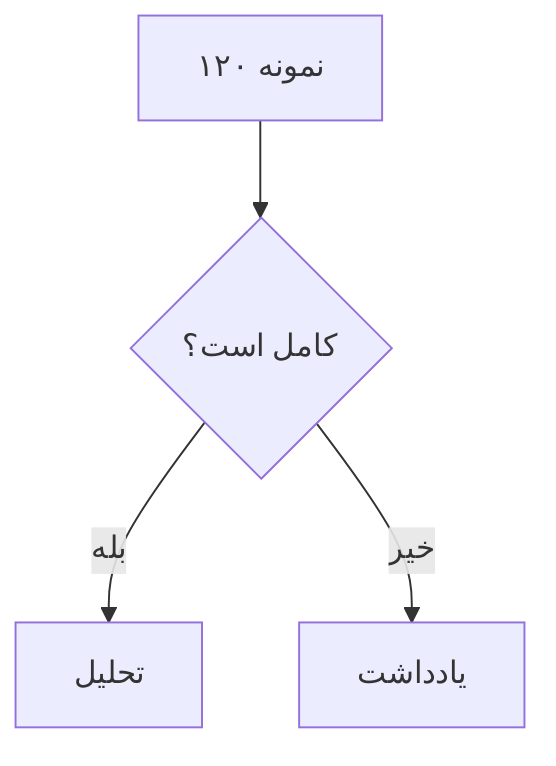
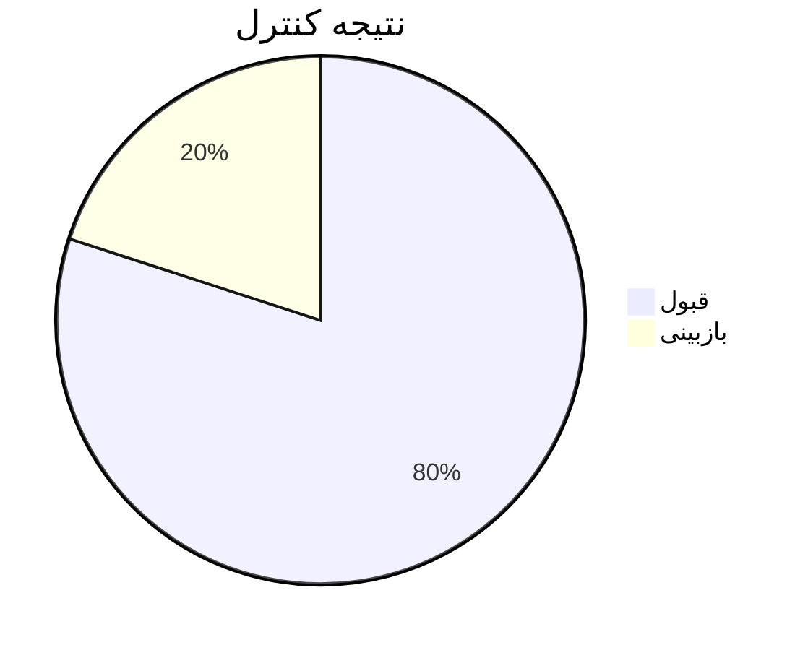
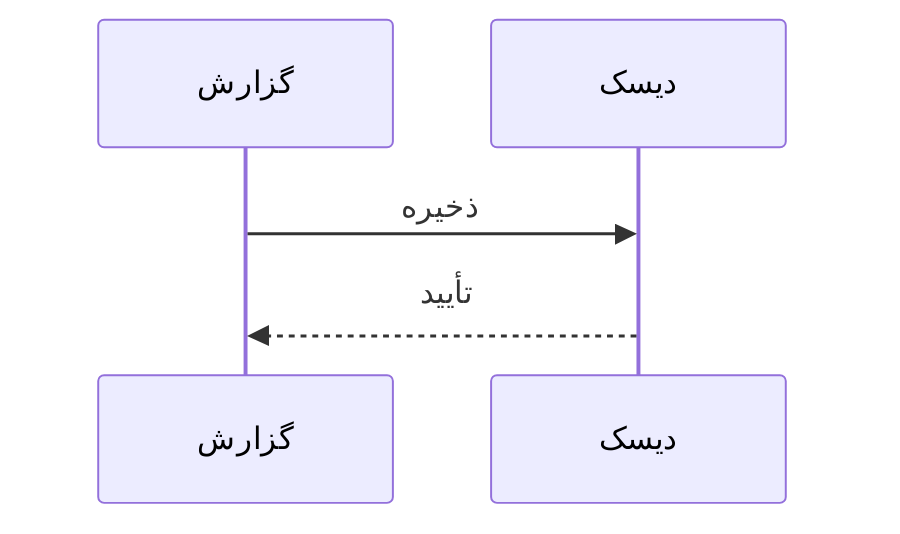

# گزارش ساختگی تحلیل مراجعه کتابخانه

شناسه آزمون: LONG-REPORT-245؛ کل پایه 1200؛ نسبت 12.50%؛ عدد فارسی ۱۲۳۴٫۵۶؛ کد S-2048.

## بخش 01: تحلیل هفته 1

ایستگاه 1-1. این تحلیل ساختگی روند مراجعه دانشجویان به کتابخانه را در یک نیمسال بررسی می‌کند. جامعه پژوهش فقط داده آزمایشی است و هیچ رکورد واقعی فردی در آن وجود ندارد. روش نمونه گیری به صورت ثابت تعریف شده تا مقایسه نسخه ها امکان پذیر باشد. مقدار میانگین باید همراه با واحد و تعداد مشاهده گزارش شود و هر تغییر در جمع کل لازم است در یادداشت روش توضیح داده شود.

ایستگاه 1-2. برای کنترل کیفیت، داده خام با جدول خلاصه مقایسه شد. مقدار گمشده با صفر برابر نیست و در محاسبه نسبت موفقیت جدا نگه داشته می‌شود. دسته بندی رشته، هفته و گروه فقط برای ساخت سناریو است. نتایج این بند ادعایی درباره دانشجویان واقعی ندارند. تحلیلگر باید پیش از خروجی گرفتن، اعداد فارسی و انگلیسی و برچسب ستون ها را دوباره بررسی کند تا خطای رونویسی به نسخه نهایی راه نیابد.

ایستگاه 1-3. در تحلیل حساسیت، بازه زمانی کوتاه و بلند جدا بررسی شد. افزایش نمونه لزوماً به معنای رفع سوگیری نیست. نقطه پرت را تنها بر اساس دلیل ثبت شده می‌توان حذف کرد و نسخه پیش از حذف باید باقی بماند. فرضیه اصلی درباره رابطه زمان مطالعه و تعداد مراجعه است. این رابطه ساختگی است و نتیجه علی محسوب نمی‌شود. گزارش حاضر برای آزمون نگارش، بازگشایی و حفظ جای مطالعه آماده شده است.

ایستگاه 1-4. این تحلیل ساختگی روند مراجعه دانشجویان به کتابخانه را در یک نیمسال بررسی می‌کند. جامعه پژوهش فقط داده آزمایشی است و هیچ رکورد واقعی فردی در آن وجود ندارد. روش نمونه گیری به صورت ثابت تعریف شده تا مقایسه نسخه ها امکان پذیر باشد. مقدار میانگین باید همراه با واحد و تعداد مشاهده گزارش شود و هر تغییر در جمع کل لازم است در یادداشت روش توضیح داده شود.

ایستگاه 1-5. برای کنترل کیفیت، داده خام با جدول خلاصه مقایسه شد. مقدار گمشده با صفر برابر نیست و در محاسبه نسبت موفقیت جدا نگه داشته می‌شود. دسته بندی رشته، هفته و گروه فقط برای ساخت سناریو است. نتایج این بند ادعایی درباره دانشجویان واقعی ندارند. تحلیلگر باید پیش از خروجی گرفتن، اعداد فارسی و انگلیسی و برچسب ستون ها را دوباره بررسی کند تا خطای رونویسی به نسخه نهایی راه نیابد.

ایستگاه 1-6. در تحلیل حساسیت، بازه زمانی کوتاه و بلند جدا بررسی شد. افزایش نمونه لزوماً به معنای رفع سوگیری نیست. نقطه پرت را تنها بر اساس دلیل ثبت شده می‌توان حذف کرد و نسخه پیش از حذف باید باقی بماند. فرضیه اصلی درباره رابطه زمان مطالعه و تعداد مراجعه است. این رابطه ساختگی است و نتیجه علی محسوب نمی‌شود. گزارش حاضر برای آزمون نگارش، بازگشایی و حفظ جای مطالعه آماده شده است.

ایستگاه 1-7. این تحلیل ساختگی روند مراجعه دانشجویان به کتابخانه را در یک نیمسال بررسی می‌کند. جامعه پژوهش فقط داده آزمایشی است و هیچ رکورد واقعی فردی در آن وجود ندارد. روش نمونه گیری به صورت ثابت تعریف شده تا مقایسه نسخه ها امکان پذیر باشد. مقدار میانگین باید همراه با واحد و تعداد مشاهده گزارش شود و هر تغییر در جمع کل لازم است در یادداشت روش توضیح داده شود.

ایستگاه 1-8. برای کنترل کیفیت، داده خام با جدول خلاصه مقایسه شد. مقدار گمشده با صفر برابر نیست و در محاسبه نسبت موفقیت جدا نگه داشته می‌شود. دسته بندی رشته، هفته و گروه فقط برای ساخت سناریو است. نتایج این بند ادعایی درباره دانشجویان واقعی ندارند. تحلیلگر باید پیش از خروجی گرفتن، اعداد فارسی و انگلیسی و برچسب ستون ها را دوباره بررسی کند تا خطای رونویسی به نسخه نهایی راه نیابد.

ایستگاه 1-9. در تحلیل حساسیت، بازه زمانی کوتاه و بلند جدا بررسی شد. افزایش نمونه لزوماً به معنای رفع سوگیری نیست. نقطه پرت را تنها بر اساس دلیل ثبت شده می‌توان حذف کرد و نسخه پیش از حذف باید باقی بماند. فرضیه اصلی درباره رابطه زمان مطالعه و تعداد مراجعه است. این رابطه ساختگی است و نتیجه علی محسوب نمی‌شود. گزارش حاضر برای آزمون نگارش، بازگشایی و حفظ جای مطالعه آماده شده است.

ایستگاه 1-10. این تحلیل ساختگی روند مراجعه دانشجویان به کتابخانه را در یک نیمسال بررسی می‌کند. جامعه پژوهش فقط داده آزمایشی است و هیچ رکورد واقعی فردی در آن وجود ندارد. روش نمونه گیری به صورت ثابت تعریف شده تا مقایسه نسخه ها امکان پذیر باشد. مقدار میانگین باید همراه با واحد و تعداد مشاهده گزارش شود و هر تغییر در جمع کل لازم است در یادداشت روش توضیح داده شود.

| گروه | تعداد | نسبت | میانگین |
|---|---:|---:|---:|
| علوم | 420 | 35.00% | ۱۲٫۵ |
| هنر | 180 | 15.00% | 8.75 |
| مهندسی | 600 | 50.00% | ۱۴٫۲ |
| کل | 1200 | 100.00% | 12.50 |

English checkpoint: sample N=1200, mean=12.50, confidence interval [11.25, 13.75]. These values are synthetic.

## بخش 02: تحلیل هفته 2

ایستگاه 2-1. این تحلیل ساختگی روند مراجعه دانشجویان به کتابخانه را در یک نیمسال بررسی می‌کند. جامعه پژوهش فقط داده آزمایشی است و هیچ رکورد واقعی فردی در آن وجود ندارد. روش نمونه گیری به صورت ثابت تعریف شده تا مقایسه نسخه ها امکان پذیر باشد. مقدار میانگین باید همراه با واحد و تعداد مشاهده گزارش شود و هر تغییر در جمع کل لازم است در یادداشت روش توضیح داده شود.

ایستگاه 2-2. برای کنترل کیفیت، داده خام با جدول خلاصه مقایسه شد. مقدار گمشده با صفر برابر نیست و در محاسبه نسبت موفقیت جدا نگه داشته می‌شود. دسته بندی رشته، هفته و گروه فقط برای ساخت سناریو است. نتایج این بند ادعایی درباره دانشجویان واقعی ندارند. تحلیلگر باید پیش از خروجی گرفتن، اعداد فارسی و انگلیسی و برچسب ستون ها را دوباره بررسی کند تا خطای رونویسی به نسخه نهایی راه نیابد.

ایستگاه 2-3. در تحلیل حساسیت، بازه زمانی کوتاه و بلند جدا بررسی شد. افزایش نمونه لزوماً به معنای رفع سوگیری نیست. نقطه پرت را تنها بر اساس دلیل ثبت شده می‌توان حذف کرد و نسخه پیش از حذف باید باقی بماند. فرضیه اصلی درباره رابطه زمان مطالعه و تعداد مراجعه است. این رابطه ساختگی است و نتیجه علی محسوب نمی‌شود. گزارش حاضر برای آزمون نگارش، بازگشایی و حفظ جای مطالعه آماده شده است.

ایستگاه 2-4. این تحلیل ساختگی روند مراجعه دانشجویان به کتابخانه را در یک نیمسال بررسی می‌کند. جامعه پژوهش فقط داده آزمایشی است و هیچ رکورد واقعی فردی در آن وجود ندارد. روش نمونه گیری به صورت ثابت تعریف شده تا مقایسه نسخه ها امکان پذیر باشد. مقدار میانگین باید همراه با واحد و تعداد مشاهده گزارش شود و هر تغییر در جمع کل لازم است در یادداشت روش توضیح داده شود.

ایستگاه 2-5. برای کنترل کیفیت، داده خام با جدول خلاصه مقایسه شد. مقدار گمشده با صفر برابر نیست و در محاسبه نسبت موفقیت جدا نگه داشته می‌شود. دسته بندی رشته، هفته و گروه فقط برای ساخت سناریو است. نتایج این بند ادعایی درباره دانشجویان واقعی ندارند. تحلیلگر باید پیش از خروجی گرفتن، اعداد فارسی و انگلیسی و برچسب ستون ها را دوباره بررسی کند تا خطای رونویسی به نسخه نهایی راه نیابد.

ایستگاه 2-6. در تحلیل حساسیت، بازه زمانی کوتاه و بلند جدا بررسی شد. افزایش نمونه لزوماً به معنای رفع سوگیری نیست. نقطه پرت را تنها بر اساس دلیل ثبت شده می‌توان حذف کرد و نسخه پیش از حذف باید باقی بماند. فرضیه اصلی درباره رابطه زمان مطالعه و تعداد مراجعه است. این رابطه ساختگی است و نتیجه علی محسوب نمی‌شود. گزارش حاضر برای آزمون نگارش، بازگشایی و حفظ جای مطالعه آماده شده است.

ایستگاه 2-7. این تحلیل ساختگی روند مراجعه دانشجویان به کتابخانه را در یک نیمسال بررسی می‌کند. جامعه پژوهش فقط داده آزمایشی است و هیچ رکورد واقعی فردی در آن وجود ندارد. روش نمونه گیری به صورت ثابت تعریف شده تا مقایسه نسخه ها امکان پذیر باشد. مقدار میانگین باید همراه با واحد و تعداد مشاهده گزارش شود و هر تغییر در جمع کل لازم است در یادداشت روش توضیح داده شود.

ایستگاه 2-8. برای کنترل کیفیت، داده خام با جدول خلاصه مقایسه شد. مقدار گمشده با صفر برابر نیست و در محاسبه نسبت موفقیت جدا نگه داشته می‌شود. دسته بندی رشته، هفته و گروه فقط برای ساخت سناریو است. نتایج این بند ادعایی درباره دانشجویان واقعی ندارند. تحلیلگر باید پیش از خروجی گرفتن، اعداد فارسی و انگلیسی و برچسب ستون ها را دوباره بررسی کند تا خطای رونویسی به نسخه نهایی راه نیابد.

ایستگاه 2-9. در تحلیل حساسیت، بازه زمانی کوتاه و بلند جدا بررسی شد. افزایش نمونه لزوماً به معنای رفع سوگیری نیست. نقطه پرت را تنها بر اساس دلیل ثبت شده می‌توان حذف کرد و نسخه پیش از حذف باید باقی بماند. فرضیه اصلی درباره رابطه زمان مطالعه و تعداد مراجعه است. این رابطه ساختگی است و نتیجه علی محسوب نمی‌شود. گزارش حاضر برای آزمون نگارش، بازگشایی و حفظ جای مطالعه آماده شده است.

ایستگاه 2-10. این تحلیل ساختگی روند مراجعه دانشجویان به کتابخانه را در یک نیمسال بررسی می‌کند. جامعه پژوهش فقط داده آزمایشی است و هیچ رکورد واقعی فردی در آن وجود ندارد. روش نمونه گیری به صورت ثابت تعریف شده تا مقایسه نسخه ها امکان پذیر باشد. مقدار میانگین باید همراه با واحد و تعداد مشاهده گزارش شود و هر تغییر در جمع کل لازم است در یادداشت روش توضیح داده شود.

| گروه | تعداد | نسبت | میانگین |
|---|---:|---:|---:|
| علوم | 420 | 35.00% | ۱۲٫۵ |
| هنر | 180 | 15.00% | 8.75 |
| مهندسی | 600 | 50.00% | ۱۴٫۲ |
| کل | 1200 | 100.00% | 12.50 |

English checkpoint: sample N=1200, mean=12.50, confidence interval [11.25, 13.75]. These values are synthetic.

## بخش 03: تحلیل هفته 3

ایستگاه 3-1. این تحلیل ساختگی روند مراجعه دانشجویان به کتابخانه را در یک نیمسال بررسی می‌کند. جامعه پژوهش فقط داده آزمایشی است و هیچ رکورد واقعی فردی در آن وجود ندارد. روش نمونه گیری به صورت ثابت تعریف شده تا مقایسه نسخه ها امکان پذیر باشد. مقدار میانگین باید همراه با واحد و تعداد مشاهده گزارش شود و هر تغییر در جمع کل لازم است در یادداشت روش توضیح داده شود.

ایستگاه 3-2. برای کنترل کیفیت، داده خام با جدول خلاصه مقایسه شد. مقدار گمشده با صفر برابر نیست و در محاسبه نسبت موفقیت جدا نگه داشته می‌شود. دسته بندی رشته، هفته و گروه فقط برای ساخت سناریو است. نتایج این بند ادعایی درباره دانشجویان واقعی ندارند. تحلیلگر باید پیش از خروجی گرفتن، اعداد فارسی و انگلیسی و برچسب ستون ها را دوباره بررسی کند تا خطای رونویسی به نسخه نهایی راه نیابد.

ایستگاه 3-3. در تحلیل حساسیت، بازه زمانی کوتاه و بلند جدا بررسی شد. افزایش نمونه لزوماً به معنای رفع سوگیری نیست. نقطه پرت را تنها بر اساس دلیل ثبت شده می‌توان حذف کرد و نسخه پیش از حذف باید باقی بماند. فرضیه اصلی درباره رابطه زمان مطالعه و تعداد مراجعه است. این رابطه ساختگی است و نتیجه علی محسوب نمی‌شود. گزارش حاضر برای آزمون نگارش، بازگشایی و حفظ جای مطالعه آماده شده است.

ایستگاه 3-4. این تحلیل ساختگی روند مراجعه دانشجویان به کتابخانه را در یک نیمسال بررسی می‌کند. جامعه پژوهش فقط داده آزمایشی است و هیچ رکورد واقعی فردی در آن وجود ندارد. روش نمونه گیری به صورت ثابت تعریف شده تا مقایسه نسخه ها امکان پذیر باشد. مقدار میانگین باید همراه با واحد و تعداد مشاهده گزارش شود و هر تغییر در جمع کل لازم است در یادداشت روش توضیح داده شود.

ایستگاه 3-5. برای کنترل کیفیت، داده خام با جدول خلاصه مقایسه شد. مقدار گمشده با صفر برابر نیست و در محاسبه نسبت موفقیت جدا نگه داشته می‌شود. دسته بندی رشته، هفته و گروه فقط برای ساخت سناریو است. نتایج این بند ادعایی درباره دانشجویان واقعی ندارند. تحلیلگر باید پیش از خروجی گرفتن، اعداد فارسی و انگلیسی و برچسب ستون ها را دوباره بررسی کند تا خطای رونویسی به نسخه نهایی راه نیابد.

ایستگاه 3-6. در تحلیل حساسیت، بازه زمانی کوتاه و بلند جدا بررسی شد. افزایش نمونه لزوماً به معنای رفع سوگیری نیست. نقطه پرت را تنها بر اساس دلیل ثبت شده می‌توان حذف کرد و نسخه پیش از حذف باید باقی بماند. فرضیه اصلی درباره رابطه زمان مطالعه و تعداد مراجعه است. این رابطه ساختگی است و نتیجه علی محسوب نمی‌شود. گزارش حاضر برای آزمون نگارش، بازگشایی و حفظ جای مطالعه آماده شده است.

ایستگاه 3-7. این تحلیل ساختگی روند مراجعه دانشجویان به کتابخانه را در یک نیمسال بررسی می‌کند. جامعه پژوهش فقط داده آزمایشی است و هیچ رکورد واقعی فردی در آن وجود ندارد. روش نمونه گیری به صورت ثابت تعریف شده تا مقایسه نسخه ها امکان پذیر باشد. مقدار میانگین باید همراه با واحد و تعداد مشاهده گزارش شود و هر تغییر در جمع کل لازم است در یادداشت روش توضیح داده شود.

ایستگاه 3-8. برای کنترل کیفیت، داده خام با جدول خلاصه مقایسه شد. مقدار گمشده با صفر برابر نیست و در محاسبه نسبت موفقیت جدا نگه داشته می‌شود. دسته بندی رشته، هفته و گروه فقط برای ساخت سناریو است. نتایج این بند ادعایی درباره دانشجویان واقعی ندارند. تحلیلگر باید پیش از خروجی گرفتن، اعداد فارسی و انگلیسی و برچسب ستون ها را دوباره بررسی کند تا خطای رونویسی به نسخه نهایی راه نیابد.

ایستگاه 3-9. در تحلیل حساسیت، بازه زمانی کوتاه و بلند جدا بررسی شد. افزایش نمونه لزوماً به معنای رفع سوگیری نیست. نقطه پرت را تنها بر اساس دلیل ثبت شده می‌توان حذف کرد و نسخه پیش از حذف باید باقی بماند. فرضیه اصلی درباره رابطه زمان مطالعه و تعداد مراجعه است. این رابطه ساختگی است و نتیجه علی محسوب نمی‌شود. گزارش حاضر برای آزمون نگارش، بازگشایی و حفظ جای مطالعه آماده شده است.

ایستگاه 3-10. این تحلیل ساختگی روند مراجعه دانشجویان به کتابخانه را در یک نیمسال بررسی می‌کند. جامعه پژوهش فقط داده آزمایشی است و هیچ رکورد واقعی فردی در آن وجود ندارد. روش نمونه گیری به صورت ثابت تعریف شده تا مقایسه نسخه ها امکان پذیر باشد. مقدار میانگین باید همراه با واحد و تعداد مشاهده گزارش شود و هر تغییر در جمع کل لازم است در یادداشت روش توضیح داده شود.

| گروه | تعداد | نسبت | میانگین |
|---|---:|---:|---:|
| علوم | 420 | 35.00% | ۱۲٫۵ |
| هنر | 180 | 15.00% | 8.75 |
| مهندسی | 600 | 50.00% | ۱۴٫۲ |
| کل | 1200 | 100.00% | 12.50 |

English checkpoint: sample N=1200, mean=12.50, confidence interval [11.25, 13.75]. These values are synthetic.

## بخش 04: تحلیل هفته 4

ایستگاه 4-1. این تحلیل ساختگی روند مراجعه دانشجویان به کتابخانه را در یک نیمسال بررسی می‌کند. جامعه پژوهش فقط داده آزمایشی است و هیچ رکورد واقعی فردی در آن وجود ندارد. روش نمونه گیری به صورت ثابت تعریف شده تا مقایسه نسخه ها امکان پذیر باشد. مقدار میانگین باید همراه با واحد و تعداد مشاهده گزارش شود و هر تغییر در جمع کل لازم است در یادداشت روش توضیح داده شود.

ایستگاه 4-2. برای کنترل کیفیت، داده خام با جدول خلاصه مقایسه شد. مقدار گمشده با صفر برابر نیست و در محاسبه نسبت موفقیت جدا نگه داشته می‌شود. دسته بندی رشته، هفته و گروه فقط برای ساخت سناریو است. نتایج این بند ادعایی درباره دانشجویان واقعی ندارند. تحلیلگر باید پیش از خروجی گرفتن، اعداد فارسی و انگلیسی و برچسب ستون ها را دوباره بررسی کند تا خطای رونویسی به نسخه نهایی راه نیابد.

ایستگاه 4-3. در تحلیل حساسیت، بازه زمانی کوتاه و بلند جدا بررسی شد. افزایش نمونه لزوماً به معنای رفع سوگیری نیست. نقطه پرت را تنها بر اساس دلیل ثبت شده می‌توان حذف کرد و نسخه پیش از حذف باید باقی بماند. فرضیه اصلی درباره رابطه زمان مطالعه و تعداد مراجعه است. این رابطه ساختگی است و نتیجه علی محسوب نمی‌شود. گزارش حاضر برای آزمون نگارش، بازگشایی و حفظ جای مطالعه آماده شده است.

ایستگاه 4-4. این تحلیل ساختگی روند مراجعه دانشجویان به کتابخانه را در یک نیمسال بررسی می‌کند. جامعه پژوهش فقط داده آزمایشی است و هیچ رکورد واقعی فردی در آن وجود ندارد. روش نمونه گیری به صورت ثابت تعریف شده تا مقایسه نسخه ها امکان پذیر باشد. مقدار میانگین باید همراه با واحد و تعداد مشاهده گزارش شود و هر تغییر در جمع کل لازم است در یادداشت روش توضیح داده شود.

ایستگاه 4-5. برای کنترل کیفیت، داده خام با جدول خلاصه مقایسه شد. مقدار گمشده با صفر برابر نیست و در محاسبه نسبت موفقیت جدا نگه داشته می‌شود. دسته بندی رشته، هفته و گروه فقط برای ساخت سناریو است. نتایج این بند ادعایی درباره دانشجویان واقعی ندارند. تحلیلگر باید پیش از خروجی گرفتن، اعداد فارسی و انگلیسی و برچسب ستون ها را دوباره بررسی کند تا خطای رونویسی به نسخه نهایی راه نیابد.

ایستگاه 4-6. در تحلیل حساسیت، بازه زمانی کوتاه و بلند جدا بررسی شد. افزایش نمونه لزوماً به معنای رفع سوگیری نیست. نقطه پرت را تنها بر اساس دلیل ثبت شده می‌توان حذف کرد و نسخه پیش از حذف باید باقی بماند. فرضیه اصلی درباره رابطه زمان مطالعه و تعداد مراجعه است. این رابطه ساختگی است و نتیجه علی محسوب نمی‌شود. گزارش حاضر برای آزمون نگارش، بازگشایی و حفظ جای مطالعه آماده شده است.

ایستگاه 4-7. این تحلیل ساختگی روند مراجعه دانشجویان به کتابخانه را در یک نیمسال بررسی می‌کند. جامعه پژوهش فقط داده آزمایشی است و هیچ رکورد واقعی فردی در آن وجود ندارد. روش نمونه گیری به صورت ثابت تعریف شده تا مقایسه نسخه ها امکان پذیر باشد. مقدار میانگین باید همراه با واحد و تعداد مشاهده گزارش شود و هر تغییر در جمع کل لازم است در یادداشت روش توضیح داده شود.

ایستگاه 4-8. برای کنترل کیفیت، داده خام با جدول خلاصه مقایسه شد. مقدار گمشده با صفر برابر نیست و در محاسبه نسبت موفقیت جدا نگه داشته می‌شود. دسته بندی رشته، هفته و گروه فقط برای ساخت سناریو است. نتایج این بند ادعایی درباره دانشجویان واقعی ندارند. تحلیلگر باید پیش از خروجی گرفتن، اعداد فارسی و انگلیسی و برچسب ستون ها را دوباره بررسی کند تا خطای رونویسی به نسخه نهایی راه نیابد.

ایستگاه 4-9. در تحلیل حساسیت، بازه زمانی کوتاه و بلند جدا بررسی شد. افزایش نمونه لزوماً به معنای رفع سوگیری نیست. نقطه پرت را تنها بر اساس دلیل ثبت شده می‌توان حذف کرد و نسخه پیش از حذف باید باقی بماند. فرضیه اصلی درباره رابطه زمان مطالعه و تعداد مراجعه است. این رابطه ساختگی است و نتیجه علی محسوب نمی‌شود. گزارش حاضر برای آزمون نگارش، بازگشایی و حفظ جای مطالعه آماده شده است.

ایستگاه 4-10. این تحلیل ساختگی روند مراجعه دانشجویان به کتابخانه را در یک نیمسال بررسی می‌کند. جامعه پژوهش فقط داده آزمایشی است و هیچ رکورد واقعی فردی در آن وجود ندارد. روش نمونه گیری به صورت ثابت تعریف شده تا مقایسه نسخه ها امکان پذیر باشد. مقدار میانگین باید همراه با واحد و تعداد مشاهده گزارش شود و هر تغییر در جمع کل لازم است در یادداشت روش توضیح داده شود.

| گروه | تعداد | نسبت | میانگین |
|---|---:|---:|---:|
| علوم | 420 | 35.00% | ۱۲٫۵ |
| هنر | 180 | 15.00% | 8.75 |
| مهندسی | 600 | 50.00% | ۱۴٫۲ |
| کل | 1200 | 100.00% | 12.50 |

English checkpoint: sample N=1200, mean=12.50, confidence interval [11.25, 13.75]. These values are synthetic.

## بخش 05: تحلیل هفته 5

ایستگاه 5-1. این تحلیل ساختگی روند مراجعه دانشجویان به کتابخانه را در یک نیمسال بررسی می‌کند. جامعه پژوهش فقط داده آزمایشی است و هیچ رکورد واقعی فردی در آن وجود ندارد. روش نمونه گیری به صورت ثابت تعریف شده تا مقایسه نسخه ها امکان پذیر باشد. مقدار میانگین باید همراه با واحد و تعداد مشاهده گزارش شود و هر تغییر در جمع کل لازم است در یادداشت روش توضیح داده شود.

ایستگاه 5-2. برای کنترل کیفیت، داده خام با جدول خلاصه مقایسه شد. مقدار گمشده با صفر برابر نیست و در محاسبه نسبت موفقیت جدا نگه داشته می‌شود. دسته بندی رشته، هفته و گروه فقط برای ساخت سناریو است. نتایج این بند ادعایی درباره دانشجویان واقعی ندارند. تحلیلگر باید پیش از خروجی گرفتن، اعداد فارسی و انگلیسی و برچسب ستون ها را دوباره بررسی کند تا خطای رونویسی به نسخه نهایی راه نیابد.

ایستگاه 5-3. در تحلیل حساسیت، بازه زمانی کوتاه و بلند جدا بررسی شد. افزایش نمونه لزوماً به معنای رفع سوگیری نیست. نقطه پرت را تنها بر اساس دلیل ثبت شده می‌توان حذف کرد و نسخه پیش از حذف باید باقی بماند. فرضیه اصلی درباره رابطه زمان مطالعه و تعداد مراجعه است. این رابطه ساختگی است و نتیجه علی محسوب نمی‌شود. گزارش حاضر برای آزمون نگارش، بازگشایی و حفظ جای مطالعه آماده شده است.

ایستگاه 5-4. این تحلیل ساختگی روند مراجعه دانشجویان به کتابخانه را در یک نیمسال بررسی می‌کند. جامعه پژوهش فقط داده آزمایشی است و هیچ رکورد واقعی فردی در آن وجود ندارد. روش نمونه گیری به صورت ثابت تعریف شده تا مقایسه نسخه ها امکان پذیر باشد. مقدار میانگین باید همراه با واحد و تعداد مشاهده گزارش شود و هر تغییر در جمع کل لازم است در یادداشت روش توضیح داده شود.

ایستگاه 5-5. برای کنترل کیفیت، داده خام با جدول خلاصه مقایسه شد. مقدار گمشده با صفر برابر نیست و در محاسبه نسبت موفقیت جدا نگه داشته می‌شود. دسته بندی رشته، هفته و گروه فقط برای ساخت سناریو است. نتایج این بند ادعایی درباره دانشجویان واقعی ندارند. تحلیلگر باید پیش از خروجی گرفتن، اعداد فارسی و انگلیسی و برچسب ستون ها را دوباره بررسی کند تا خطای رونویسی به نسخه نهایی راه نیابد.

ایستگاه 5-6. در تحلیل حساسیت، بازه زمانی کوتاه و بلند جدا بررسی شد. افزایش نمونه لزوماً به معنای رفع سوگیری نیست. نقطه پرت را تنها بر اساس دلیل ثبت شده می‌توان حذف کرد و نسخه پیش از حذف باید باقی بماند. فرضیه اصلی درباره رابطه زمان مطالعه و تعداد مراجعه است. این رابطه ساختگی است و نتیجه علی محسوب نمی‌شود. گزارش حاضر برای آزمون نگارش، بازگشایی و حفظ جای مطالعه آماده شده است.

ایستگاه 5-7. این تحلیل ساختگی روند مراجعه دانشجویان به کتابخانه را در یک نیمسال بررسی می‌کند. جامعه پژوهش فقط داده آزمایشی است و هیچ رکورد واقعی فردی در آن وجود ندارد. روش نمونه گیری به صورت ثابت تعریف شده تا مقایسه نسخه ها امکان پذیر باشد. مقدار میانگین باید همراه با واحد و تعداد مشاهده گزارش شود و هر تغییر در جمع کل لازم است در یادداشت روش توضیح داده شود.

ایستگاه 5-8. برای کنترل کیفیت، داده خام با جدول خلاصه مقایسه شد. مقدار گمشده با صفر برابر نیست و در محاسبه نسبت موفقیت جدا نگه داشته می‌شود. دسته بندی رشته، هفته و گروه فقط برای ساخت سناریو است. نتایج این بند ادعایی درباره دانشجویان واقعی ندارند. تحلیلگر باید پیش از خروجی گرفتن، اعداد فارسی و انگلیسی و برچسب ستون ها را دوباره بررسی کند تا خطای رونویسی به نسخه نهایی راه نیابد.

ایستگاه 5-9. در تحلیل حساسیت، بازه زمانی کوتاه و بلند جدا بررسی شد. افزایش نمونه لزوماً به معنای رفع سوگیری نیست. نقطه پرت را تنها بر اساس دلیل ثبت شده می‌توان حذف کرد و نسخه پیش از حذف باید باقی بماند. فرضیه اصلی درباره رابطه زمان مطالعه و تعداد مراجعه است. این رابطه ساختگی است و نتیجه علی محسوب نمی‌شود. گزارش حاضر برای آزمون نگارش، بازگشایی و حفظ جای مطالعه آماده شده است.

ایستگاه 5-10. این تحلیل ساختگی روند مراجعه دانشجویان به کتابخانه را در یک نیمسال بررسی می‌کند. جامعه پژوهش فقط داده آزمایشی است و هیچ رکورد واقعی فردی در آن وجود ندارد. روش نمونه گیری به صورت ثابت تعریف شده تا مقایسه نسخه ها امکان پذیر باشد. مقدار میانگین باید همراه با واحد و تعداد مشاهده گزارش شود و هر تغییر در جمع کل لازم است در یادداشت روش توضیح داده شود.

| گروه | تعداد | نسبت | میانگین |
|---|---:|---:|---:|
| علوم | 420 | 35.00% | ۱۲٫۵ |
| هنر | 180 | 15.00% | 8.75 |
| مهندسی | 600 | 50.00% | ۱۴٫۲ |
| کل | 1200 | 100.00% | 12.50 |

$$
\bar{x} = \frac{1}{n} \sum_{i=1}^{n} x_i = 12.50
$$

English checkpoint: sample N=1200, mean=12.50, confidence interval [11.25, 13.75]. These values are synthetic.

## بخش 06: تحلیل هفته 6

ایستگاه 6-1. این تحلیل ساختگی روند مراجعه دانشجویان به کتابخانه را در یک نیمسال بررسی می‌کند. جامعه پژوهش فقط داده آزمایشی است و هیچ رکورد واقعی فردی در آن وجود ندارد. روش نمونه گیری به صورت ثابت تعریف شده تا مقایسه نسخه ها امکان پذیر باشد. مقدار میانگین باید همراه با واحد و تعداد مشاهده گزارش شود و هر تغییر در جمع کل لازم است در یادداشت روش توضیح داده شود.

ایستگاه 6-2. برای کنترل کیفیت، داده خام با جدول خلاصه مقایسه شد. مقدار گمشده با صفر برابر نیست و در محاسبه نسبت موفقیت جدا نگه داشته می‌شود. دسته بندی رشته، هفته و گروه فقط برای ساخت سناریو است. نتایج این بند ادعایی درباره دانشجویان واقعی ندارند. تحلیلگر باید پیش از خروجی گرفتن، اعداد فارسی و انگلیسی و برچسب ستون ها را دوباره بررسی کند تا خطای رونویسی به نسخه نهایی راه نیابد.

ایستگاه 6-3. در تحلیل حساسیت، بازه زمانی کوتاه و بلند جدا بررسی شد. افزایش نمونه لزوماً به معنای رفع سوگیری نیست. نقطه پرت را تنها بر اساس دلیل ثبت شده می‌توان حذف کرد و نسخه پیش از حذف باید باقی بماند. فرضیه اصلی درباره رابطه زمان مطالعه و تعداد مراجعه است. این رابطه ساختگی است و نتیجه علی محسوب نمی‌شود. گزارش حاضر برای آزمون نگارش، بازگشایی و حفظ جای مطالعه آماده شده است.

ایستگاه 6-4. این تحلیل ساختگی روند مراجعه دانشجویان به کتابخانه را در یک نیمسال بررسی می‌کند. جامعه پژوهش فقط داده آزمایشی است و هیچ رکورد واقعی فردی در آن وجود ندارد. روش نمونه گیری به صورت ثابت تعریف شده تا مقایسه نسخه ها امکان پذیر باشد. مقدار میانگین باید همراه با واحد و تعداد مشاهده گزارش شود و هر تغییر در جمع کل لازم است در یادداشت روش توضیح داده شود.

ایستگاه 6-5. برای کنترل کیفیت، داده خام با جدول خلاصه مقایسه شد. مقدار گمشده با صفر برابر نیست و در محاسبه نسبت موفقیت جدا نگه داشته می‌شود. دسته بندی رشته، هفته و گروه فقط برای ساخت سناریو است. نتایج این بند ادعایی درباره دانشجویان واقعی ندارند. تحلیلگر باید پیش از خروجی گرفتن، اعداد فارسی و انگلیسی و برچسب ستون ها را دوباره بررسی کند تا خطای رونویسی به نسخه نهایی راه نیابد.

ایستگاه 6-6. در تحلیل حساسیت، بازه زمانی کوتاه و بلند جدا بررسی شد. افزایش نمونه لزوماً به معنای رفع سوگیری نیست. نقطه پرت را تنها بر اساس دلیل ثبت شده می‌توان حذف کرد و نسخه پیش از حذف باید باقی بماند. فرضیه اصلی درباره رابطه زمان مطالعه و تعداد مراجعه است. این رابطه ساختگی است و نتیجه علی محسوب نمی‌شود. گزارش حاضر برای آزمون نگارش، بازگشایی و حفظ جای مطالعه آماده شده است.

ایستگاه 6-7. این تحلیل ساختگی روند مراجعه دانشجویان به کتابخانه را در یک نیمسال بررسی می‌کند. جامعه پژوهش فقط داده آزمایشی است و هیچ رکورد واقعی فردی در آن وجود ندارد. روش نمونه گیری به صورت ثابت تعریف شده تا مقایسه نسخه ها امکان پذیر باشد. مقدار میانگین باید همراه با واحد و تعداد مشاهده گزارش شود و هر تغییر در جمع کل لازم است در یادداشت روش توضیح داده شود.

ایستگاه 6-8. برای کنترل کیفیت، داده خام با جدول خلاصه مقایسه شد. مقدار گمشده با صفر برابر نیست و در محاسبه نسبت موفقیت جدا نگه داشته می‌شود. دسته بندی رشته، هفته و گروه فقط برای ساخت سناریو است. نتایج این بند ادعایی درباره دانشجویان واقعی ندارند. تحلیلگر باید پیش از خروجی گرفتن، اعداد فارسی و انگلیسی و برچسب ستون ها را دوباره بررسی کند تا خطای رونویسی به نسخه نهایی راه نیابد.

ایستگاه 6-9. در تحلیل حساسیت، بازه زمانی کوتاه و بلند جدا بررسی شد. افزایش نمونه لزوماً به معنای رفع سوگیری نیست. نقطه پرت را تنها بر اساس دلیل ثبت شده می‌توان حذف کرد و نسخه پیش از حذف باید باقی بماند. فرضیه اصلی درباره رابطه زمان مطالعه و تعداد مراجعه است. این رابطه ساختگی است و نتیجه علی محسوب نمی‌شود. گزارش حاضر برای آزمون نگارش، بازگشایی و حفظ جای مطالعه آماده شده است.

ایستگاه 6-10. این تحلیل ساختگی روند مراجعه دانشجویان به کتابخانه را در یک نیمسال بررسی می‌کند. جامعه پژوهش فقط داده آزمایشی است و هیچ رکورد واقعی فردی در آن وجود ندارد. روش نمونه گیری به صورت ثابت تعریف شده تا مقایسه نسخه ها امکان پذیر باشد. مقدار میانگین باید همراه با واحد و تعداد مشاهده گزارش شود و هر تغییر در جمع کل لازم است در یادداشت روش توضیح داده شود.

| گروه | تعداد | نسبت | میانگین |
|---|---:|---:|---:|
| علوم | 420 | 35.00% | ۱۲٫۵ |
| هنر | 180 | 15.00% | 8.75 |
| مهندسی | 600 | 50.00% | ۱۴٫۲ |
| کل | 1200 | 100.00% | 12.50 |

English checkpoint: sample N=1200, mean=12.50, confidence interval [11.25, 13.75]. These values are synthetic.

## بخش 07: تحلیل هفته 7

ایستگاه 7-1. این تحلیل ساختگی روند مراجعه دانشجویان به کتابخانه را در یک نیمسال بررسی می‌کند. جامعه پژوهش فقط داده آزمایشی است و هیچ رکورد واقعی فردی در آن وجود ندارد. روش نمونه گیری به صورت ثابت تعریف شده تا مقایسه نسخه ها امکان پذیر باشد. مقدار میانگین باید همراه با واحد و تعداد مشاهده گزارش شود و هر تغییر در جمع کل لازم است در یادداشت روش توضیح داده شود.

ایستگاه 7-2. برای کنترل کیفیت، داده خام با جدول خلاصه مقایسه شد. مقدار گمشده با صفر برابر نیست و در محاسبه نسبت موفقیت جدا نگه داشته می‌شود. دسته بندی رشته، هفته و گروه فقط برای ساخت سناریو است. نتایج این بند ادعایی درباره دانشجویان واقعی ندارند. تحلیلگر باید پیش از خروجی گرفتن، اعداد فارسی و انگلیسی و برچسب ستون ها را دوباره بررسی کند تا خطای رونویسی به نسخه نهایی راه نیابد.

ایستگاه 7-3. در تحلیل حساسیت، بازه زمانی کوتاه و بلند جدا بررسی شد. افزایش نمونه لزوماً به معنای رفع سوگیری نیست. نقطه پرت را تنها بر اساس دلیل ثبت شده می‌توان حذف کرد و نسخه پیش از حذف باید باقی بماند. فرضیه اصلی درباره رابطه زمان مطالعه و تعداد مراجعه است. این رابطه ساختگی است و نتیجه علی محسوب نمی‌شود. گزارش حاضر برای آزمون نگارش، بازگشایی و حفظ جای مطالعه آماده شده است.

ایستگاه 7-4. این تحلیل ساختگی روند مراجعه دانشجویان به کتابخانه را در یک نیمسال بررسی می‌کند. جامعه پژوهش فقط داده آزمایشی است و هیچ رکورد واقعی فردی در آن وجود ندارد. روش نمونه گیری به صورت ثابت تعریف شده تا مقایسه نسخه ها امکان پذیر باشد. مقدار میانگین باید همراه با واحد و تعداد مشاهده گزارش شود و هر تغییر در جمع کل لازم است در یادداشت روش توضیح داده شود.

ایستگاه 7-5. برای کنترل کیفیت، داده خام با جدول خلاصه مقایسه شد. مقدار گمشده با صفر برابر نیست و در محاسبه نسبت موفقیت جدا نگه داشته می‌شود. دسته بندی رشته، هفته و گروه فقط برای ساخت سناریو است. نتایج این بند ادعایی درباره دانشجویان واقعی ندارند. تحلیلگر باید پیش از خروجی گرفتن، اعداد فارسی و انگلیسی و برچسب ستون ها را دوباره بررسی کند تا خطای رونویسی به نسخه نهایی راه نیابد.

ایستگاه 7-6. در تحلیل حساسیت، بازه زمانی کوتاه و بلند جدا بررسی شد. افزایش نمونه لزوماً به معنای رفع سوگیری نیست. نقطه پرت را تنها بر اساس دلیل ثبت شده می‌توان حذف کرد و نسخه پیش از حذف باید باقی بماند. فرضیه اصلی درباره رابطه زمان مطالعه و تعداد مراجعه است. این رابطه ساختگی است و نتیجه علی محسوب نمی‌شود. گزارش حاضر برای آزمون نگارش، بازگشایی و حفظ جای مطالعه آماده شده است.

ایستگاه 7-7. این تحلیل ساختگی روند مراجعه دانشجویان به کتابخانه را در یک نیمسال بررسی می‌کند. جامعه پژوهش فقط داده آزمایشی است و هیچ رکورد واقعی فردی در آن وجود ندارد. روش نمونه گیری به صورت ثابت تعریف شده تا مقایسه نسخه ها امکان پذیر باشد. مقدار میانگین باید همراه با واحد و تعداد مشاهده گزارش شود و هر تغییر در جمع کل لازم است در یادداشت روش توضیح داده شود.

ایستگاه 7-8. برای کنترل کیفیت، داده خام با جدول خلاصه مقایسه شد. مقدار گمشده با صفر برابر نیست و در محاسبه نسبت موفقیت جدا نگه داشته می‌شود. دسته بندی رشته، هفته و گروه فقط برای ساخت سناریو است. نتایج این بند ادعایی درباره دانشجویان واقعی ندارند. تحلیلگر باید پیش از خروجی گرفتن، اعداد فارسی و انگلیسی و برچسب ستون ها را دوباره بررسی کند تا خطای رونویسی به نسخه نهایی راه نیابد.

ایستگاه 7-9. در تحلیل حساسیت، بازه زمانی کوتاه و بلند جدا بررسی شد. افزایش نمونه لزوماً به معنای رفع سوگیری نیست. نقطه پرت را تنها بر اساس دلیل ثبت شده می‌توان حذف کرد و نسخه پیش از حذف باید باقی بماند. فرضیه اصلی درباره رابطه زمان مطالعه و تعداد مراجعه است. این رابطه ساختگی است و نتیجه علی محسوب نمی‌شود. گزارش حاضر برای آزمون نگارش، بازگشایی و حفظ جای مطالعه آماده شده است.

ایستگاه 7-10. این تحلیل ساختگی روند مراجعه دانشجویان به کتابخانه را در یک نیمسال بررسی می‌کند. جامعه پژوهش فقط داده آزمایشی است و هیچ رکورد واقعی فردی در آن وجود ندارد. روش نمونه گیری به صورت ثابت تعریف شده تا مقایسه نسخه ها امکان پذیر باشد. مقدار میانگین باید همراه با واحد و تعداد مشاهده گزارش شود و هر تغییر در جمع کل لازم است در یادداشت روش توضیح داده شود.

| گروه | تعداد | نسبت | میانگین |
|---|---:|---:|---:|
| علوم | 420 | 35.00% | ۱۲٫۵ |
| هنر | 180 | 15.00% | 8.75 |
| مهندسی | 600 | 50.00% | ۱۴٫۲ |
| کل | 1200 | 100.00% | 12.50 |

English checkpoint: sample N=1200, mean=12.50, confidence interval [11.25, 13.75]. These values are synthetic.

## بخش 08: تحلیل هفته 8

ایستگاه 8-1. این تحلیل ساختگی روند مراجعه دانشجویان به کتابخانه را در یک نیمسال بررسی می‌کند. جامعه پژوهش فقط داده آزمایشی است و هیچ رکورد واقعی فردی در آن وجود ندارد. روش نمونه گیری به صورت ثابت تعریف شده تا مقایسه نسخه ها امکان پذیر باشد. مقدار میانگین باید همراه با واحد و تعداد مشاهده گزارش شود و هر تغییر در جمع کل لازم است در یادداشت روش توضیح داده شود.

ایستگاه 8-2. برای کنترل کیفیت، داده خام با جدول خلاصه مقایسه شد. مقدار گمشده با صفر برابر نیست و در محاسبه نسبت موفقیت جدا نگه داشته می‌شود. دسته بندی رشته، هفته و گروه فقط برای ساخت سناریو است. نتایج این بند ادعایی درباره دانشجویان واقعی ندارند. تحلیلگر باید پیش از خروجی گرفتن، اعداد فارسی و انگلیسی و برچسب ستون ها را دوباره بررسی کند تا خطای رونویسی به نسخه نهایی راه نیابد.

ایستگاه 8-3. در تحلیل حساسیت، بازه زمانی کوتاه و بلند جدا بررسی شد. افزایش نمونه لزوماً به معنای رفع سوگیری نیست. نقطه پرت را تنها بر اساس دلیل ثبت شده می‌توان حذف کرد و نسخه پیش از حذف باید باقی بماند. فرضیه اصلی درباره رابطه زمان مطالعه و تعداد مراجعه است. این رابطه ساختگی است و نتیجه علی محسوب نمی‌شود. گزارش حاضر برای آزمون نگارش، بازگشایی و حفظ جای مطالعه آماده شده است.

ایستگاه 8-4. این تحلیل ساختگی روند مراجعه دانشجویان به کتابخانه را در یک نیمسال بررسی می‌کند. جامعه پژوهش فقط داده آزمایشی است و هیچ رکورد واقعی فردی در آن وجود ندارد. روش نمونه گیری به صورت ثابت تعریف شده تا مقایسه نسخه ها امکان پذیر باشد. مقدار میانگین باید همراه با واحد و تعداد مشاهده گزارش شود و هر تغییر در جمع کل لازم است در یادداشت روش توضیح داده شود.

ایستگاه 8-5. برای کنترل کیفیت، داده خام با جدول خلاصه مقایسه شد. مقدار گمشده با صفر برابر نیست و در محاسبه نسبت موفقیت جدا نگه داشته می‌شود. دسته بندی رشته، هفته و گروه فقط برای ساخت سناریو است. نتایج این بند ادعایی درباره دانشجویان واقعی ندارند. تحلیلگر باید پیش از خروجی گرفتن، اعداد فارسی و انگلیسی و برچسب ستون ها را دوباره بررسی کند تا خطای رونویسی به نسخه نهایی راه نیابد.

ایستگاه 8-6. در تحلیل حساسیت، بازه زمانی کوتاه و بلند جدا بررسی شد. افزایش نمونه لزوماً به معنای رفع سوگیری نیست. نقطه پرت را تنها بر اساس دلیل ثبت شده می‌توان حذف کرد و نسخه پیش از حذف باید باقی بماند. فرضیه اصلی درباره رابطه زمان مطالعه و تعداد مراجعه است. این رابطه ساختگی است و نتیجه علی محسوب نمی‌شود. گزارش حاضر برای آزمون نگارش، بازگشایی و حفظ جای مطالعه آماده شده است.

ایستگاه 8-7. این تحلیل ساختگی روند مراجعه دانشجویان به کتابخانه را در یک نیمسال بررسی می‌کند. جامعه پژوهش فقط داده آزمایشی است و هیچ رکورد واقعی فردی در آن وجود ندارد. روش نمونه گیری به صورت ثابت تعریف شده تا مقایسه نسخه ها امکان پذیر باشد. مقدار میانگین باید همراه با واحد و تعداد مشاهده گزارش شود و هر تغییر در جمع کل لازم است در یادداشت روش توضیح داده شود.

ایستگاه 8-8. برای کنترل کیفیت، داده خام با جدول خلاصه مقایسه شد. مقدار گمشده با صفر برابر نیست و در محاسبه نسبت موفقیت جدا نگه داشته می‌شود. دسته بندی رشته، هفته و گروه فقط برای ساخت سناریو است. نتایج این بند ادعایی درباره دانشجویان واقعی ندارند. تحلیلگر باید پیش از خروجی گرفتن، اعداد فارسی و انگلیسی و برچسب ستون ها را دوباره بررسی کند تا خطای رونویسی به نسخه نهایی راه نیابد.

ایستگاه 8-9. در تحلیل حساسیت، بازه زمانی کوتاه و بلند جدا بررسی شد. افزایش نمونه لزوماً به معنای رفع سوگیری نیست. نقطه پرت را تنها بر اساس دلیل ثبت شده می‌توان حذف کرد و نسخه پیش از حذف باید باقی بماند. فرضیه اصلی درباره رابطه زمان مطالعه و تعداد مراجعه است. این رابطه ساختگی است و نتیجه علی محسوب نمی‌شود. گزارش حاضر برای آزمون نگارش، بازگشایی و حفظ جای مطالعه آماده شده است.

ایستگاه 8-10. این تحلیل ساختگی روند مراجعه دانشجویان به کتابخانه را در یک نیمسال بررسی می‌کند. جامعه پژوهش فقط داده آزمایشی است و هیچ رکورد واقعی فردی در آن وجود ندارد. روش نمونه گیری به صورت ثابت تعریف شده تا مقایسه نسخه ها امکان پذیر باشد. مقدار میانگین باید همراه با واحد و تعداد مشاهده گزارش شود و هر تغییر در جمع کل لازم است در یادداشت روش توضیح داده شود.

| گروه | تعداد | نسبت | میانگین |
|---|---:|---:|---:|
| علوم | 420 | 35.00% | ۱۲٫۵ |
| هنر | 180 | 15.00% | 8.75 |
| مهندسی | 600 | 50.00% | ۱۴٫۲ |
| کل | 1200 | 100.00% | 12.50 |

English checkpoint: sample N=1200, mean=12.50, confidence interval [11.25, 13.75]. These values are synthetic.

## بخش 09: تحلیل هفته 9

ایستگاه 9-1. این تحلیل ساختگی روند مراجعه دانشجویان به کتابخانه را در یک نیمسال بررسی می‌کند. جامعه پژوهش فقط داده آزمایشی است و هیچ رکورد واقعی فردی در آن وجود ندارد. روش نمونه گیری به صورت ثابت تعریف شده تا مقایسه نسخه ها امکان پذیر باشد. مقدار میانگین باید همراه با واحد و تعداد مشاهده گزارش شود و هر تغییر در جمع کل لازم است در یادداشت روش توضیح داده شود.

ایستگاه 9-2. برای کنترل کیفیت، داده خام با جدول خلاصه مقایسه شد. مقدار گمشده با صفر برابر نیست و در محاسبه نسبت موفقیت جدا نگه داشته می‌شود. دسته بندی رشته، هفته و گروه فقط برای ساخت سناریو است. نتایج این بند ادعایی درباره دانشجویان واقعی ندارند. تحلیلگر باید پیش از خروجی گرفتن، اعداد فارسی و انگلیسی و برچسب ستون ها را دوباره بررسی کند تا خطای رونویسی به نسخه نهایی راه نیابد.

ایستگاه 9-3. در تحلیل حساسیت، بازه زمانی کوتاه و بلند جدا بررسی شد. افزایش نمونه لزوماً به معنای رفع سوگیری نیست. نقطه پرت را تنها بر اساس دلیل ثبت شده می‌توان حذف کرد و نسخه پیش از حذف باید باقی بماند. فرضیه اصلی درباره رابطه زمان مطالعه و تعداد مراجعه است. این رابطه ساختگی است و نتیجه علی محسوب نمی‌شود. گزارش حاضر برای آزمون نگارش، بازگشایی و حفظ جای مطالعه آماده شده است.

ایستگاه 9-4. این تحلیل ساختگی روند مراجعه دانشجویان به کتابخانه را در یک نیمسال بررسی می‌کند. جامعه پژوهش فقط داده آزمایشی است و هیچ رکورد واقعی فردی در آن وجود ندارد. روش نمونه گیری به صورت ثابت تعریف شده تا مقایسه نسخه ها امکان پذیر باشد. مقدار میانگین باید همراه با واحد و تعداد مشاهده گزارش شود و هر تغییر در جمع کل لازم است در یادداشت روش توضیح داده شود.

ایستگاه 9-5. برای کنترل کیفیت، داده خام با جدول خلاصه مقایسه شد. مقدار گمشده با صفر برابر نیست و در محاسبه نسبت موفقیت جدا نگه داشته می‌شود. دسته بندی رشته، هفته و گروه فقط برای ساخت سناریو است. نتایج این بند ادعایی درباره دانشجویان واقعی ندارند. تحلیلگر باید پیش از خروجی گرفتن، اعداد فارسی و انگلیسی و برچسب ستون ها را دوباره بررسی کند تا خطای رونویسی به نسخه نهایی راه نیابد.

ایستگاه 9-6. در تحلیل حساسیت، بازه زمانی کوتاه و بلند جدا بررسی شد. افزایش نمونه لزوماً به معنای رفع سوگیری نیست. نقطه پرت را تنها بر اساس دلیل ثبت شده می‌توان حذف کرد و نسخه پیش از حذف باید باقی بماند. فرضیه اصلی درباره رابطه زمان مطالعه و تعداد مراجعه است. این رابطه ساختگی است و نتیجه علی محسوب نمی‌شود. گزارش حاضر برای آزمون نگارش، بازگشایی و حفظ جای مطالعه آماده شده است.

ایستگاه 9-7. این تحلیل ساختگی روند مراجعه دانشجویان به کتابخانه را در یک نیمسال بررسی می‌کند. جامعه پژوهش فقط داده آزمایشی است و هیچ رکورد واقعی فردی در آن وجود ندارد. روش نمونه گیری به صورت ثابت تعریف شده تا مقایسه نسخه ها امکان پذیر باشد. مقدار میانگین باید همراه با واحد و تعداد مشاهده گزارش شود و هر تغییر در جمع کل لازم است در یادداشت روش توضیح داده شود.

ایستگاه 9-8. برای کنترل کیفیت، داده خام با جدول خلاصه مقایسه شد. مقدار گمشده با صفر برابر نیست و در محاسبه نسبت موفقیت جدا نگه داشته می‌شود. دسته بندی رشته، هفته و گروه فقط برای ساخت سناریو است. نتایج این بند ادعایی درباره دانشجویان واقعی ندارند. تحلیلگر باید پیش از خروجی گرفتن، اعداد فارسی و انگلیسی و برچسب ستون ها را دوباره بررسی کند تا خطای رونویسی به نسخه نهایی راه نیابد.

ایستگاه 9-9. در تحلیل حساسیت، بازه زمانی کوتاه و بلند جدا بررسی شد. افزایش نمونه لزوماً به معنای رفع سوگیری نیست. نقطه پرت را تنها بر اساس دلیل ثبت شده می‌توان حذف کرد و نسخه پیش از حذف باید باقی بماند. فرضیه اصلی درباره رابطه زمان مطالعه و تعداد مراجعه است. این رابطه ساختگی است و نتیجه علی محسوب نمی‌شود. گزارش حاضر برای آزمون نگارش، بازگشایی و حفظ جای مطالعه آماده شده است.

ایستگاه 9-10. این تحلیل ساختگی روند مراجعه دانشجویان به کتابخانه را در یک نیمسال بررسی می‌کند. جامعه پژوهش فقط داده آزمایشی است و هیچ رکورد واقعی فردی در آن وجود ندارد. روش نمونه گیری به صورت ثابت تعریف شده تا مقایسه نسخه ها امکان پذیر باشد. مقدار میانگین باید همراه با واحد و تعداد مشاهده گزارش شود و هر تغییر در جمع کل لازم است در یادداشت روش توضیح داده شود.

English checkpoint: sample N=1200, mean=12.50, confidence interval [11.25, 13.75]. These values are synthetic.

## بخش 10: تحلیل هفته 10

ایستگاه 10-1. این تحلیل ساختگی روند مراجعه دانشجویان به کتابخانه را در یک نیمسال بررسی می‌کند. جامعه پژوهش فقط داده آزمایشی است و هیچ رکورد واقعی فردی در آن وجود ندارد. روش نمونه گیری به صورت ثابت تعریف شده تا مقایسه نسخه ها امکان پذیر باشد. مقدار میانگین باید همراه با واحد و تعداد مشاهده گزارش شود و هر تغییر در جمع کل لازم است در یادداشت روش توضیح داده شود.

ایستگاه 10-2. برای کنترل کیفیت، داده خام با جدول خلاصه مقایسه شد. مقدار گمشده با صفر برابر نیست و در محاسبه نسبت موفقیت جدا نگه داشته می‌شود. دسته بندی رشته، هفته و گروه فقط برای ساخت سناریو است. نتایج این بند ادعایی درباره دانشجویان واقعی ندارند. تحلیلگر باید پیش از خروجی گرفتن، اعداد فارسی و انگلیسی و برچسب ستون ها را دوباره بررسی کند تا خطای رونویسی به نسخه نهایی راه نیابد.

ایستگاه 10-3. در تحلیل حساسیت، بازه زمانی کوتاه و بلند جدا بررسی شد. افزایش نمونه لزوماً به معنای رفع سوگیری نیست. نقطه پرت را تنها بر اساس دلیل ثبت شده می‌توان حذف کرد و نسخه پیش از حذف باید باقی بماند. فرضیه اصلی درباره رابطه زمان مطالعه و تعداد مراجعه است. این رابطه ساختگی است و نتیجه علی محسوب نمی‌شود. گزارش حاضر برای آزمون نگارش، بازگشایی و حفظ جای مطالعه آماده شده است.

ایستگاه 10-4. این تحلیل ساختگی روند مراجعه دانشجویان به کتابخانه را در یک نیمسال بررسی می‌کند. جامعه پژوهش فقط داده آزمایشی است و هیچ رکورد واقعی فردی در آن وجود ندارد. روش نمونه گیری به صورت ثابت تعریف شده تا مقایسه نسخه ها امکان پذیر باشد. مقدار میانگین باید همراه با واحد و تعداد مشاهده گزارش شود و هر تغییر در جمع کل لازم است در یادداشت روش توضیح داده شود.

ایستگاه 10-5. برای کنترل کیفیت، داده خام با جدول خلاصه مقایسه شد. مقدار گمشده با صفر برابر نیست و در محاسبه نسبت موفقیت جدا نگه داشته می‌شود. دسته بندی رشته، هفته و گروه فقط برای ساخت سناریو است. نتایج این بند ادعایی درباره دانشجویان واقعی ندارند. تحلیلگر باید پیش از خروجی گرفتن، اعداد فارسی و انگلیسی و برچسب ستون ها را دوباره بررسی کند تا خطای رونویسی به نسخه نهایی راه نیابد.

ایستگاه 10-6. در تحلیل حساسیت، بازه زمانی کوتاه و بلند جدا بررسی شد. افزایش نمونه لزوماً به معنای رفع سوگیری نیست. نقطه پرت را تنها بر اساس دلیل ثبت شده می‌توان حذف کرد و نسخه پیش از حذف باید باقی بماند. فرضیه اصلی درباره رابطه زمان مطالعه و تعداد مراجعه است. این رابطه ساختگی است و نتیجه علی محسوب نمی‌شود. گزارش حاضر برای آزمون نگارش، بازگشایی و حفظ جای مطالعه آماده شده است.

ایستگاه 10-7. این تحلیل ساختگی روند مراجعه دانشجویان به کتابخانه را در یک نیمسال بررسی می‌کند. جامعه پژوهش فقط داده آزمایشی است و هیچ رکورد واقعی فردی در آن وجود ندارد. روش نمونه گیری به صورت ثابت تعریف شده تا مقایسه نسخه ها امکان پذیر باشد. مقدار میانگین باید همراه با واحد و تعداد مشاهده گزارش شود و هر تغییر در جمع کل لازم است در یادداشت روش توضیح داده شود.

ایستگاه 10-8. برای کنترل کیفیت، داده خام با جدول خلاصه مقایسه شد. مقدار گمشده با صفر برابر نیست و در محاسبه نسبت موفقیت جدا نگه داشته می‌شود. دسته بندی رشته، هفته و گروه فقط برای ساخت سناریو است. نتایج این بند ادعایی درباره دانشجویان واقعی ندارند. تحلیلگر باید پیش از خروجی گرفتن، اعداد فارسی و انگلیسی و برچسب ستون ها را دوباره بررسی کند تا خطای رونویسی به نسخه نهایی راه نیابد.

ایستگاه 10-9. در تحلیل حساسیت، بازه زمانی کوتاه و بلند جدا بررسی شد. افزایش نمونه لزوماً به معنای رفع سوگیری نیست. نقطه پرت را تنها بر اساس دلیل ثبت شده می‌توان حذف کرد و نسخه پیش از حذف باید باقی بماند. فرضیه اصلی درباره رابطه زمان مطالعه و تعداد مراجعه است. این رابطه ساختگی است و نتیجه علی محسوب نمی‌شود. گزارش حاضر برای آزمون نگارش، بازگشایی و حفظ جای مطالعه آماده شده است.

ایستگاه 10-10. این تحلیل ساختگی روند مراجعه دانشجویان به کتابخانه را در یک نیمسال بررسی می‌کند. جامعه پژوهش فقط داده آزمایشی است و هیچ رکورد واقعی فردی در آن وجود ندارد. روش نمونه گیری به صورت ثابت تعریف شده تا مقایسه نسخه ها امکان پذیر باشد. مقدار میانگین باید همراه با واحد و تعداد مشاهده گزارش شود و هر تغییر در جمع کل لازم است در یادداشت روش توضیح داده شود.

$$
\bar{x} = \frac{1}{n} \sum_{i=1}^{n} x_i = 12.50
$$

English checkpoint: sample N=1200, mean=12.50, confidence interval [11.25, 13.75]. These values are synthetic.

## بخش 11: تحلیل هفته 11

ایستگاه 11-1. این تحلیل ساختگی روند مراجعه دانشجویان به کتابخانه را در یک نیمسال بررسی می‌کند. جامعه پژوهش فقط داده آزمایشی است و هیچ رکورد واقعی فردی در آن وجود ندارد. روش نمونه گیری به صورت ثابت تعریف شده تا مقایسه نسخه ها امکان پذیر باشد. مقدار میانگین باید همراه با واحد و تعداد مشاهده گزارش شود و هر تغییر در جمع کل لازم است در یادداشت روش توضیح داده شود.

ایستگاه 11-2. برای کنترل کیفیت، داده خام با جدول خلاصه مقایسه شد. مقدار گمشده با صفر برابر نیست و در محاسبه نسبت موفقیت جدا نگه داشته می‌شود. دسته بندی رشته، هفته و گروه فقط برای ساخت سناریو است. نتایج این بند ادعایی درباره دانشجویان واقعی ندارند. تحلیلگر باید پیش از خروجی گرفتن، اعداد فارسی و انگلیسی و برچسب ستون ها را دوباره بررسی کند تا خطای رونویسی به نسخه نهایی راه نیابد.

ایستگاه 11-3. در تحلیل حساسیت، بازه زمانی کوتاه و بلند جدا بررسی شد. افزایش نمونه لزوماً به معنای رفع سوگیری نیست. نقطه پرت را تنها بر اساس دلیل ثبت شده می‌توان حذف کرد و نسخه پیش از حذف باید باقی بماند. فرضیه اصلی درباره رابطه زمان مطالعه و تعداد مراجعه است. این رابطه ساختگی است و نتیجه علی محسوب نمی‌شود. گزارش حاضر برای آزمون نگارش، بازگشایی و حفظ جای مطالعه آماده شده است.

ایستگاه 11-4. این تحلیل ساختگی روند مراجعه دانشجویان به کتابخانه را در یک نیمسال بررسی می‌کند. جامعه پژوهش فقط داده آزمایشی است و هیچ رکورد واقعی فردی در آن وجود ندارد. روش نمونه گیری به صورت ثابت تعریف شده تا مقایسه نسخه ها امکان پذیر باشد. مقدار میانگین باید همراه با واحد و تعداد مشاهده گزارش شود و هر تغییر در جمع کل لازم است در یادداشت روش توضیح داده شود.

ایستگاه 11-5. برای کنترل کیفیت، داده خام با جدول خلاصه مقایسه شد. مقدار گمشده با صفر برابر نیست و در محاسبه نسبت موفقیت جدا نگه داشته می‌شود. دسته بندی رشته، هفته و گروه فقط برای ساخت سناریو است. نتایج این بند ادعایی درباره دانشجویان واقعی ندارند. تحلیلگر باید پیش از خروجی گرفتن، اعداد فارسی و انگلیسی و برچسب ستون ها را دوباره بررسی کند تا خطای رونویسی به نسخه نهایی راه نیابد.

ایستگاه 11-6. در تحلیل حساسیت، بازه زمانی کوتاه و بلند جدا بررسی شد. افزایش نمونه لزوماً به معنای رفع سوگیری نیست. نقطه پرت را تنها بر اساس دلیل ثبت شده می‌توان حذف کرد و نسخه پیش از حذف باید باقی بماند. فرضیه اصلی درباره رابطه زمان مطالعه و تعداد مراجعه است. این رابطه ساختگی است و نتیجه علی محسوب نمی‌شود. گزارش حاضر برای آزمون نگارش، بازگشایی و حفظ جای مطالعه آماده شده است.

ایستگاه 11-7. این تحلیل ساختگی روند مراجعه دانشجویان به کتابخانه را در یک نیمسال بررسی می‌کند. جامعه پژوهش فقط داده آزمایشی است و هیچ رکورد واقعی فردی در آن وجود ندارد. روش نمونه گیری به صورت ثابت تعریف شده تا مقایسه نسخه ها امکان پذیر باشد. مقدار میانگین باید همراه با واحد و تعداد مشاهده گزارش شود و هر تغییر در جمع کل لازم است در یادداشت روش توضیح داده شود.

ایستگاه 11-8. برای کنترل کیفیت، داده خام با جدول خلاصه مقایسه شد. مقدار گمشده با صفر برابر نیست و در محاسبه نسبت موفقیت جدا نگه داشته می‌شود. دسته بندی رشته، هفته و گروه فقط برای ساخت سناریو است. نتایج این بند ادعایی درباره دانشجویان واقعی ندارند. تحلیلگر باید پیش از خروجی گرفتن، اعداد فارسی و انگلیسی و برچسب ستون ها را دوباره بررسی کند تا خطای رونویسی به نسخه نهایی راه نیابد.

ایستگاه 11-9. در تحلیل حساسیت، بازه زمانی کوتاه و بلند جدا بررسی شد. افزایش نمونه لزوماً به معنای رفع سوگیری نیست. نقطه پرت را تنها بر اساس دلیل ثبت شده می‌توان حذف کرد و نسخه پیش از حذف باید باقی بماند. فرضیه اصلی درباره رابطه زمان مطالعه و تعداد مراجعه است. این رابطه ساختگی است و نتیجه علی محسوب نمی‌شود. گزارش حاضر برای آزمون نگارش، بازگشایی و حفظ جای مطالعه آماده شده است.

ایستگاه 11-10. این تحلیل ساختگی روند مراجعه دانشجویان به کتابخانه را در یک نیمسال بررسی می‌کند. جامعه پژوهش فقط داده آزمایشی است و هیچ رکورد واقعی فردی در آن وجود ندارد. روش نمونه گیری به صورت ثابت تعریف شده تا مقایسه نسخه ها امکان پذیر باشد. مقدار میانگین باید همراه با واحد و تعداد مشاهده گزارش شود و هر تغییر در جمع کل لازم است در یادداشت روش توضیح داده شود.

English checkpoint: sample N=1200, mean=12.50, confidence interval [11.25, 13.75]. These values are synthetic.

## بخش 12: تحلیل هفته 12

ایستگاه 12-1. این تحلیل ساختگی روند مراجعه دانشجویان به کتابخانه را در یک نیمسال بررسی می‌کند. جامعه پژوهش فقط داده آزمایشی است و هیچ رکورد واقعی فردی در آن وجود ندارد. روش نمونه گیری به صورت ثابت تعریف شده تا مقایسه نسخه ها امکان پذیر باشد. مقدار میانگین باید همراه با واحد و تعداد مشاهده گزارش شود و هر تغییر در جمع کل لازم است در یادداشت روش توضیح داده شود.

ایستگاه 12-2. برای کنترل کیفیت، داده خام با جدول خلاصه مقایسه شد. مقدار گمشده با صفر برابر نیست و در محاسبه نسبت موفقیت جدا نگه داشته می‌شود. دسته بندی رشته، هفته و گروه فقط برای ساخت سناریو است. نتایج این بند ادعایی درباره دانشجویان واقعی ندارند. تحلیلگر باید پیش از خروجی گرفتن، اعداد فارسی و انگلیسی و برچسب ستون ها را دوباره بررسی کند تا خطای رونویسی به نسخه نهایی راه نیابد.

ایستگاه 12-3. در تحلیل حساسیت، بازه زمانی کوتاه و بلند جدا بررسی شد. افزایش نمونه لزوماً به معنای رفع سوگیری نیست. نقطه پرت را تنها بر اساس دلیل ثبت شده می‌توان حذف کرد و نسخه پیش از حذف باید باقی بماند. فرضیه اصلی درباره رابطه زمان مطالعه و تعداد مراجعه است. این رابطه ساختگی است و نتیجه علی محسوب نمی‌شود. گزارش حاضر برای آزمون نگارش، بازگشایی و حفظ جای مطالعه آماده شده است.

ایستگاه 12-4. این تحلیل ساختگی روند مراجعه دانشجویان به کتابخانه را در یک نیمسال بررسی می‌کند. جامعه پژوهش فقط داده آزمایشی است و هیچ رکورد واقعی فردی در آن وجود ندارد. روش نمونه گیری به صورت ثابت تعریف شده تا مقایسه نسخه ها امکان پذیر باشد. مقدار میانگین باید همراه با واحد و تعداد مشاهده گزارش شود و هر تغییر در جمع کل لازم است در یادداشت روش توضیح داده شود.

ایستگاه 12-5. برای کنترل کیفیت، داده خام با جدول خلاصه مقایسه شد. مقدار گمشده با صفر برابر نیست و در محاسبه نسبت موفقیت جدا نگه داشته می‌شود. دسته بندی رشته، هفته و گروه فقط برای ساخت سناریو است. نتایج این بند ادعایی درباره دانشجویان واقعی ندارند. تحلیلگر باید پیش از خروجی گرفتن، اعداد فارسی و انگلیسی و برچسب ستون ها را دوباره بررسی کند تا خطای رونویسی به نسخه نهایی راه نیابد.

ایستگاه 12-6. در تحلیل حساسیت، بازه زمانی کوتاه و بلند جدا بررسی شد. افزایش نمونه لزوماً به معنای رفع سوگیری نیست. نقطه پرت را تنها بر اساس دلیل ثبت شده می‌توان حذف کرد و نسخه پیش از حذف باید باقی بماند. فرضیه اصلی درباره رابطه زمان مطالعه و تعداد مراجعه است. این رابطه ساختگی است و نتیجه علی محسوب نمی‌شود. گزارش حاضر برای آزمون نگارش، بازگشایی و حفظ جای مطالعه آماده شده است.

ایستگاه 12-7. این تحلیل ساختگی روند مراجعه دانشجویان به کتابخانه را در یک نیمسال بررسی می‌کند. جامعه پژوهش فقط داده آزمایشی است و هیچ رکورد واقعی فردی در آن وجود ندارد. روش نمونه گیری به صورت ثابت تعریف شده تا مقایسه نسخه ها امکان پذیر باشد. مقدار میانگین باید همراه با واحد و تعداد مشاهده گزارش شود و هر تغییر در جمع کل لازم است در یادداشت روش توضیح داده شود.

ایستگاه 12-8. برای کنترل کیفیت، داده خام با جدول خلاصه مقایسه شد. مقدار گمشده با صفر برابر نیست و در محاسبه نسبت موفقیت جدا نگه داشته می‌شود. دسته بندی رشته، هفته و گروه فقط برای ساخت سناریو است. نتایج این بند ادعایی درباره دانشجویان واقعی ندارند. تحلیلگر باید پیش از خروجی گرفتن، اعداد فارسی و انگلیسی و برچسب ستون ها را دوباره بررسی کند تا خطای رونویسی به نسخه نهایی راه نیابد.

ایستگاه 12-9. در تحلیل حساسیت، بازه زمانی کوتاه و بلند جدا بررسی شد. افزایش نمونه لزوماً به معنای رفع سوگیری نیست. نقطه پرت را تنها بر اساس دلیل ثبت شده می‌توان حذف کرد و نسخه پیش از حذف باید باقی بماند. فرضیه اصلی درباره رابطه زمان مطالعه و تعداد مراجعه است. این رابطه ساختگی است و نتیجه علی محسوب نمی‌شود. گزارش حاضر برای آزمون نگارش، بازگشایی و حفظ جای مطالعه آماده شده است.

ایستگاه 12-10. این تحلیل ساختگی روند مراجعه دانشجویان به کتابخانه را در یک نیمسال بررسی می‌کند. جامعه پژوهش فقط داده آزمایشی است و هیچ رکورد واقعی فردی در آن وجود ندارد. روش نمونه گیری به صورت ثابت تعریف شده تا مقایسه نسخه ها امکان پذیر باشد. مقدار میانگین باید همراه با واحد و تعداد مشاهده گزارش شود و هر تغییر در جمع کل لازم است در یادداشت روش توضیح داده شود.

English checkpoint: sample N=1200, mean=12.50, confidence interval [11.25, 13.75]. These values are synthetic.

## بخش 13: تحلیل هفته 13

ایستگاه 13-1. این تحلیل ساختگی روند مراجعه دانشجویان به کتابخانه را در یک نیمسال بررسی می‌کند. جامعه پژوهش فقط داده آزمایشی است و هیچ رکورد واقعی فردی در آن وجود ندارد. روش نمونه گیری به صورت ثابت تعریف شده تا مقایسه نسخه ها امکان پذیر باشد. مقدار میانگین باید همراه با واحد و تعداد مشاهده گزارش شود و هر تغییر در جمع کل لازم است در یادداشت روش توضیح داده شود.

ایستگاه 13-2. برای کنترل کیفیت، داده خام با جدول خلاصه مقایسه شد. مقدار گمشده با صفر برابر نیست و در محاسبه نسبت موفقیت جدا نگه داشته می‌شود. دسته بندی رشته، هفته و گروه فقط برای ساخت سناریو است. نتایج این بند ادعایی درباره دانشجویان واقعی ندارند. تحلیلگر باید پیش از خروجی گرفتن، اعداد فارسی و انگلیسی و برچسب ستون ها را دوباره بررسی کند تا خطای رونویسی به نسخه نهایی راه نیابد.

ایستگاه 13-3. در تحلیل حساسیت، بازه زمانی کوتاه و بلند جدا بررسی شد. افزایش نمونه لزوماً به معنای رفع سوگیری نیست. نقطه پرت را تنها بر اساس دلیل ثبت شده می‌توان حذف کرد و نسخه پیش از حذف باید باقی بماند. فرضیه اصلی درباره رابطه زمان مطالعه و تعداد مراجعه است. این رابطه ساختگی است و نتیجه علی محسوب نمی‌شود. گزارش حاضر برای آزمون نگارش، بازگشایی و حفظ جای مطالعه آماده شده است.

ایستگاه 13-4. این تحلیل ساختگی روند مراجعه دانشجویان به کتابخانه را در یک نیمسال بررسی می‌کند. جامعه پژوهش فقط داده آزمایشی است و هیچ رکورد واقعی فردی در آن وجود ندارد. روش نمونه گیری به صورت ثابت تعریف شده تا مقایسه نسخه ها امکان پذیر باشد. مقدار میانگین باید همراه با واحد و تعداد مشاهده گزارش شود و هر تغییر در جمع کل لازم است در یادداشت روش توضیح داده شود.

ایستگاه 13-5. برای کنترل کیفیت، داده خام با جدول خلاصه مقایسه شد. مقدار گمشده با صفر برابر نیست و در محاسبه نسبت موفقیت جدا نگه داشته می‌شود. دسته بندی رشته، هفته و گروه فقط برای ساخت سناریو است. نتایج این بند ادعایی درباره دانشجویان واقعی ندارند. تحلیلگر باید پیش از خروجی گرفتن، اعداد فارسی و انگلیسی و برچسب ستون ها را دوباره بررسی کند تا خطای رونویسی به نسخه نهایی راه نیابد.

ایستگاه 13-6. در تحلیل حساسیت، بازه زمانی کوتاه و بلند جدا بررسی شد. افزایش نمونه لزوماً به معنای رفع سوگیری نیست. نقطه پرت را تنها بر اساس دلیل ثبت شده می‌توان حذف کرد و نسخه پیش از حذف باید باقی بماند. فرضیه اصلی درباره رابطه زمان مطالعه و تعداد مراجعه است. این رابطه ساختگی است و نتیجه علی محسوب نمی‌شود. گزارش حاضر برای آزمون نگارش، بازگشایی و حفظ جای مطالعه آماده شده است.

ایستگاه 13-7. این تحلیل ساختگی روند مراجعه دانشجویان به کتابخانه را در یک نیمسال بررسی می‌کند. جامعه پژوهش فقط داده آزمایشی است و هیچ رکورد واقعی فردی در آن وجود ندارد. روش نمونه گیری به صورت ثابت تعریف شده تا مقایسه نسخه ها امکان پذیر باشد. مقدار میانگین باید همراه با واحد و تعداد مشاهده گزارش شود و هر تغییر در جمع کل لازم است در یادداشت روش توضیح داده شود.

ایستگاه 13-8. برای کنترل کیفیت، داده خام با جدول خلاصه مقایسه شد. مقدار گمشده با صفر برابر نیست و در محاسبه نسبت موفقیت جدا نگه داشته می‌شود. دسته بندی رشته، هفته و گروه فقط برای ساخت سناریو است. نتایج این بند ادعایی درباره دانشجویان واقعی ندارند. تحلیلگر باید پیش از خروجی گرفتن، اعداد فارسی و انگلیسی و برچسب ستون ها را دوباره بررسی کند تا خطای رونویسی به نسخه نهایی راه نیابد.

ایستگاه 13-9. در تحلیل حساسیت، بازه زمانی کوتاه و بلند جدا بررسی شد. افزایش نمونه لزوماً به معنای رفع سوگیری نیست. نقطه پرت را تنها بر اساس دلیل ثبت شده می‌توان حذف کرد و نسخه پیش از حذف باید باقی بماند. فرضیه اصلی درباره رابطه زمان مطالعه و تعداد مراجعه است. این رابطه ساختگی است و نتیجه علی محسوب نمی‌شود. گزارش حاضر برای آزمون نگارش، بازگشایی و حفظ جای مطالعه آماده شده است.

ایستگاه 13-10. این تحلیل ساختگی روند مراجعه دانشجویان به کتابخانه را در یک نیمسال بررسی می‌کند. جامعه پژوهش فقط داده آزمایشی است و هیچ رکورد واقعی فردی در آن وجود ندارد. روش نمونه گیری به صورت ثابت تعریف شده تا مقایسه نسخه ها امکان پذیر باشد. مقدار میانگین باید همراه با واحد و تعداد مشاهده گزارش شود و هر تغییر در جمع کل لازم است در یادداشت روش توضیح داده شود.

English checkpoint: sample N=1200, mean=12.50, confidence interval [11.25, 13.75]. These values are synthetic.

## بخش 14: تحلیل هفته 14

ایستگاه 14-1. این تحلیل ساختگی روند مراجعه دانشجویان به کتابخانه را در یک نیمسال بررسی می‌کند. جامعه پژوهش فقط داده آزمایشی است و هیچ رکورد واقعی فردی در آن وجود ندارد. روش نمونه گیری به صورت ثابت تعریف شده تا مقایسه نسخه ها امکان پذیر باشد. مقدار میانگین باید همراه با واحد و تعداد مشاهده گزارش شود و هر تغییر در جمع کل لازم است در یادداشت روش توضیح داده شود.

ایستگاه 14-2. برای کنترل کیفیت، داده خام با جدول خلاصه مقایسه شد. مقدار گمشده با صفر برابر نیست و در محاسبه نسبت موفقیت جدا نگه داشته می‌شود. دسته بندی رشته، هفته و گروه فقط برای ساخت سناریو است. نتایج این بند ادعایی درباره دانشجویان واقعی ندارند. تحلیلگر باید پیش از خروجی گرفتن، اعداد فارسی و انگلیسی و برچسب ستون ها را دوباره بررسی کند تا خطای رونویسی به نسخه نهایی راه نیابد.

ایستگاه 14-3. در تحلیل حساسیت، بازه زمانی کوتاه و بلند جدا بررسی شد. افزایش نمونه لزوماً به معنای رفع سوگیری نیست. نقطه پرت را تنها بر اساس دلیل ثبت شده می‌توان حذف کرد و نسخه پیش از حذف باید باقی بماند. فرضیه اصلی درباره رابطه زمان مطالعه و تعداد مراجعه است. این رابطه ساختگی است و نتیجه علی محسوب نمی‌شود. گزارش حاضر برای آزمون نگارش، بازگشایی و حفظ جای مطالعه آماده شده است.

ایستگاه 14-4. این تحلیل ساختگی روند مراجعه دانشجویان به کتابخانه را در یک نیمسال بررسی می‌کند. جامعه پژوهش فقط داده آزمایشی است و هیچ رکورد واقعی فردی در آن وجود ندارد. روش نمونه گیری به صورت ثابت تعریف شده تا مقایسه نسخه ها امکان پذیر باشد. مقدار میانگین باید همراه با واحد و تعداد مشاهده گزارش شود و هر تغییر در جمع کل لازم است در یادداشت روش توضیح داده شود.

ایستگاه 14-5. برای کنترل کیفیت، داده خام با جدول خلاصه مقایسه شد. مقدار گمشده با صفر برابر نیست و در محاسبه نسبت موفقیت جدا نگه داشته می‌شود. دسته بندی رشته، هفته و گروه فقط برای ساخت سناریو است. نتایج این بند ادعایی درباره دانشجویان واقعی ندارند. تحلیلگر باید پیش از خروجی گرفتن، اعداد فارسی و انگلیسی و برچسب ستون ها را دوباره بررسی کند تا خطای رونویسی به نسخه نهایی راه نیابد.

ایستگاه 14-6. در تحلیل حساسیت، بازه زمانی کوتاه و بلند جدا بررسی شد. افزایش نمونه لزوماً به معنای رفع سوگیری نیست. نقطه پرت را تنها بر اساس دلیل ثبت شده می‌توان حذف کرد و نسخه پیش از حذف باید باقی بماند. فرضیه اصلی درباره رابطه زمان مطالعه و تعداد مراجعه است. این رابطه ساختگی است و نتیجه علی محسوب نمی‌شود. گزارش حاضر برای آزمون نگارش، بازگشایی و حفظ جای مطالعه آماده شده است.

ایستگاه 14-7. این تحلیل ساختگی روند مراجعه دانشجویان به کتابخانه را در یک نیمسال بررسی می‌کند. جامعه پژوهش فقط داده آزمایشی است و هیچ رکورد واقعی فردی در آن وجود ندارد. روش نمونه گیری به صورت ثابت تعریف شده تا مقایسه نسخه ها امکان پذیر باشد. مقدار میانگین باید همراه با واحد و تعداد مشاهده گزارش شود و هر تغییر در جمع کل لازم است در یادداشت روش توضیح داده شود.

ایستگاه 14-8. برای کنترل کیفیت، داده خام با جدول خلاصه مقایسه شد. مقدار گمشده با صفر برابر نیست و در محاسبه نسبت موفقیت جدا نگه داشته می‌شود. دسته بندی رشته، هفته و گروه فقط برای ساخت سناریو است. نتایج این بند ادعایی درباره دانشجویان واقعی ندارند. تحلیلگر باید پیش از خروجی گرفتن، اعداد فارسی و انگلیسی و برچسب ستون ها را دوباره بررسی کند تا خطای رونویسی به نسخه نهایی راه نیابد.

ایستگاه 14-9. در تحلیل حساسیت، بازه زمانی کوتاه و بلند جدا بررسی شد. افزایش نمونه لزوماً به معنای رفع سوگیری نیست. نقطه پرت را تنها بر اساس دلیل ثبت شده می‌توان حذف کرد و نسخه پیش از حذف باید باقی بماند. فرضیه اصلی درباره رابطه زمان مطالعه و تعداد مراجعه است. این رابطه ساختگی است و نتیجه علی محسوب نمی‌شود. گزارش حاضر برای آزمون نگارش، بازگشایی و حفظ جای مطالعه آماده شده است.

ایستگاه 14-10. این تحلیل ساختگی روند مراجعه دانشجویان به کتابخانه را در یک نیمسال بررسی می‌کند. جامعه پژوهش فقط داده آزمایشی است و هیچ رکورد واقعی فردی در آن وجود ندارد. روش نمونه گیری به صورت ثابت تعریف شده تا مقایسه نسخه ها امکان پذیر باشد. مقدار میانگین باید همراه با واحد و تعداد مشاهده گزارش شود و هر تغییر در جمع کل لازم است در یادداشت روش توضیح داده شود.

English checkpoint: sample N=1200, mean=12.50, confidence interval [11.25, 13.75]. These values are synthetic.

## بخش 15: تحلیل هفته 15

ایستگاه 15-1. این تحلیل ساختگی روند مراجعه دانشجویان به کتابخانه را در یک نیمسال بررسی می‌کند. جامعه پژوهش فقط داده آزمایشی است و هیچ رکورد واقعی فردی در آن وجود ندارد. روش نمونه گیری به صورت ثابت تعریف شده تا مقایسه نسخه ها امکان پذیر باشد. مقدار میانگین باید همراه با واحد و تعداد مشاهده گزارش شود و هر تغییر در جمع کل لازم است در یادداشت روش توضیح داده شود.

ایستگاه 15-2. برای کنترل کیفیت، داده خام با جدول خلاصه مقایسه شد. مقدار گمشده با صفر برابر نیست و در محاسبه نسبت موفقیت جدا نگه داشته می‌شود. دسته بندی رشته، هفته و گروه فقط برای ساخت سناریو است. نتایج این بند ادعایی درباره دانشجویان واقعی ندارند. تحلیلگر باید پیش از خروجی گرفتن، اعداد فارسی و انگلیسی و برچسب ستون ها را دوباره بررسی کند تا خطای رونویسی به نسخه نهایی راه نیابد.

ایستگاه 15-3. در تحلیل حساسیت، بازه زمانی کوتاه و بلند جدا بررسی شد. افزایش نمونه لزوماً به معنای رفع سوگیری نیست. نقطه پرت را تنها بر اساس دلیل ثبت شده می‌توان حذف کرد و نسخه پیش از حذف باید باقی بماند. فرضیه اصلی درباره رابطه زمان مطالعه و تعداد مراجعه است. این رابطه ساختگی است و نتیجه علی محسوب نمی‌شود. گزارش حاضر برای آزمون نگارش، بازگشایی و حفظ جای مطالعه آماده شده است.

ایستگاه 15-4. این تحلیل ساختگی روند مراجعه دانشجویان به کتابخانه را در یک نیمسال بررسی می‌کند. جامعه پژوهش فقط داده آزمایشی است و هیچ رکورد واقعی فردی در آن وجود ندارد. روش نمونه گیری به صورت ثابت تعریف شده تا مقایسه نسخه ها امکان پذیر باشد. مقدار میانگین باید همراه با واحد و تعداد مشاهده گزارش شود و هر تغییر در جمع کل لازم است در یادداشت روش توضیح داده شود.

ایستگاه 15-5. MID-EDIT-1250  برای کنترل کیفیت، داده خام با جدول خلاصه مقایسه شد. مقدار گمشده با صفر برابر نیست و در محاسبه نسبت موفقیت جدا نگه داشته می‌شود. دسته بندی رشته، هفته و گروه فقط برای ساخت سناریو است. نتایج این بند ادعایی درباره دانشجویان واقعی ندارند. تحلیلگر باید پیش از خروجی گرفتن، اعداد فارسی و انگلیسی و برچسب ستون ها را دوباره بررسی کند تا خطای رونویسی به نسخه نهایی راه نیابد.

ایستگاه 15-6. در تحلیل حساسیت، بازه زمانی کوتاه و بلند جدا بررسی شد. افزایش نمونه لزوماً به معنای رفع سوگیری نیست. نقطه پرت را تنها بر اساس دلیل ثبت شده می‌توان حذف کرد و نسخه پیش از حذف باید باقی بماند. فرضیه اصلی درباره رابطه زمان مطالعه و تعداد مراجعه است. این رابطه ساختگی است و نتیجه علی محسوب نمی‌شود. گزارش حاضر برای آزمون نگارش، بازگشایی و حفظ جای مطالعه آماده شده است.

ایستگاه 15-7. این تحلیل ساختگی روند مراجعه دانشجویان به کتابخانه را در یک نیمسال بررسی می‌کند. جامعه پژوهش فقط داده آزمایشی است و هیچ رکورد واقعی فردی در آن وجود ندارد. روش نمونه گیری به صورت ثابت تعریف شده تا مقایسه نسخه ها امکان پذیر باشد. مقدار میانگین باید همراه با واحد و تعداد مشاهده گزارش شود و هر تغییر در جمع کل لازم است در یادداشت روش توضیح داده شود.

ایستگاه 15-8. برای کنترل کیفیت، داده خام با جدول خلاصه مقایسه شد. مقدار گمشده با صفر برابر نیست و در محاسبه نسبت موفقیت جدا نگه داشته می‌شود. دسته بندی رشته، هفته و گروه فقط برای ساخت سناریو است. نتایج این بند ادعایی درباره دانشجویان واقعی ندارند. تحلیلگر باید پیش از خروجی گرفتن، اعداد فارسی و انگلیسی و برچسب ستون ها را دوباره بررسی کند تا خطای رونویسی به نسخه نهایی راه نیابد.

ایستگاه 15-9. در تحلیل حساسیت، بازه زمانی کوتاه و بلند جدا بررسی شد. افزایش نمونه لزوماً به معنای رفع سوگیری نیست. نقطه پرت را تنها بر اساس دلیل ثبت شده می‌توان حذف کرد و نسخه پیش از حذف باید باقی بماند. فرضیه اصلی درباره رابطه زمان مطالعه و تعداد مراجعه است. این رابطه ساختگی است و نتیجه علی محسوب نمی‌شود. گزارش حاضر برای آزمون نگارش، بازگشایی و حفظ جای مطالعه آماده شده است.

ایستگاه 15-10. این تحلیل ساختگی روند مراجعه دانشجویان به کتابخانه را در یک نیمسال بررسی می‌کند. جامعه پژوهش فقط داده آزمایشی است و هیچ رکورد واقعی فردی در آن وجود ندارد. روش نمونه گیری به صورت ثابت تعریف شده تا مقایسه نسخه ها امکان پذیر باشد. مقدار میانگین باید همراه با واحد و تعداد مشاهده گزارش شود و هر تغییر در جمع کل لازم است در یادداشت روش توضیح داده شود.

$$
\bar{x} = \frac{1}{n} \sum_{i=1}^{n} x_i = 12.50
$$

English checkpoint: sample N=1200, mean=12.50, confidence interval [11.25, 13.75]. These values are synthetic.

## بخش 16: تحلیل هفته 16

ایستگاه 16-1. این تحلیل ساختگی روند مراجعه دانشجویان به کتابخانه را در یک نیمسال بررسی می‌کند. جامعه پژوهش فقط داده آزمایشی است و هیچ رکورد واقعی فردی در آن وجود ندارد. روش نمونه گیری به صورت ثابت تعریف شده تا مقایسه نسخه ها امکان پذیر باشد. مقدار میانگین باید همراه با واحد و تعداد مشاهده گزارش شود و هر تغییر در جمع کل لازم است در یادداشت روش توضیح داده شود.

ایستگاه 16-2. برای کنترل کیفیت، داده خام با جدول خلاصه مقایسه شد. مقدار گمشده با صفر برابر نیست و در محاسبه نسبت موفقیت جدا نگه داشته می‌شود. دسته بندی رشته، هفته و گروه فقط برای ساخت سناریو است. نتایج این بند ادعایی درباره دانشجویان واقعی ندارند. تحلیلگر باید پیش از خروجی گرفتن، اعداد فارسی و انگلیسی و برچسب ستون ها را دوباره بررسی کند تا خطای رونویسی به نسخه نهایی راه نیابد.

ایستگاه 16-3. در تحلیل حساسیت، بازه زمانی کوتاه و بلند جدا بررسی شد. افزایش نمونه لزوماً به معنای رفع سوگیری نیست. نقطه پرت را تنها بر اساس دلیل ثبت شده می‌توان حذف کرد و نسخه پیش از حذف باید باقی بماند. فرضیه اصلی درباره رابطه زمان مطالعه و تعداد مراجعه است. این رابطه ساختگی است و نتیجه علی محسوب نمی‌شود. گزارش حاضر برای آزمون نگارش، بازگشایی و حفظ جای مطالعه آماده شده است.

ایستگاه 16-4. این تحلیل ساختگی روند مراجعه دانشجویان به کتابخانه را در یک نیمسال بررسی می‌کند. جامعه پژوهش فقط داده آزمایشی است و هیچ رکورد واقعی فردی در آن وجود ندارد. روش نمونه گیری به صورت ثابت تعریف شده تا مقایسه نسخه ها امکان پذیر باشد. مقدار میانگین باید همراه با واحد و تعداد مشاهده گزارش شود و هر تغییر در جمع کل لازم است در یادداشت روش توضیح داده شود.

ایستگاه 16-5. برای کنترل کیفیت، داده خام با جدول خلاصه مقایسه شد. مقدار گمشده با صفر برابر نیست و در محاسبه نسبت موفقیت جدا نگه داشته می‌شود. دسته بندی رشته، هفته و گروه فقط برای ساخت سناریو است. نتایج این بند ادعایی درباره دانشجویان واقعی ندارند. تحلیلگر باید پیش از خروجی گرفتن، اعداد فارسی و انگلیسی و برچسب ستون ها را دوباره بررسی کند تا خطای رونویسی به نسخه نهایی راه نیابد.

ایستگاه 16-6. در تحلیل حساسیت، بازه زمانی کوتاه و بلند جدا بررسی شد. افزایش نمونه لزوماً به معنای رفع سوگیری نیست. نقطه پرت را تنها بر اساس دلیل ثبت شده می‌توان حذف کرد و نسخه پیش از حذف باید باقی بماند. فرضیه اصلی درباره رابطه زمان مطالعه و تعداد مراجعه است. این رابطه ساختگی است و نتیجه علی محسوب نمی‌شود. گزارش حاضر برای آزمون نگارش، بازگشایی و حفظ جای مطالعه آماده شده است.

ایستگاه 16-7. این تحلیل ساختگی روند مراجعه دانشجویان به کتابخانه را در یک نیمسال بررسی می‌کند. جامعه پژوهش فقط داده آزمایشی است و هیچ رکورد واقعی فردی در آن وجود ندارد. روش نمونه گیری به صورت ثابت تعریف شده تا مقایسه نسخه ها امکان پذیر باشد. مقدار میانگین باید همراه با واحد و تعداد مشاهده گزارش شود و هر تغییر در جمع کل لازم است در یادداشت روش توضیح داده شود.

ایستگاه 16-8. برای کنترل کیفیت، داده خام با جدول خلاصه مقایسه شد. مقدار گمشده با صفر برابر نیست و در محاسبه نسبت موفقیت جدا نگه داشته می‌شود. دسته بندی رشته، هفته و گروه فقط برای ساخت سناریو است. نتایج این بند ادعایی درباره دانشجویان واقعی ندارند. تحلیلگر باید پیش از خروجی گرفتن، اعداد فارسی و انگلیسی و برچسب ستون ها را دوباره بررسی کند تا خطای رونویسی به نسخه نهایی راه نیابد.

ایستگاه 16-9. در تحلیل حساسیت، بازه زمانی کوتاه و بلند جدا بررسی شد. افزایش نمونه لزوماً به معنای رفع سوگیری نیست. نقطه پرت را تنها بر اساس دلیل ثبت شده می‌توان حذف کرد و نسخه پیش از حذف باید باقی بماند. فرضیه اصلی درباره رابطه زمان مطالعه و تعداد مراجعه است. این رابطه ساختگی است و نتیجه علی محسوب نمی‌شود. گزارش حاضر برای آزمون نگارش، بازگشایی و حفظ جای مطالعه آماده شده است.

ایستگاه 16-10. این تحلیل ساختگی روند مراجعه دانشجویان به کتابخانه را در یک نیمسال بررسی می‌کند. جامعه پژوهش فقط داده آزمایشی است و هیچ رکورد واقعی فردی در آن وجود ندارد. روش نمونه گیری به صورت ثابت تعریف شده تا مقایسه نسخه ها امکان پذیر باشد. مقدار میانگین باید همراه با واحد و تعداد مشاهده گزارش شود و هر تغییر در جمع کل لازم است در یادداشت روش توضیح داده شود.

English checkpoint: sample N=1200, mean=12.50, confidence interval [11.25, 13.75]. These values are synthetic.

## بخش 17: تحلیل هفته 17

ایستگاه 17-1. این تحلیل ساختگی روند مراجعه دانشجویان به کتابخانه را در یک نیمسال بررسی می‌کند. جامعه پژوهش فقط داده آزمایشی است و هیچ رکورد واقعی فردی در آن وجود ندارد. روش نمونه گیری به صورت ثابت تعریف شده تا مقایسه نسخه ها امکان پذیر باشد. مقدار میانگین باید همراه با واحد و تعداد مشاهده گزارش شود و هر تغییر در جمع کل لازم است در یادداشت روش توضیح داده شود.

ایستگاه 17-2. برای کنترل کیفیت، داده خام با جدول خلاصه مقایسه شد. مقدار گمشده با صفر برابر نیست و در محاسبه نسبت موفقیت جدا نگه داشته می‌شود. دسته بندی رشته، هفته و گروه فقط برای ساخت سناریو است. نتایج این بند ادعایی درباره دانشجویان واقعی ندارند. تحلیلگر باید پیش از خروجی گرفتن، اعداد فارسی و انگلیسی و برچسب ستون ها را دوباره بررسی کند تا خطای رونویسی به نسخه نهایی راه نیابد.

ایستگاه 17-3. در تحلیل حساسیت، بازه زمانی کوتاه و بلند جدا بررسی شد. افزایش نمونه لزوماً به معنای رفع سوگیری نیست. نقطه پرت را تنها بر اساس دلیل ثبت شده می‌توان حذف کرد و نسخه پیش از حذف باید باقی بماند. فرضیه اصلی درباره رابطه زمان مطالعه و تعداد مراجعه است. این رابطه ساختگی است و نتیجه علی محسوب نمی‌شود. گزارش حاضر برای آزمون نگارش، بازگشایی و حفظ جای مطالعه آماده شده است.

ایستگاه 17-4. این تحلیل ساختگی روند مراجعه دانشجویان به کتابخانه را در یک نیمسال بررسی می‌کند. جامعه پژوهش فقط داده آزمایشی است و هیچ رکورد واقعی فردی در آن وجود ندارد. روش نمونه گیری به صورت ثابت تعریف شده تا مقایسه نسخه ها امکان پذیر باشد. مقدار میانگین باید همراه با واحد و تعداد مشاهده گزارش شود و هر تغییر در جمع کل لازم است در یادداشت روش توضیح داده شود.

ایستگاه 17-5. برای کنترل کیفیت، داده خام با جدول خلاصه مقایسه شد. مقدار گمشده با صفر برابر نیست و در محاسبه نسبت موفقیت جدا نگه داشته می‌شود. دسته بندی رشته، هفته و گروه فقط برای ساخت سناریو است. نتایج این بند ادعایی درباره دانشجویان واقعی ندارند. تحلیلگر باید پیش از خروجی گرفتن، اعداد فارسی و انگلیسی و برچسب ستون ها را دوباره بررسی کند تا خطای رونویسی به نسخه نهایی راه نیابد.

ایستگاه 17-6. در تحلیل حساسیت، بازه زمانی کوتاه و بلند جدا بررسی شد. افزایش نمونه لزوماً به معنای رفع سوگیری نیست. نقطه پرت را تنها بر اساس دلیل ثبت شده می‌توان حذف کرد و نسخه پیش از حذف باید باقی بماند. فرضیه اصلی درباره رابطه زمان مطالعه و تعداد مراجعه است. این رابطه ساختگی است و نتیجه علی محسوب نمی‌شود. گزارش حاضر برای آزمون نگارش، بازگشایی و حفظ جای مطالعه آماده شده است.

ایستگاه 17-7. این تحلیل ساختگی روند مراجعه دانشجویان به کتابخانه را در یک نیمسال بررسی می‌کند. جامعه پژوهش فقط داده آزمایشی است و هیچ رکورد واقعی فردی در آن وجود ندارد. روش نمونه گیری به صورت ثابت تعریف شده تا مقایسه نسخه ها امکان پذیر باشد. مقدار میانگین باید همراه با واحد و تعداد مشاهده گزارش شود و هر تغییر در جمع کل لازم است در یادداشت روش توضیح داده شود.

ایستگاه 17-8. برای کنترل کیفیت، داده خام با جدول خلاصه مقایسه شد. مقدار گمشده با صفر برابر نیست و در محاسبه نسبت موفقیت جدا نگه داشته می‌شود. دسته بندی رشته، هفته و گروه فقط برای ساخت سناریو است. نتایج این بند ادعایی درباره دانشجویان واقعی ندارند. تحلیلگر باید پیش از خروجی گرفتن، اعداد فارسی و انگلیسی و برچسب ستون ها را دوباره بررسی کند تا خطای رونویسی به نسخه نهایی راه نیابد.

ایستگاه 17-9. در تحلیل حساسیت، بازه زمانی کوتاه و بلند جدا بررسی شد. افزایش نمونه لزوماً به معنای رفع سوگیری نیست. نقطه پرت را تنها بر اساس دلیل ثبت شده می‌توان حذف کرد و نسخه پیش از حذف باید باقی بماند. فرضیه اصلی درباره رابطه زمان مطالعه و تعداد مراجعه است. این رابطه ساختگی است و نتیجه علی محسوب نمی‌شود. گزارش حاضر برای آزمون نگارش، بازگشایی و حفظ جای مطالعه آماده شده است.

ایستگاه 17-10. این تحلیل ساختگی روند مراجعه دانشجویان به کتابخانه را در یک نیمسال بررسی می‌کند. جامعه پژوهش فقط داده آزمایشی است و هیچ رکورد واقعی فردی در آن وجود ندارد. روش نمونه گیری به صورت ثابت تعریف شده تا مقایسه نسخه ها امکان پذیر باشد. مقدار میانگین باید همراه با واحد و تعداد مشاهده گزارش شود و هر تغییر در جمع کل لازم است در یادداشت روش توضیح داده شود.

English checkpoint: sample N=1200, mean=12.50, confidence interval [11.25, 13.75]. These values are synthetic.

## بخش 18: تحلیل هفته 18

ایستگاه 18-1. این تحلیل ساختگی روند مراجعه دانشجویان به کتابخانه را در یک نیمسال بررسی می‌کند. جامعه پژوهش فقط داده آزمایشی است و هیچ رکورد واقعی فردی در آن وجود ندارد. روش نمونه گیری به صورت ثابت تعریف شده تا مقایسه نسخه ها امکان پذیر باشد. مقدار میانگین باید همراه با واحد و تعداد مشاهده گزارش شود و هر تغییر در جمع کل لازم است در یادداشت روش توضیح داده شود.

ایستگاه 18-2. برای کنترل کیفیت، داده خام با جدول خلاصه مقایسه شد. مقدار گمشده با صفر برابر نیست و در محاسبه نسبت موفقیت جدا نگه داشته می‌شود. دسته بندی رشته، هفته و گروه فقط برای ساخت سناریو است. نتایج این بند ادعایی درباره دانشجویان واقعی ندارند. تحلیلگر باید پیش از خروجی گرفتن، اعداد فارسی و انگلیسی و برچسب ستون ها را دوباره بررسی کند تا خطای رونویسی به نسخه نهایی راه نیابد.

ایستگاه 18-3. در تحلیل حساسیت، بازه زمانی کوتاه و بلند جدا بررسی شد. افزایش نمونه لزوماً به معنای رفع سوگیری نیست. نقطه پرت را تنها بر اساس دلیل ثبت شده می‌توان حذف کرد و نسخه پیش از حذف باید باقی بماند. فرضیه اصلی درباره رابطه زمان مطالعه و تعداد مراجعه است. این رابطه ساختگی است و نتیجه علی محسوب نمی‌شود. گزارش حاضر برای آزمون نگارش، بازگشایی و حفظ جای مطالعه آماده شده است.

ایستگاه 18-4. این تحلیل ساختگی روند مراجعه دانشجویان به کتابخانه را در یک نیمسال بررسی می‌کند. جامعه پژوهش فقط داده آزمایشی است و هیچ رکورد واقعی فردی در آن وجود ندارد. روش نمونه گیری به صورت ثابت تعریف شده تا مقایسه نسخه ها امکان پذیر باشد. مقدار میانگین باید همراه با واحد و تعداد مشاهده گزارش شود و هر تغییر در جمع کل لازم است در یادداشت روش توضیح داده شود.

ایستگاه 18-5. برای کنترل کیفیت، داده خام با جدول خلاصه مقایسه شد. مقدار گمشده با صفر برابر نیست و در محاسبه نسبت موفقیت جدا نگه داشته می‌شود. دسته بندی رشته، هفته و گروه فقط برای ساخت سناریو است. نتایج این بند ادعایی درباره دانشجویان واقعی ندارند. تحلیلگر باید پیش از خروجی گرفتن، اعداد فارسی و انگلیسی و برچسب ستون ها را دوباره بررسی کند تا خطای رونویسی به نسخه نهایی راه نیابد.

ایستگاه 18-6. در تحلیل حساسیت، بازه زمانی کوتاه و بلند جدا بررسی شد. افزایش نمونه لزوماً به معنای رفع سوگیری نیست. نقطه پرت را تنها بر اساس دلیل ثبت شده می‌توان حذف کرد و نسخه پیش از حذف باید باقی بماند. فرضیه اصلی درباره رابطه زمان مطالعه و تعداد مراجعه است. این رابطه ساختگی است و نتیجه علی محسوب نمی‌شود. گزارش حاضر برای آزمون نگارش، بازگشایی و حفظ جای مطالعه آماده شده است.

ایستگاه 18-7. این تحلیل ساختگی روند مراجعه دانشجویان به کتابخانه را در یک نیمسال بررسی می‌کند. جامعه پژوهش فقط داده آزمایشی است و هیچ رکورد واقعی فردی در آن وجود ندارد. روش نمونه گیری به صورت ثابت تعریف شده تا مقایسه نسخه ها امکان پذیر باشد. مقدار میانگین باید همراه با واحد و تعداد مشاهده گزارش شود و هر تغییر در جمع کل لازم است در یادداشت روش توضیح داده شود.

ایستگاه 18-8. برای کنترل کیفیت، داده خام با جدول خلاصه مقایسه شد. مقدار گمشده با صفر برابر نیست و در محاسبه نسبت موفقیت جدا نگه داشته می‌شود. دسته بندی رشته، هفته و گروه فقط برای ساخت سناریو است. نتایج این بند ادعایی درباره دانشجویان واقعی ندارند. تحلیلگر باید پیش از خروجی گرفتن، اعداد فارسی و انگلیسی و برچسب ستون ها را دوباره بررسی کند تا خطای رونویسی به نسخه نهایی راه نیابد.

ایستگاه 18-9. در تحلیل حساسیت، بازه زمانی کوتاه و بلند جدا بررسی شد. افزایش نمونه لزوماً به معنای رفع سوگیری نیست. نقطه پرت را تنها بر اساس دلیل ثبت شده می‌توان حذف کرد و نسخه پیش از حذف باید باقی بماند. فرضیه اصلی درباره رابطه زمان مطالعه و تعداد مراجعه است. این رابطه ساختگی است و نتیجه علی محسوب نمی‌شود. گزارش حاضر برای آزمون نگارش، بازگشایی و حفظ جای مطالعه آماده شده است.

ایستگاه 18-10. این تحلیل ساختگی روند مراجعه دانشجویان به کتابخانه را در یک نیمسال بررسی می‌کند. جامعه پژوهش فقط داده آزمایشی است و هیچ رکورد واقعی فردی در آن وجود ندارد. روش نمونه گیری به صورت ثابت تعریف شده تا مقایسه نسخه ها امکان پذیر باشد. مقدار میانگین باید همراه با واحد و تعداد مشاهده گزارش شود و هر تغییر در جمع کل لازم است در یادداشت روش توضیح داده شود.

English checkpoint: sample N=1200, mean=12.50, confidence interval [11.25, 13.75]. These values are synthetic.

## بخش 19: تحلیل هفته 19

ایستگاه 19-1. این تحلیل ساختگی روند مراجعه دانشجویان به کتابخانه را در یک نیمسال بررسی می‌کند. جامعه پژوهش فقط داده آزمایشی است و هیچ رکورد واقعی فردی در آن وجود ندارد. روش نمونه گیری به صورت ثابت تعریف شده تا مقایسه نسخه ها امکان پذیر باشد. مقدار میانگین باید همراه با واحد و تعداد مشاهده گزارش شود و هر تغییر در جمع کل لازم است در یادداشت روش توضیح داده شود.

ایستگاه 19-2. برای کنترل کیفیت، داده خام با جدول خلاصه مقایسه شد. مقدار گمشده با صفر برابر نیست و در محاسبه نسبت موفقیت جدا نگه داشته می‌شود. دسته بندی رشته، هفته و گروه فقط برای ساخت سناریو است. نتایج این بند ادعایی درباره دانشجویان واقعی ندارند. تحلیلگر باید پیش از خروجی گرفتن، اعداد فارسی و انگلیسی و برچسب ستون ها را دوباره بررسی کند تا خطای رونویسی به نسخه نهایی راه نیابد.

ایستگاه 19-3. در تحلیل حساسیت، بازه زمانی کوتاه و بلند جدا بررسی شد. افزایش نمونه لزوماً به معنای رفع سوگیری نیست. نقطه پرت را تنها بر اساس دلیل ثبت شده می‌توان حذف کرد و نسخه پیش از حذف باید باقی بماند. فرضیه اصلی درباره رابطه زمان مطالعه و تعداد مراجعه است. این رابطه ساختگی است و نتیجه علی محسوب نمی‌شود. گزارش حاضر برای آزمون نگارش، بازگشایی و حفظ جای مطالعه آماده شده است.

ایستگاه 19-4. این تحلیل ساختگی روند مراجعه دانشجویان به کتابخانه را در یک نیمسال بررسی می‌کند. جامعه پژوهش فقط داده آزمایشی است و هیچ رکورد واقعی فردی در آن وجود ندارد. روش نمونه گیری به صورت ثابت تعریف شده تا مقایسه نسخه ها امکان پذیر باشد. مقدار میانگین باید همراه با واحد و تعداد مشاهده گزارش شود و هر تغییر در جمع کل لازم است در یادداشت روش توضیح داده شود.

ایستگاه 19-5. برای کنترل کیفیت، داده خام با جدول خلاصه مقایسه شد. مقدار گمشده با صفر برابر نیست و در محاسبه نسبت موفقیت جدا نگه داشته می‌شود. دسته بندی رشته، هفته و گروه فقط برای ساخت سناریو است. نتایج این بند ادعایی درباره دانشجویان واقعی ندارند. تحلیلگر باید پیش از خروجی گرفتن، اعداد فارسی و انگلیسی و برچسب ستون ها را دوباره بررسی کند تا خطای رونویسی به نسخه نهایی راه نیابد.

ایستگاه 19-6. در تحلیل حساسیت، بازه زمانی کوتاه و بلند جدا بررسی شد. افزایش نمونه لزوماً به معنای رفع سوگیری نیست. نقطه پرت را تنها بر اساس دلیل ثبت شده می‌توان حذف کرد و نسخه پیش از حذف باید باقی بماند. فرضیه اصلی درباره رابطه زمان مطالعه و تعداد مراجعه است. این رابطه ساختگی است و نتیجه علی محسوب نمی‌شود. گزارش حاضر برای آزمون نگارش، بازگشایی و حفظ جای مطالعه آماده شده است.

ایستگاه 19-7. این تحلیل ساختگی روند مراجعه دانشجویان به کتابخانه را در یک نیمسال بررسی می‌کند. جامعه پژوهش فقط داده آزمایشی است و هیچ رکورد واقعی فردی در آن وجود ندارد. روش نمونه گیری به صورت ثابت تعریف شده تا مقایسه نسخه ها امکان پذیر باشد. مقدار میانگین باید همراه با واحد و تعداد مشاهده گزارش شود و هر تغییر در جمع کل لازم است در یادداشت روش توضیح داده شود.

ایستگاه 19-8. برای کنترل کیفیت، داده خام با جدول خلاصه مقایسه شد. مقدار گمشده با صفر برابر نیست و در محاسبه نسبت موفقیت جدا نگه داشته می‌شود. دسته بندی رشته، هفته و گروه فقط برای ساخت سناریو است. نتایج این بند ادعایی درباره دانشجویان واقعی ندارند. تحلیلگر باید پیش از خروجی گرفتن، اعداد فارسی و انگلیسی و برچسب ستون ها را دوباره بررسی کند تا خطای رونویسی به نسخه نهایی راه نیابد.

ایستگاه 19-9. در تحلیل حساسیت، بازه زمانی کوتاه و بلند جدا بررسی شد. افزایش نمونه لزوماً به معنای رفع سوگیری نیست. نقطه پرت را تنها بر اساس دلیل ثبت شده می‌توان حذف کرد و نسخه پیش از حذف باید باقی بماند. فرضیه اصلی درباره رابطه زمان مطالعه و تعداد مراجعه است. این رابطه ساختگی است و نتیجه علی محسوب نمی‌شود. گزارش حاضر برای آزمون نگارش، بازگشایی و حفظ جای مطالعه آماده شده است.

ایستگاه 19-10. این تحلیل ساختگی روند مراجعه دانشجویان به کتابخانه را در یک نیمسال بررسی می‌کند. جامعه پژوهش فقط داده آزمایشی است و هیچ رکورد واقعی فردی در آن وجود ندارد. روش نمونه گیری به صورت ثابت تعریف شده تا مقایسه نسخه ها امکان پذیر باشد. مقدار میانگین باید همراه با واحد و تعداد مشاهده گزارش شود و هر تغییر در جمع کل لازم است در یادداشت روش توضیح داده شود.

English checkpoint: sample N=1200, mean=12.50, confidence interval [11.25, 13.75]. These values are synthetic.

## بخش 20: تحلیل هفته 20

ایستگاه 20-1. این تحلیل ساختگی روند مراجعه دانشجویان به کتابخانه را در یک نیمسال بررسی می‌کند. جامعه پژوهش فقط داده آزمایشی است و هیچ رکورد واقعی فردی در آن وجود ندارد. روش نمونه گیری به صورت ثابت تعریف شده تا مقایسه نسخه ها امکان پذیر باشد. مقدار میانگین باید همراه با واحد و تعداد مشاهده گزارش شود و هر تغییر در جمع کل لازم است در یادداشت روش توضیح داده شود.

ایستگاه 20-2. برای کنترل کیفیت، داده خام با جدول خلاصه مقایسه شد. مقدار گمشده با صفر برابر نیست و در محاسبه نسبت موفقیت جدا نگه داشته می‌شود. دسته بندی رشته، هفته و گروه فقط برای ساخت سناریو است. نتایج این بند ادعایی درباره دانشجویان واقعی ندارند. تحلیلگر باید پیش از خروجی گرفتن، اعداد فارسی و انگلیسی و برچسب ستون ها را دوباره بررسی کند تا خطای رونویسی به نسخه نهایی راه نیابد.

ایستگاه 20-3. در تحلیل حساسیت، بازه زمانی کوتاه و بلند جدا بررسی شد. افزایش نمونه لزوماً به معنای رفع سوگیری نیست. نقطه پرت را تنها بر اساس دلیل ثبت شده می‌توان حذف کرد و نسخه پیش از حذف باید باقی بماند. فرضیه اصلی درباره رابطه زمان مطالعه و تعداد مراجعه است. این رابطه ساختگی است و نتیجه علی محسوب نمی‌شود. گزارش حاضر برای آزمون نگارش، بازگشایی و حفظ جای مطالعه آماده شده است.

ایستگاه 20-4. این تحلیل ساختگی روند مراجعه دانشجویان به کتابخانه را در یک نیمسال بررسی می‌کند. جامعه پژوهش فقط داده آزمایشی است و هیچ رکورد واقعی فردی در آن وجود ندارد. روش نمونه گیری به صورت ثابت تعریف شده تا مقایسه نسخه ها امکان پذیر باشد. مقدار میانگین باید همراه با واحد و تعداد مشاهده گزارش شود و هر تغییر در جمع کل لازم است در یادداشت روش توضیح داده شود.

ایستگاه 20-5. برای کنترل کیفیت، داده خام با جدول خلاصه مقایسه شد. مقدار گمشده با صفر برابر نیست و در محاسبه نسبت موفقیت جدا نگه داشته می‌شود. دسته بندی رشته، هفته و گروه فقط برای ساخت سناریو است. نتایج این بند ادعایی درباره دانشجویان واقعی ندارند. تحلیلگر باید پیش از خروجی گرفتن، اعداد فارسی و انگلیسی و برچسب ستون ها را دوباره بررسی کند تا خطای رونویسی به نسخه نهایی راه نیابد.

ایستگاه 20-6. در تحلیل حساسیت، بازه زمانی کوتاه و بلند جدا بررسی شد. افزایش نمونه لزوماً به معنای رفع سوگیری نیست. نقطه پرت را تنها بر اساس دلیل ثبت شده می‌توان حذف کرد و نسخه پیش از حذف باید باقی بماند. فرضیه اصلی درباره رابطه زمان مطالعه و تعداد مراجعه است. این رابطه ساختگی است و نتیجه علی محسوب نمی‌شود. گزارش حاضر برای آزمون نگارش، بازگشایی و حفظ جای مطالعه آماده شده است.

ایستگاه 20-7. این تحلیل ساختگی روند مراجعه دانشجویان به کتابخانه را در یک نیمسال بررسی می‌کند. جامعه پژوهش فقط داده آزمایشی است و هیچ رکورد واقعی فردی در آن وجود ندارد. روش نمونه گیری به صورت ثابت تعریف شده تا مقایسه نسخه ها امکان پذیر باشد. مقدار میانگین باید همراه با واحد و تعداد مشاهده گزارش شود و هر تغییر در جمع کل لازم است در یادداشت روش توضیح داده شود.

ایستگاه 20-8. برای کنترل کیفیت، داده خام با جدول خلاصه مقایسه شد. مقدار گمشده با صفر برابر نیست و در محاسبه نسبت موفقیت جدا نگه داشته می‌شود. دسته بندی رشته، هفته و گروه فقط برای ساخت سناریو است. نتایج این بند ادعایی درباره دانشجویان واقعی ندارند. تحلیلگر باید پیش از خروجی گرفتن، اعداد فارسی و انگلیسی و برچسب ستون ها را دوباره بررسی کند تا خطای رونویسی به نسخه نهایی راه نیابد.

ایستگاه 20-9. در تحلیل حساسیت، بازه زمانی کوتاه و بلند جدا بررسی شد. افزایش نمونه لزوماً به معنای رفع سوگیری نیست. نقطه پرت را تنها بر اساس دلیل ثبت شده می‌توان حذف کرد و نسخه پیش از حذف باید باقی بماند. فرضیه اصلی درباره رابطه زمان مطالعه و تعداد مراجعه است. این رابطه ساختگی است و نتیجه علی محسوب نمی‌شود. گزارش حاضر برای آزمون نگارش، بازگشایی و حفظ جای مطالعه آماده شده است.

ایستگاه 20-10. این تحلیل ساختگی روند مراجعه دانشجویان به کتابخانه را در یک نیمسال بررسی می‌کند. جامعه پژوهش فقط داده آزمایشی است و هیچ رکورد واقعی فردی در آن وجود ندارد. روش نمونه گیری به صورت ثابت تعریف شده تا مقایسه نسخه ها امکان پذیر باشد. مقدار میانگین باید همراه با واحد و تعداد مشاهده گزارش شود و هر تغییر در جمع کل لازم است در یادداشت روش توضیح داده شود.

$$
\bar{x} = \frac{1}{n} \sum_{i=1}^{n} x_i = 12.50
$$

English checkpoint: sample N=1200, mean=12.50, confidence interval [11.25, 13.75]. These values are synthetic.

## بخش 21: تحلیل هفته 21

ایستگاه 21-1. این تحلیل ساختگی روند مراجعه دانشجویان به کتابخانه را در یک نیمسال بررسی می‌کند. جامعه پژوهش فقط داده آزمایشی است و هیچ رکورد واقعی فردی در آن وجود ندارد. روش نمونه گیری به صورت ثابت تعریف شده تا مقایسه نسخه ها امکان پذیر باشد. مقدار میانگین باید همراه با واحد و تعداد مشاهده گزارش شود و هر تغییر در جمع کل لازم است در یادداشت روش توضیح داده شود.

ایستگاه 21-2. برای کنترل کیفیت، داده خام با جدول خلاصه مقایسه شد. مقدار گمشده با صفر برابر نیست و در محاسبه نسبت موفقیت جدا نگه داشته می‌شود. دسته بندی رشته، هفته و گروه فقط برای ساخت سناریو است. نتایج این بند ادعایی درباره دانشجویان واقعی ندارند. تحلیلگر باید پیش از خروجی گرفتن، اعداد فارسی و انگلیسی و برچسب ستون ها را دوباره بررسی کند تا خطای رونویسی به نسخه نهایی راه نیابد.

ایستگاه 21-3. در تحلیل حساسیت، بازه زمانی کوتاه و بلند جدا بررسی شد. افزایش نمونه لزوماً به معنای رفع سوگیری نیست. نقطه پرت را تنها بر اساس دلیل ثبت شده می‌توان حذف کرد و نسخه پیش از حذف باید باقی بماند. فرضیه اصلی درباره رابطه زمان مطالعه و تعداد مراجعه است. این رابطه ساختگی است و نتیجه علی محسوب نمی‌شود. گزارش حاضر برای آزمون نگارش، بازگشایی و حفظ جای مطالعه آماده شده است.

ایستگاه 21-4. این تحلیل ساختگی روند مراجعه دانشجویان به کتابخانه را در یک نیمسال بررسی می‌کند. جامعه پژوهش فقط داده آزمایشی است و هیچ رکورد واقعی فردی در آن وجود ندارد. روش نمونه گیری به صورت ثابت تعریف شده تا مقایسه نسخه ها امکان پذیر باشد. مقدار میانگین باید همراه با واحد و تعداد مشاهده گزارش شود و هر تغییر در جمع کل لازم است در یادداشت روش توضیح داده شود.

ایستگاه 21-5. برای کنترل کیفیت، داده خام با جدول خلاصه مقایسه شد. مقدار گمشده با صفر برابر نیست و در محاسبه نسبت موفقیت جدا نگه داشته می‌شود. دسته بندی رشته، هفته و گروه فقط برای ساخت سناریو است. نتایج این بند ادعایی درباره دانشجویان واقعی ندارند. تحلیلگر باید پیش از خروجی گرفتن، اعداد فارسی و انگلیسی و برچسب ستون ها را دوباره بررسی کند تا خطای رونویسی به نسخه نهایی راه نیابد.

ایستگاه 21-6. در تحلیل حساسیت، بازه زمانی کوتاه و بلند جدا بررسی شد. افزایش نمونه لزوماً به معنای رفع سوگیری نیست. نقطه پرت را تنها بر اساس دلیل ثبت شده می‌توان حذف کرد و نسخه پیش از حذف باید باقی بماند. فرضیه اصلی درباره رابطه زمان مطالعه و تعداد مراجعه است. این رابطه ساختگی است و نتیجه علی محسوب نمی‌شود. گزارش حاضر برای آزمون نگارش، بازگشایی و حفظ جای مطالعه آماده شده است.

ایستگاه 21-7. این تحلیل ساختگی روند مراجعه دانشجویان به کتابخانه را در یک نیمسال بررسی می‌کند. جامعه پژوهش فقط داده آزمایشی است و هیچ رکورد واقعی فردی در آن وجود ندارد. روش نمونه گیری به صورت ثابت تعریف شده تا مقایسه نسخه ها امکان پذیر باشد. مقدار میانگین باید همراه با واحد و تعداد مشاهده گزارش شود و هر تغییر در جمع کل لازم است در یادداشت روش توضیح داده شود.

ایستگاه 21-8. برای کنترل کیفیت، داده خام با جدول خلاصه مقایسه شد. مقدار گمشده با صفر برابر نیست و در محاسبه نسبت موفقیت جدا نگه داشته می‌شود. دسته بندی رشته، هفته و گروه فقط برای ساخت سناریو است. نتایج این بند ادعایی درباره دانشجویان واقعی ندارند. تحلیلگر باید پیش از خروجی گرفتن، اعداد فارسی و انگلیسی و برچسب ستون ها را دوباره بررسی کند تا خطای رونویسی به نسخه نهایی راه نیابد.

ایستگاه 21-9. در تحلیل حساسیت، بازه زمانی کوتاه و بلند جدا بررسی شد. افزایش نمونه لزوماً به معنای رفع سوگیری نیست. نقطه پرت را تنها بر اساس دلیل ثبت شده می‌توان حذف کرد و نسخه پیش از حذف باید باقی بماند. فرضیه اصلی درباره رابطه زمان مطالعه و تعداد مراجعه است. این رابطه ساختگی است و نتیجه علی محسوب نمی‌شود. گزارش حاضر برای آزمون نگارش، بازگشایی و حفظ جای مطالعه آماده شده است.

ایستگاه 21-10. این تحلیل ساختگی روند مراجعه دانشجویان به کتابخانه را در یک نیمسال بررسی می‌کند. جامعه پژوهش فقط داده آزمایشی است و هیچ رکورد واقعی فردی در آن وجود ندارد. روش نمونه گیری به صورت ثابت تعریف شده تا مقایسه نسخه ها امکان پذیر باشد. مقدار میانگین باید همراه با واحد و تعداد مشاهده گزارش شود و هر تغییر در جمع کل لازم است در یادداشت روش توضیح داده شود.

English checkpoint: sample N=1200, mean=12.50, confidence interval [11.25, 13.75]. These values are synthetic.

## بخش 22: تحلیل هفته 22

ایستگاه 22-1. این تحلیل ساختگی روند مراجعه دانشجویان به کتابخانه را در یک نیمسال بررسی می‌کند. جامعه پژوهش فقط داده آزمایشی است و هیچ رکورد واقعی فردی در آن وجود ندارد. روش نمونه گیری به صورت ثابت تعریف شده تا مقایسه نسخه ها امکان پذیر باشد. مقدار میانگین باید همراه با واحد و تعداد مشاهده گزارش شود و هر تغییر در جمع کل لازم است در یادداشت روش توضیح داده شود.

ایستگاه 22-2. برای کنترل کیفیت، داده خام با جدول خلاصه مقایسه شد. مقدار گمشده با صفر برابر نیست و در محاسبه نسبت موفقیت جدا نگه داشته می‌شود. دسته بندی رشته، هفته و گروه فقط برای ساخت سناریو است. نتایج این بند ادعایی درباره دانشجویان واقعی ندارند. تحلیلگر باید پیش از خروجی گرفتن، اعداد فارسی و انگلیسی و برچسب ستون ها را دوباره بررسی کند تا خطای رونویسی به نسخه نهایی راه نیابد.

ایستگاه 22-3. در تحلیل حساسیت، بازه زمانی کوتاه و بلند جدا بررسی شد. افزایش نمونه لزوماً به معنای رفع سوگیری نیست. نقطه پرت را تنها بر اساس دلیل ثبت شده می‌توان حذف کرد و نسخه پیش از حذف باید باقی بماند. فرضیه اصلی درباره رابطه زمان مطالعه و تعداد مراجعه است. این رابطه ساختگی است و نتیجه علی محسوب نمی‌شود. گزارش حاضر برای آزمون نگارش، بازگشایی و حفظ جای مطالعه آماده شده است.

ایستگاه 22-4. این تحلیل ساختگی روند مراجعه دانشجویان به کتابخانه را در یک نیمسال بررسی می‌کند. جامعه پژوهش فقط داده آزمایشی است و هیچ رکورد واقعی فردی در آن وجود ندارد. روش نمونه گیری به صورت ثابت تعریف شده تا مقایسه نسخه ها امکان پذیر باشد. مقدار میانگین باید همراه با واحد و تعداد مشاهده گزارش شود و هر تغییر در جمع کل لازم است در یادداشت روش توضیح داده شود.

ایستگاه 22-5. برای کنترل کیفیت، داده خام با جدول خلاصه مقایسه شد. مقدار گمشده با صفر برابر نیست و در محاسبه نسبت موفقیت جدا نگه داشته می‌شود. دسته بندی رشته، هفته و گروه فقط برای ساخت سناریو است. نتایج این بند ادعایی درباره دانشجویان واقعی ندارند. تحلیلگر باید پیش از خروجی گرفتن، اعداد فارسی و انگلیسی و برچسب ستون ها را دوباره بررسی کند تا خطای رونویسی به نسخه نهایی راه نیابد.

ایستگاه 22-6. در تحلیل حساسیت، بازه زمانی کوتاه و بلند جدا بررسی شد. افزایش نمونه لزوماً به معنای رفع سوگیری نیست. نقطه پرت را تنها بر اساس دلیل ثبت شده می‌توان حذف کرد و نسخه پیش از حذف باید باقی بماند. فرضیه اصلی درباره رابطه زمان مطالعه و تعداد مراجعه است. این رابطه ساختگی است و نتیجه علی محسوب نمی‌شود. گزارش حاضر برای آزمون نگارش، بازگشایی و حفظ جای مطالعه آماده شده است.

ایستگاه 22-7. این تحلیل ساختگی روند مراجعه دانشجویان به کتابخانه را در یک نیمسال بررسی می‌کند. جامعه پژوهش فقط داده آزمایشی است و هیچ رکورد واقعی فردی در آن وجود ندارد. روش نمونه گیری به صورت ثابت تعریف شده تا مقایسه نسخه ها امکان پذیر باشد. مقدار میانگین باید همراه با واحد و تعداد مشاهده گزارش شود و هر تغییر در جمع کل لازم است در یادداشت روش توضیح داده شود.

ایستگاه 22-8. برای کنترل کیفیت، داده خام با جدول خلاصه مقایسه شد. مقدار گمشده با صفر برابر نیست و در محاسبه نسبت موفقیت جدا نگه داشته می‌شود. دسته بندی رشته، هفته و گروه فقط برای ساخت سناریو است. نتایج این بند ادعایی درباره دانشجویان واقعی ندارند. تحلیلگر باید پیش از خروجی گرفتن، اعداد فارسی و انگلیسی و برچسب ستون ها را دوباره بررسی کند تا خطای رونویسی به نسخه نهایی راه نیابد.

ایستگاه 22-9. در تحلیل حساسیت، بازه زمانی کوتاه و بلند جدا بررسی شد. افزایش نمونه لزوماً به معنای رفع سوگیری نیست. نقطه پرت را تنها بر اساس دلیل ثبت شده می‌توان حذف کرد و نسخه پیش از حذف باید باقی بماند. فرضیه اصلی درباره رابطه زمان مطالعه و تعداد مراجعه است. این رابطه ساختگی است و نتیجه علی محسوب نمی‌شود. گزارش حاضر برای آزمون نگارش، بازگشایی و حفظ جای مطالعه آماده شده است.

ایستگاه 22-10. این تحلیل ساختگی روند مراجعه دانشجویان به کتابخانه را در یک نیمسال بررسی می‌کند. جامعه پژوهش فقط داده آزمایشی است و هیچ رکورد واقعی فردی در آن وجود ندارد. روش نمونه گیری به صورت ثابت تعریف شده تا مقایسه نسخه ها امکان پذیر باشد. مقدار میانگین باید همراه با واحد و تعداد مشاهده گزارش شود و هر تغییر در جمع کل لازم است در یادداشت روش توضیح داده شود.

English checkpoint: sample N=1200, mean=12.50, confidence interval [11.25, 13.75]. These values are synthetic.

## بخش 23: تحلیل هفته 23

ایستگاه 23-1. این تحلیل ساختگی روند مراجعه دانشجویان به کتابخانه را در یک نیمسال بررسی می‌کند. جامعه پژوهش فقط داده آزمایشی است و هیچ رکورد واقعی فردی در آن وجود ندارد. روش نمونه گیری به صورت ثابت تعریف شده تا مقایسه نسخه ها امکان پذیر باشد. مقدار میانگین باید همراه با واحد و تعداد مشاهده گزارش شود و هر تغییر در جمع کل لازم است در یادداشت روش توضیح داده شود.

ایستگاه 23-2. برای کنترل کیفیت، داده خام با جدول خلاصه مقایسه شد. مقدار گمشده با صفر برابر نیست و در محاسبه نسبت موفقیت جدا نگه داشته می‌شود. دسته بندی رشته، هفته و گروه فقط برای ساخت سناریو است. نتایج این بند ادعایی درباره دانشجویان واقعی ندارند. تحلیلگر باید پیش از خروجی گرفتن، اعداد فارسی و انگلیسی و برچسب ستون ها را دوباره بررسی کند تا خطای رونویسی به نسخه نهایی راه نیابد.

ایستگاه 23-3. در تحلیل حساسیت، بازه زمانی کوتاه و بلند جدا بررسی شد. افزایش نمونه لزوماً به معنای رفع سوگیری نیست. نقطه پرت را تنها بر اساس دلیل ثبت شده می‌توان حذف کرد و نسخه پیش از حذف باید باقی بماند. فرضیه اصلی درباره رابطه زمان مطالعه و تعداد مراجعه است. این رابطه ساختگی است و نتیجه علی محسوب نمی‌شود. گزارش حاضر برای آزمون نگارش، بازگشایی و حفظ جای مطالعه آماده شده است.

ایستگاه 23-4. این تحلیل ساختگی روند مراجعه دانشجویان به کتابخانه را در یک نیمسال بررسی می‌کند. جامعه پژوهش فقط داده آزمایشی است و هیچ رکورد واقعی فردی در آن وجود ندارد. روش نمونه گیری به صورت ثابت تعریف شده تا مقایسه نسخه ها امکان پذیر باشد. مقدار میانگین باید همراه با واحد و تعداد مشاهده گزارش شود و هر تغییر در جمع کل لازم است در یادداشت روش توضیح داده شود.

ایستگاه 23-5. برای کنترل کیفیت، داده خام با جدول خلاصه مقایسه شد. مقدار گمشده با صفر برابر نیست و در محاسبه نسبت موفقیت جدا نگه داشته می‌شود. دسته بندی رشته، هفته و گروه فقط برای ساخت سناریو است. نتایج این بند ادعایی درباره دانشجویان واقعی ندارند. تحلیلگر باید پیش از خروجی گرفتن، اعداد فارسی و انگلیسی و برچسب ستون ها را دوباره بررسی کند تا خطای رونویسی به نسخه نهایی راه نیابد.

ایستگاه 23-6. در تحلیل حساسیت، بازه زمانی کوتاه و بلند جدا بررسی شد. افزایش نمونه لزوماً به معنای رفع سوگیری نیست. نقطه پرت را تنها بر اساس دلیل ثبت شده می‌توان حذف کرد و نسخه پیش از حذف باید باقی بماند. فرضیه اصلی درباره رابطه زمان مطالعه و تعداد مراجعه است. این رابطه ساختگی است و نتیجه علی محسوب نمی‌شود. گزارش حاضر برای آزمون نگارش، بازگشایی و حفظ جای مطالعه آماده شده است.

ایستگاه 23-7. این تحلیل ساختگی روند مراجعه دانشجویان به کتابخانه را در یک نیمسال بررسی می‌کند. جامعه پژوهش فقط داده آزمایشی است و هیچ رکورد واقعی فردی در آن وجود ندارد. روش نمونه گیری به صورت ثابت تعریف شده تا مقایسه نسخه ها امکان پذیر باشد. مقدار میانگین باید همراه با واحد و تعداد مشاهده گزارش شود و هر تغییر در جمع کل لازم است در یادداشت روش توضیح داده شود.

ایستگاه 23-8. برای کنترل کیفیت، داده خام با جدول خلاصه مقایسه شد. مقدار گمشده با صفر برابر نیست و در محاسبه نسبت موفقیت جدا نگه داشته می‌شود. دسته بندی رشته، هفته و گروه فقط برای ساخت سناریو است. نتایج این بند ادعایی درباره دانشجویان واقعی ندارند. تحلیلگر باید پیش از خروجی گرفتن، اعداد فارسی و انگلیسی و برچسب ستون ها را دوباره بررسی کند تا خطای رونویسی به نسخه نهایی راه نیابد.

ایستگاه 23-9. در تحلیل حساسیت، بازه زمانی کوتاه و بلند جدا بررسی شد. افزایش نمونه لزوماً به معنای رفع سوگیری نیست. نقطه پرت را تنها بر اساس دلیل ثبت شده می‌توان حذف کرد و نسخه پیش از حذف باید باقی بماند. فرضیه اصلی درباره رابطه زمان مطالعه و تعداد مراجعه است. این رابطه ساختگی است و نتیجه علی محسوب نمی‌شود. گزارش حاضر برای آزمون نگارش، بازگشایی و حفظ جای مطالعه آماده شده است.

ایستگاه 23-10. این تحلیل ساختگی روند مراجعه دانشجویان به کتابخانه را در یک نیمسال بررسی می‌کند. جامعه پژوهش فقط داده آزمایشی است و هیچ رکورد واقعی فردی در آن وجود ندارد. روش نمونه گیری به صورت ثابت تعریف شده تا مقایسه نسخه ها امکان پذیر باشد. مقدار میانگین باید همراه با واحد و تعداد مشاهده گزارش شود و هر تغییر در جمع کل لازم است در یادداشت روش توضیح داده شود.

English checkpoint: sample N=1200, mean=12.50, confidence interval [11.25, 13.75]. These values are synthetic.

## بخش 24: تحلیل هفته 24

ایستگاه 24-1. این تحلیل ساختگی روند مراجعه دانشجویان به کتابخانه را در یک نیمسال بررسی می‌کند. جامعه پژوهش فقط داده آزمایشی است و هیچ رکورد واقعی فردی در آن وجود ندارد. روش نمونه گیری به صورت ثابت تعریف شده تا مقایسه نسخه ها امکان پذیر باشد. مقدار میانگین باید همراه با واحد و تعداد مشاهده گزارش شود و هر تغییر در جمع کل لازم است در یادداشت روش توضیح داده شود.

ایستگاه 24-2. برای کنترل کیفیت، داده خام با جدول خلاصه مقایسه شد. مقدار گمشده با صفر برابر نیست و در محاسبه نسبت موفقیت جدا نگه داشته می‌شود. دسته بندی رشته، هفته و گروه فقط برای ساخت سناریو است. نتایج این بند ادعایی درباره دانشجویان واقعی ندارند. تحلیلگر باید پیش از خروجی گرفتن، اعداد فارسی و انگلیسی و برچسب ستون ها را دوباره بررسی کند تا خطای رونویسی به نسخه نهایی راه نیابد.

ایستگاه 24-3. در تحلیل حساسیت، بازه زمانی کوتاه و بلند جدا بررسی شد. افزایش نمونه لزوماً به معنای رفع سوگیری نیست. نقطه پرت را تنها بر اساس دلیل ثبت شده می‌توان حذف کرد و نسخه پیش از حذف باید باقی بماند. فرضیه اصلی درباره رابطه زمان مطالعه و تعداد مراجعه است. این رابطه ساختگی است و نتیجه علی محسوب نمی‌شود. گزارش حاضر برای آزمون نگارش، بازگشایی و حفظ جای مطالعه آماده شده است.

ایستگاه 24-4. این تحلیل ساختگی روند مراجعه دانشجویان به کتابخانه را در یک نیمسال بررسی می‌کند. جامعه پژوهش فقط داده آزمایشی است و هیچ رکورد واقعی فردی در آن وجود ندارد. روش نمونه گیری به صورت ثابت تعریف شده تا مقایسه نسخه ها امکان پذیر باشد. مقدار میانگین باید همراه با واحد و تعداد مشاهده گزارش شود و هر تغییر در جمع کل لازم است در یادداشت روش توضیح داده شود.

ایستگاه 24-5. برای کنترل کیفیت، داده خام با جدول خلاصه مقایسه شد. مقدار گمشده با صفر برابر نیست و در محاسبه نسبت موفقیت جدا نگه داشته می‌شود. دسته بندی رشته، هفته و گروه فقط برای ساخت سناریو است. نتایج این بند ادعایی درباره دانشجویان واقعی ندارند. تحلیلگر باید پیش از خروجی گرفتن، اعداد فارسی و انگلیسی و برچسب ستون ها را دوباره بررسی کند تا خطای رونویسی به نسخه نهایی راه نیابد.

ایستگاه 24-6. در تحلیل حساسیت، بازه زمانی کوتاه و بلند جدا بررسی شد. افزایش نمونه لزوماً به معنای رفع سوگیری نیست. نقطه پرت را تنها بر اساس دلیل ثبت شده می‌توان حذف کرد و نسخه پیش از حذف باید باقی بماند. فرضیه اصلی درباره رابطه زمان مطالعه و تعداد مراجعه است. این رابطه ساختگی است و نتیجه علی محسوب نمی‌شود. گزارش حاضر برای آزمون نگارش، بازگشایی و حفظ جای مطالعه آماده شده است.

ایستگاه 24-7. این تحلیل ساختگی روند مراجعه دانشجویان به کتابخانه را در یک نیمسال بررسی می‌کند. جامعه پژوهش فقط داده آزمایشی است و هیچ رکورد واقعی فردی در آن وجود ندارد. روش نمونه گیری به صورت ثابت تعریف شده تا مقایسه نسخه ها امکان پذیر باشد. مقدار میانگین باید همراه با واحد و تعداد مشاهده گزارش شود و هر تغییر در جمع کل لازم است در یادداشت روش توضیح داده شود.

ایستگاه 24-8. برای کنترل کیفیت، داده خام با جدول خلاصه مقایسه شد. مقدار گمشده با صفر برابر نیست و در محاسبه نسبت موفقیت جدا نگه داشته می‌شود. دسته بندی رشته، هفته و گروه فقط برای ساخت سناریو است. نتایج این بند ادعایی درباره دانشجویان واقعی ندارند. تحلیلگر باید پیش از خروجی گرفتن، اعداد فارسی و انگلیسی و برچسب ستون ها را دوباره بررسی کند تا خطای رونویسی به نسخه نهایی راه نیابد.

ایستگاه 24-9. در تحلیل حساسیت، بازه زمانی کوتاه و بلند جدا بررسی شد. افزایش نمونه لزوماً به معنای رفع سوگیری نیست. نقطه پرت را تنها بر اساس دلیل ثبت شده می‌توان حذف کرد و نسخه پیش از حذف باید باقی بماند. فرضیه اصلی درباره رابطه زمان مطالعه و تعداد مراجعه است. این رابطه ساختگی است و نتیجه علی محسوب نمی‌شود. گزارش حاضر برای آزمون نگارش، بازگشایی و حفظ جای مطالعه آماده شده است.

ایستگاه 24-10. این تحلیل ساختگی روند مراجعه دانشجویان به کتابخانه را در یک نیمسال بررسی می‌کند. جامعه پژوهش فقط داده آزمایشی است و هیچ رکورد واقعی فردی در آن وجود ندارد. روش نمونه گیری به صورت ثابت تعریف شده تا مقایسه نسخه ها امکان پذیر باشد. مقدار میانگین باید همراه با واحد و تعداد مشاهده گزارش شود و هر تغییر در جمع کل لازم است در یادداشت روش توضیح داده شود.

English checkpoint: sample N=1200, mean=12.50, confidence interval [11.25, 13.75]. These values are synthetic.

## بخش 25: تحلیل هفته 25

ایستگاه 25-1. این تحلیل ساختگی روند مراجعه دانشجویان به کتابخانه را در یک نیمسال بررسی می‌کند. جامعه پژوهش فقط داده آزمایشی است و هیچ رکورد واقعی فردی در آن وجود ندارد. روش نمونه گیری به صورت ثابت تعریف شده تا مقایسه نسخه ها امکان پذیر باشد. مقدار میانگین باید همراه با واحد و تعداد مشاهده گزارش شود و هر تغییر در جمع کل لازم است در یادداشت روش توضیح داده شود.

ایستگاه 25-2. برای کنترل کیفیت، داده خام با جدول خلاصه مقایسه شد. مقدار گمشده با صفر برابر نیست و در محاسبه نسبت موفقیت جدا نگه داشته می‌شود. دسته بندی رشته، هفته و گروه فقط برای ساخت سناریو است. نتایج این بند ادعایی درباره دانشجویان واقعی ندارند. تحلیلگر باید پیش از خروجی گرفتن، اعداد فارسی و انگلیسی و برچسب ستون ها را دوباره بررسی کند تا خطای رونویسی به نسخه نهایی راه نیابد.

ایستگاه 25-3. در تحلیل حساسیت، بازه زمانی کوتاه و بلند جدا بررسی شد. افزایش نمونه لزوماً به معنای رفع سوگیری نیست. نقطه پرت را تنها بر اساس دلیل ثبت شده می‌توان حذف کرد و نسخه پیش از حذف باید باقی بماند. فرضیه اصلی درباره رابطه زمان مطالعه و تعداد مراجعه است. این رابطه ساختگی است و نتیجه علی محسوب نمی‌شود. گزارش حاضر برای آزمون نگارش، بازگشایی و حفظ جای مطالعه آماده شده است.

ایستگاه 25-4. این تحلیل ساختگی روند مراجعه دانشجویان به کتابخانه را در یک نیمسال بررسی می‌کند. جامعه پژوهش فقط داده آزمایشی است و هیچ رکورد واقعی فردی در آن وجود ندارد. روش نمونه گیری به صورت ثابت تعریف شده تا مقایسه نسخه ها امکان پذیر باشد. مقدار میانگین باید همراه با واحد و تعداد مشاهده گزارش شود و هر تغییر در جمع کل لازم است در یادداشت روش توضیح داده شود.

ایستگاه 25-5. برای کنترل کیفیت، داده خام با جدول خلاصه مقایسه شد. مقدار گمشده با صفر برابر نیست و در محاسبه نسبت موفقیت جدا نگه داشته می‌شود. دسته بندی رشته، هفته و گروه فقط برای ساخت سناریو است. نتایج این بند ادعایی درباره دانشجویان واقعی ندارند. تحلیلگر باید پیش از خروجی گرفتن، اعداد فارسی و انگلیسی و برچسب ستون ها را دوباره بررسی کند تا خطای رونویسی به نسخه نهایی راه نیابد.

ایستگاه 25-6. در تحلیل حساسیت، بازه زمانی کوتاه و بلند جدا بررسی شد. افزایش نمونه لزوماً به معنای رفع سوگیری نیست. نقطه پرت را تنها بر اساس دلیل ثبت شده می‌توان حذف کرد و نسخه پیش از حذف باید باقی بماند. فرضیه اصلی درباره رابطه زمان مطالعه و تعداد مراجعه است. این رابطه ساختگی است و نتیجه علی محسوب نمی‌شود. گزارش حاضر برای آزمون نگارش، بازگشایی و حفظ جای مطالعه آماده شده است.

ایستگاه 25-7. این تحلیل ساختگی روند مراجعه دانشجویان به کتابخانه را در یک نیمسال بررسی می‌کند. جامعه پژوهش فقط داده آزمایشی است و هیچ رکورد واقعی فردی در آن وجود ندارد. روش نمونه گیری به صورت ثابت تعریف شده تا مقایسه نسخه ها امکان پذیر باشد. مقدار میانگین باید همراه با واحد و تعداد مشاهده گزارش شود و هر تغییر در جمع کل لازم است در یادداشت روش توضیح داده شود.

ایستگاه 25-8. برای کنترل کیفیت، داده خام با جدول خلاصه مقایسه شد. مقدار گمشده با صفر برابر نیست و در محاسبه نسبت موفقیت جدا نگه داشته می‌شود. دسته بندی رشته، هفته و گروه فقط برای ساخت سناریو است. نتایج این بند ادعایی درباره دانشجویان واقعی ندارند. تحلیلگر باید پیش از خروجی گرفتن، اعداد فارسی و انگلیسی و برچسب ستون ها را دوباره بررسی کند تا خطای رونویسی به نسخه نهایی راه نیابد.

ایستگاه 25-9. در تحلیل حساسیت، بازه زمانی کوتاه و بلند جدا بررسی شد. افزایش نمونه لزوماً به معنای رفع سوگیری نیست. نقطه پرت را تنها بر اساس دلیل ثبت شده می‌توان حذف کرد و نسخه پیش از حذف باید باقی بماند. فرضیه اصلی درباره رابطه زمان مطالعه و تعداد مراجعه است. این رابطه ساختگی است و نتیجه علی محسوب نمی‌شود. گزارش حاضر برای آزمون نگارش، بازگشایی و حفظ جای مطالعه آماده شده است.

ایستگاه 25-10. این تحلیل ساختگی روند مراجعه دانشجویان به کتابخانه را در یک نیمسال بررسی می‌کند. جامعه پژوهش فقط داده آزمایشی است و هیچ رکورد واقعی فردی در آن وجود ندارد. روش نمونه گیری به صورت ثابت تعریف شده تا مقایسه نسخه ها امکان پذیر باشد. مقدار میانگین باید همراه با واحد و تعداد مشاهده گزارش شود و هر تغییر در جمع کل لازم است در یادداشت روش توضیح داده شود.

$$
\bar{x} = \frac{1}{n} \sum_{i=1}^{n} x_i = 12.50
$$

English checkpoint: sample N=1200, mean=12.50, confidence interval [11.25, 13.75]. These values are synthetic.

## بخش 26: تحلیل هفته 26

ایستگاه 26-1. این تحلیل ساختگی روند مراجعه دانشجویان به کتابخانه را در یک نیمسال بررسی می‌کند. جامعه پژوهش فقط داده آزمایشی است و هیچ رکورد واقعی فردی در آن وجود ندارد. روش نمونه گیری به صورت ثابت تعریف شده تا مقایسه نسخه ها امکان پذیر باشد. مقدار میانگین باید همراه با واحد و تعداد مشاهده گزارش شود و هر تغییر در جمع کل لازم است در یادداشت روش توضیح داده شود.

ایستگاه 26-2. برای کنترل کیفیت، داده خام با جدول خلاصه مقایسه شد. مقدار گمشده با صفر برابر نیست و در محاسبه نسبت موفقیت جدا نگه داشته می‌شود. دسته بندی رشته، هفته و گروه فقط برای ساخت سناریو است. نتایج این بند ادعایی درباره دانشجویان واقعی ندارند. تحلیلگر باید پیش از خروجی گرفتن، اعداد فارسی و انگلیسی و برچسب ستون ها را دوباره بررسی کند تا خطای رونویسی به نسخه نهایی راه نیابد.

ایستگاه 26-3. در تحلیل حساسیت، بازه زمانی کوتاه و بلند جدا بررسی شد. افزایش نمونه لزوماً به معنای رفع سوگیری نیست. نقطه پرت را تنها بر اساس دلیل ثبت شده می‌توان حذف کرد و نسخه پیش از حذف باید باقی بماند. فرضیه اصلی درباره رابطه زمان مطالعه و تعداد مراجعه است. این رابطه ساختگی است و نتیجه علی محسوب نمی‌شود. گزارش حاضر برای آزمون نگارش، بازگشایی و حفظ جای مطالعه آماده شده است.

ایستگاه 26-4. این تحلیل ساختگی روند مراجعه دانشجویان به کتابخانه را در یک نیمسال بررسی می‌کند. جامعه پژوهش فقط داده آزمایشی است و هیچ رکورد واقعی فردی در آن وجود ندارد. روش نمونه گیری به صورت ثابت تعریف شده تا مقایسه نسخه ها امکان پذیر باشد. مقدار میانگین باید همراه با واحد و تعداد مشاهده گزارش شود و هر تغییر در جمع کل لازم است در یادداشت روش توضیح داده شود.

ایستگاه 26-5. برای کنترل کیفیت، داده خام با جدول خلاصه مقایسه شد. مقدار گمشده با صفر برابر نیست و در محاسبه نسبت موفقیت جدا نگه داشته می‌شود. دسته بندی رشته، هفته و گروه فقط برای ساخت سناریو است. نتایج این بند ادعایی درباره دانشجویان واقعی ندارند. تحلیلگر باید پیش از خروجی گرفتن، اعداد فارسی و انگلیسی و برچسب ستون ها را دوباره بررسی کند تا خطای رونویسی به نسخه نهایی راه نیابد.

ایستگاه 26-6. در تحلیل حساسیت، بازه زمانی کوتاه و بلند جدا بررسی شد. افزایش نمونه لزوماً به معنای رفع سوگیری نیست. نقطه پرت را تنها بر اساس دلیل ثبت شده می‌توان حذف کرد و نسخه پیش از حذف باید باقی بماند. فرضیه اصلی درباره رابطه زمان مطالعه و تعداد مراجعه است. این رابطه ساختگی است و نتیجه علی محسوب نمی‌شود. گزارش حاضر برای آزمون نگارش، بازگشایی و حفظ جای مطالعه آماده شده است.

ایستگاه 26-7. این تحلیل ساختگی روند مراجعه دانشجویان به کتابخانه را در یک نیمسال بررسی می‌کند. جامعه پژوهش فقط داده آزمایشی است و هیچ رکورد واقعی فردی در آن وجود ندارد. روش نمونه گیری به صورت ثابت تعریف شده تا مقایسه نسخه ها امکان پذیر باشد. مقدار میانگین باید همراه با واحد و تعداد مشاهده گزارش شود و هر تغییر در جمع کل لازم است در یادداشت روش توضیح داده شود.

ایستگاه 26-8. برای کنترل کیفیت، داده خام با جدول خلاصه مقایسه شد. مقدار گمشده با صفر برابر نیست و در محاسبه نسبت موفقیت جدا نگه داشته می‌شود. دسته بندی رشته، هفته و گروه فقط برای ساخت سناریو است. نتایج این بند ادعایی درباره دانشجویان واقعی ندارند. تحلیلگر باید پیش از خروجی گرفتن، اعداد فارسی و انگلیسی و برچسب ستون ها را دوباره بررسی کند تا خطای رونویسی به نسخه نهایی راه نیابد.

ایستگاه 26-9. در تحلیل حساسیت، بازه زمانی کوتاه و بلند جدا بررسی شد. افزایش نمونه لزوماً به معنای رفع سوگیری نیست. نقطه پرت را تنها بر اساس دلیل ثبت شده می‌توان حذف کرد و نسخه پیش از حذف باید باقی بماند. فرضیه اصلی درباره رابطه زمان مطالعه و تعداد مراجعه است. این رابطه ساختگی است و نتیجه علی محسوب نمی‌شود. گزارش حاضر برای آزمون نگارش، بازگشایی و حفظ جای مطالعه آماده شده است.

ایستگاه 26-10. این تحلیل ساختگی روند مراجعه دانشجویان به کتابخانه را در یک نیمسال بررسی می‌کند. جامعه پژوهش فقط داده آزمایشی است و هیچ رکورد واقعی فردی در آن وجود ندارد. روش نمونه گیری به صورت ثابت تعریف شده تا مقایسه نسخه ها امکان پذیر باشد. مقدار میانگین باید همراه با واحد و تعداد مشاهده گزارش شود و هر تغییر در جمع کل لازم است در یادداشت روش توضیح داده شود.

English checkpoint: sample N=1200, mean=12.50, confidence interval [11.25, 13.75]. These values are synthetic.

## بخش 27: تحلیل هفته 27

ایستگاه 27-1. این تحلیل ساختگی روند مراجعه دانشجویان به کتابخانه را در یک نیمسال بررسی می‌کند. جامعه پژوهش فقط داده آزمایشی است و هیچ رکورد واقعی فردی در آن وجود ندارد. روش نمونه گیری به صورت ثابت تعریف شده تا مقایسه نسخه ها امکان پذیر باشد. مقدار میانگین باید همراه با واحد و تعداد مشاهده گزارش شود و هر تغییر در جمع کل لازم است در یادداشت روش توضیح داده شود.

ایستگاه 27-2. برای کنترل کیفیت، داده خام با جدول خلاصه مقایسه شد. مقدار گمشده با صفر برابر نیست و در محاسبه نسبت موفقیت جدا نگه داشته می‌شود. دسته بندی رشته، هفته و گروه فقط برای ساخت سناریو است. نتایج این بند ادعایی درباره دانشجویان واقعی ندارند. تحلیلگر باید پیش از خروجی گرفتن، اعداد فارسی و انگلیسی و برچسب ستون ها را دوباره بررسی کند تا خطای رونویسی به نسخه نهایی راه نیابد.

ایستگاه 27-3. در تحلیل حساسیت، بازه زمانی کوتاه و بلند جدا بررسی شد. افزایش نمونه لزوماً به معنای رفع سوگیری نیست. نقطه پرت را تنها بر اساس دلیل ثبت شده می‌توان حذف کرد و نسخه پیش از حذف باید باقی بماند. فرضیه اصلی درباره رابطه زمان مطالعه و تعداد مراجعه است. این رابطه ساختگی است و نتیجه علی محسوب نمی‌شود. گزارش حاضر برای آزمون نگارش، بازگشایی و حفظ جای مطالعه آماده شده است.

ایستگاه 27-4. این تحلیل ساختگی روند مراجعه دانشجویان به کتابخانه را در یک نیمسال بررسی می‌کند. جامعه پژوهش فقط داده آزمایشی است و هیچ رکورد واقعی فردی در آن وجود ندارد. روش نمونه گیری به صورت ثابت تعریف شده تا مقایسه نسخه ها امکان پذیر باشد. مقدار میانگین باید همراه با واحد و تعداد مشاهده گزارش شود و هر تغییر در جمع کل لازم است در یادداشت روش توضیح داده شود.

ایستگاه 27-5. برای کنترل کیفیت، داده خام با جدول خلاصه مقایسه شد. مقدار گمشده با صفر برابر نیست و در محاسبه نسبت موفقیت جدا نگه داشته می‌شود. دسته بندی رشته، هفته و گروه فقط برای ساخت سناریو است. نتایج این بند ادعایی درباره دانشجویان واقعی ندارند. تحلیلگر باید پیش از خروجی گرفتن، اعداد فارسی و انگلیسی و برچسب ستون ها را دوباره بررسی کند تا خطای رونویسی به نسخه نهایی راه نیابد.

ایستگاه 27-6. در تحلیل حساسیت، بازه زمانی کوتاه و بلند جدا بررسی شد. افزایش نمونه لزوماً به معنای رفع سوگیری نیست. نقطه پرت را تنها بر اساس دلیل ثبت شده می‌توان حذف کرد و نسخه پیش از حذف باید باقی بماند. فرضیه اصلی درباره رابطه زمان مطالعه و تعداد مراجعه است. این رابطه ساختگی است و نتیجه علی محسوب نمی‌شود. گزارش حاضر برای آزمون نگارش، بازگشایی و حفظ جای مطالعه آماده شده است.

ایستگاه 27-7. این تحلیل ساختگی روند مراجعه دانشجویان به کتابخانه را در یک نیمسال بررسی می‌کند. جامعه پژوهش فقط داده آزمایشی است و هیچ رکورد واقعی فردی در آن وجود ندارد. روش نمونه گیری به صورت ثابت تعریف شده تا مقایسه نسخه ها امکان پذیر باشد. مقدار میانگین باید همراه با واحد و تعداد مشاهده گزارش شود و هر تغییر در جمع کل لازم است در یادداشت روش توضیح داده شود.

ایستگاه 27-8. برای کنترل کیفیت، داده خام با جدول خلاصه مقایسه شد. مقدار گمشده با صفر برابر نیست و در محاسبه نسبت موفقیت جدا نگه داشته می‌شود. دسته بندی رشته، هفته و گروه فقط برای ساخت سناریو است. نتایج این بند ادعایی درباره دانشجویان واقعی ندارند. تحلیلگر باید پیش از خروجی گرفتن، اعداد فارسی و انگلیسی و برچسب ستون ها را دوباره بررسی کند تا خطای رونویسی به نسخه نهایی راه نیابد.

ایستگاه 27-9. در تحلیل حساسیت، بازه زمانی کوتاه و بلند جدا بررسی شد. افزایش نمونه لزوماً به معنای رفع سوگیری نیست. نقطه پرت را تنها بر اساس دلیل ثبت شده می‌توان حذف کرد و نسخه پیش از حذف باید باقی بماند. فرضیه اصلی درباره رابطه زمان مطالعه و تعداد مراجعه است. این رابطه ساختگی است و نتیجه علی محسوب نمی‌شود. گزارش حاضر برای آزمون نگارش، بازگشایی و حفظ جای مطالعه آماده شده است.

ایستگاه 27-10. این تحلیل ساختگی روند مراجعه دانشجویان به کتابخانه را در یک نیمسال بررسی می‌کند. جامعه پژوهش فقط داده آزمایشی است و هیچ رکورد واقعی فردی در آن وجود ندارد. روش نمونه گیری به صورت ثابت تعریف شده تا مقایسه نسخه ها امکان پذیر باشد. مقدار میانگین باید همراه با واحد و تعداد مشاهده گزارش شود و هر تغییر در جمع کل لازم است در یادداشت روش توضیح داده شود.

English checkpoint: sample N=1200, mean=12.50, confidence interval [11.25, 13.75]. These values are synthetic.

## بخش 28: تحلیل هفته 28

ایستگاه 28-1. این تحلیل ساختگی روند مراجعه دانشجویان به کتابخانه را در یک نیمسال بررسی می‌کند. جامعه پژوهش فقط داده آزمایشی است و هیچ رکورد واقعی فردی در آن وجود ندارد. روش نمونه گیری به صورت ثابت تعریف شده تا مقایسه نسخه ها امکان پذیر باشد. مقدار میانگین باید همراه با واحد و تعداد مشاهده گزارش شود و هر تغییر در جمع کل لازم است در یادداشت روش توضیح داده شود.

ایستگاه 28-2. برای کنترل کیفیت، داده خام با جدول خلاصه مقایسه شد. مقدار گمشده با صفر برابر نیست و در محاسبه نسبت موفقیت جدا نگه داشته می‌شود. دسته بندی رشته، هفته و گروه فقط برای ساخت سناریو است. نتایج این بند ادعایی درباره دانشجویان واقعی ندارند. تحلیلگر باید پیش از خروجی گرفتن، اعداد فارسی و انگلیسی و برچسب ستون ها را دوباره بررسی کند تا خطای رونویسی به نسخه نهایی راه نیابد.

ایستگاه 28-3. در تحلیل حساسیت، بازه زمانی کوتاه و بلند جدا بررسی شد. افزایش نمونه لزوماً به معنای رفع سوگیری نیست. نقطه پرت را تنها بر اساس دلیل ثبت شده می‌توان حذف کرد و نسخه پیش از حذف باید باقی بماند. فرضیه اصلی درباره رابطه زمان مطالعه و تعداد مراجعه است. این رابطه ساختگی است و نتیجه علی محسوب نمی‌شود. گزارش حاضر برای آزمون نگارش، بازگشایی و حفظ جای مطالعه آماده شده است.

ایستگاه 28-4. این تحلیل ساختگی روند مراجعه دانشجویان به کتابخانه را در یک نیمسال بررسی می‌کند. جامعه پژوهش فقط داده آزمایشی است و هیچ رکورد واقعی فردی در آن وجود ندارد. روش نمونه گیری به صورت ثابت تعریف شده تا مقایسه نسخه ها امکان پذیر باشد. مقدار میانگین باید همراه با واحد و تعداد مشاهده گزارش شود و هر تغییر در جمع کل لازم است در یادداشت روش توضیح داده شود.

ایستگاه 28-5. برای کنترل کیفیت، داده خام با جدول خلاصه مقایسه شد. مقدار گمشده با صفر برابر نیست و در محاسبه نسبت موفقیت جدا نگه داشته می‌شود. دسته بندی رشته، هفته و گروه فقط برای ساخت سناریو است. نتایج این بند ادعایی درباره دانشجویان واقعی ندارند. تحلیلگر باید پیش از خروجی گرفتن، اعداد فارسی و انگلیسی و برچسب ستون ها را دوباره بررسی کند تا خطای رونویسی به نسخه نهایی راه نیابد.

ایستگاه 28-6. در تحلیل حساسیت، بازه زمانی کوتاه و بلند جدا بررسی شد. افزایش نمونه لزوماً به معنای رفع سوگیری نیست. نقطه پرت را تنها بر اساس دلیل ثبت شده می‌توان حذف کرد و نسخه پیش از حذف باید باقی بماند. فرضیه اصلی درباره رابطه زمان مطالعه و تعداد مراجعه است. این رابطه ساختگی است و نتیجه علی محسوب نمی‌شود. گزارش حاضر برای آزمون نگارش، بازگشایی و حفظ جای مطالعه آماده شده است.

ایستگاه 28-7. این تحلیل ساختگی روند مراجعه دانشجویان به کتابخانه را در یک نیمسال بررسی می‌کند. جامعه پژوهش فقط داده آزمایشی است و هیچ رکورد واقعی فردی در آن وجود ندارد. روش نمونه گیری به صورت ثابت تعریف شده تا مقایسه نسخه ها امکان پذیر باشد. مقدار میانگین باید همراه با واحد و تعداد مشاهده گزارش شود و هر تغییر در جمع کل لازم است در یادداشت روش توضیح داده شود.

ایستگاه 28-8. برای کنترل کیفیت، داده خام با جدول خلاصه مقایسه شد. مقدار گمشده با صفر برابر نیست و در محاسبه نسبت موفقیت جدا نگه داشته می‌شود. دسته بندی رشته، هفته و گروه فقط برای ساخت سناریو است. نتایج این بند ادعایی درباره دانشجویان واقعی ندارند. تحلیلگر باید پیش از خروجی گرفتن، اعداد فارسی و انگلیسی و برچسب ستون ها را دوباره بررسی کند تا خطای رونویسی به نسخه نهایی راه نیابد.

ایستگاه 28-9. در تحلیل حساسیت، بازه زمانی کوتاه و بلند جدا بررسی شد. افزایش نمونه لزوماً به معنای رفع سوگیری نیست. نقطه پرت را تنها بر اساس دلیل ثبت شده می‌توان حذف کرد و نسخه پیش از حذف باید باقی بماند. فرضیه اصلی درباره رابطه زمان مطالعه و تعداد مراجعه است. این رابطه ساختگی است و نتیجه علی محسوب نمی‌شود. گزارش حاضر برای آزمون نگارش، بازگشایی و حفظ جای مطالعه آماده شده است.

ایستگاه 28-10. این تحلیل ساختگی روند مراجعه دانشجویان به کتابخانه را در یک نیمسال بررسی می‌کند. جامعه پژوهش فقط داده آزمایشی است و هیچ رکورد واقعی فردی در آن وجود ندارد. روش نمونه گیری به صورت ثابت تعریف شده تا مقایسه نسخه ها امکان پذیر باشد. مقدار میانگین باید همراه با واحد و تعداد مشاهده گزارش شود و هر تغییر در جمع کل لازم است در یادداشت روش توضیح داده شود.

English checkpoint: sample N=1200, mean=12.50, confidence interval [11.25, 13.75]. These values are synthetic.

## بخش 29: تحلیل هفته 29

ایستگاه 29-1. این تحلیل ساختگی روند مراجعه دانشجویان به کتابخانه را در یک نیمسال بررسی می‌کند. جامعه پژوهش فقط داده آزمایشی است و هیچ رکورد واقعی فردی در آن وجود ندارد. روش نمونه گیری به صورت ثابت تعریف شده تا مقایسه نسخه ها امکان پذیر باشد. مقدار میانگین باید همراه با واحد و تعداد مشاهده گزارش شود و هر تغییر در جمع کل لازم است در یادداشت روش توضیح داده شود.

ایستگاه 29-2. برای کنترل کیفیت، داده خام با جدول خلاصه مقایسه شد. مقدار گمشده با صفر برابر نیست و در محاسبه نسبت موفقیت جدا نگه داشته می‌شود. دسته بندی رشته، هفته و گروه فقط برای ساخت سناریو است. نتایج این بند ادعایی درباره دانشجویان واقعی ندارند. تحلیلگر باید پیش از خروجی گرفتن، اعداد فارسی و انگلیسی و برچسب ستون ها را دوباره بررسی کند تا خطای رونویسی به نسخه نهایی راه نیابد.

ایستگاه 29-3. در تحلیل حساسیت، بازه زمانی کوتاه و بلند جدا بررسی شد. افزایش نمونه لزوماً به معنای رفع سوگیری نیست. نقطه پرت را تنها بر اساس دلیل ثبت شده می‌توان حذف کرد و نسخه پیش از حذف باید باقی بماند. فرضیه اصلی درباره رابطه زمان مطالعه و تعداد مراجعه است. این رابطه ساختگی است و نتیجه علی محسوب نمی‌شود. گزارش حاضر برای آزمون نگارش، بازگشایی و حفظ جای مطالعه آماده شده است.

ایستگاه 29-4. این تحلیل ساختگی روند مراجعه دانشجویان به کتابخانه را در یک نیمسال بررسی می‌کند. جامعه پژوهش فقط داده آزمایشی است و هیچ رکورد واقعی فردی در آن وجود ندارد. روش نمونه گیری به صورت ثابت تعریف شده تا مقایسه نسخه ها امکان پذیر باشد. مقدار میانگین باید همراه با واحد و تعداد مشاهده گزارش شود و هر تغییر در جمع کل لازم است در یادداشت روش توضیح داده شود.

ایستگاه 29-5. برای کنترل کیفیت، داده خام با جدول خلاصه مقایسه شد. مقدار گمشده با صفر برابر نیست و در محاسبه نسبت موفقیت جدا نگه داشته می‌شود. دسته بندی رشته، هفته و گروه فقط برای ساخت سناریو است. نتایج این بند ادعایی درباره دانشجویان واقعی ندارند. تحلیلگر باید پیش از خروجی گرفتن، اعداد فارسی و انگلیسی و برچسب ستون ها را دوباره بررسی کند تا خطای رونویسی به نسخه نهایی راه نیابد.

ایستگاه 29-6. در تحلیل حساسیت، بازه زمانی کوتاه و بلند جدا بررسی شد. افزایش نمونه لزوماً به معنای رفع سوگیری نیست. نقطه پرت را تنها بر اساس دلیل ثبت شده می‌توان حذف کرد و نسخه پیش از حذف باید باقی بماند. فرضیه اصلی درباره رابطه زمان مطالعه و تعداد مراجعه است. این رابطه ساختگی است و نتیجه علی محسوب نمی‌شود. گزارش حاضر برای آزمون نگارش، بازگشایی و حفظ جای مطالعه آماده شده است.

ایستگاه 29-7. این تحلیل ساختگی روند مراجعه دانشجویان به کتابخانه را در یک نیمسال بررسی می‌کند. جامعه پژوهش فقط داده آزمایشی است و هیچ رکورد واقعی فردی در آن وجود ندارد. روش نمونه گیری به صورت ثابت تعریف شده تا مقایسه نسخه ها امکان پذیر باشد. مقدار میانگین باید همراه با واحد و تعداد مشاهده گزارش شود و هر تغییر در جمع کل لازم است در یادداشت روش توضیح داده شود.

ایستگاه 29-8. برای کنترل کیفیت، داده خام با جدول خلاصه مقایسه شد. مقدار گمشده با صفر برابر نیست و در محاسبه نسبت موفقیت جدا نگه داشته می‌شود. دسته بندی رشته، هفته و گروه فقط برای ساخت سناریو است. نتایج این بند ادعایی درباره دانشجویان واقعی ندارند. تحلیلگر باید پیش از خروجی گرفتن، اعداد فارسی و انگلیسی و برچسب ستون ها را دوباره بررسی کند تا خطای رونویسی به نسخه نهایی راه نیابد.

ایستگاه 29-9. در تحلیل حساسیت، بازه زمانی کوتاه و بلند جدا بررسی شد. افزایش نمونه لزوماً به معنای رفع سوگیری نیست. نقطه پرت را تنها بر اساس دلیل ثبت شده می‌توان حذف کرد و نسخه پیش از حذف باید باقی بماند. فرضیه اصلی درباره رابطه زمان مطالعه و تعداد مراجعه است. این رابطه ساختگی است و نتیجه علی محسوب نمی‌شود. گزارش حاضر برای آزمون نگارش، بازگشایی و حفظ جای مطالعه آماده شده است.

ایستگاه 29-10. این تحلیل ساختگی روند مراجعه دانشجویان به کتابخانه را در یک نیمسال بررسی می‌کند. جامعه پژوهش فقط داده آزمایشی است و هیچ رکورد واقعی فردی در آن وجود ندارد. روش نمونه گیری به صورت ثابت تعریف شده تا مقایسه نسخه ها امکان پذیر باشد. مقدار میانگین باید همراه با واحد و تعداد مشاهده گزارش شود و هر تغییر در جمع کل لازم است در یادداشت روش توضیح داده شود.

English checkpoint: sample N=1200, mean=12.50, confidence interval [11.25, 13.75]. These values are synthetic.

## بخش 30: تحلیل هفته 30

ایستگاه 30-1. این تحلیل ساختگی روند مراجعه دانشجویان به کتابخانه را در یک نیمسال بررسی می‌کند. جامعه پژوهش فقط داده آزمایشی است و هیچ رکورد واقعی فردی در آن وجود ندارد. روش نمونه گیری به صورت ثابت تعریف شده تا مقایسه نسخه ها امکان پذیر باشد. مقدار میانگین باید همراه با واحد و تعداد مشاهده گزارش شود و هر تغییر در جمع کل لازم است در یادداشت روش توضیح داده شود.

ایستگاه 30-2. برای کنترل کیفیت، داده خام با جدول خلاصه مقایسه شد. مقدار گمشده با صفر برابر نیست و در محاسبه نسبت موفقیت جدا نگه داشته می‌شود. دسته بندی رشته، هفته و گروه فقط برای ساخت سناریو است. نتایج این بند ادعایی درباره دانشجویان واقعی ندارند. تحلیلگر باید پیش از خروجی گرفتن، اعداد فارسی و انگلیسی و برچسب ستون ها را دوباره بررسی کند تا خطای رونویسی به نسخه نهایی راه نیابد.

ایستگاه 30-3. در تحلیل حساسیت، بازه زمانی کوتاه و بلند جدا بررسی شد. افزایش نمونه لزوماً به معنای رفع سوگیری نیست. نقطه پرت را تنها بر اساس دلیل ثبت شده می‌توان حذف کرد و نسخه پیش از حذف باید باقی بماند. فرضیه اصلی درباره رابطه زمان مطالعه و تعداد مراجعه است. این رابطه ساختگی است و نتیجه علی محسوب نمی‌شود. گزارش حاضر برای آزمون نگارش، بازگشایی و حفظ جای مطالعه آماده شده است.

ایستگاه 30-4. این تحلیل ساختگی روند مراجعه دانشجویان به کتابخانه را در یک نیمسال بررسی می‌کند. جامعه پژوهش فقط داده آزمایشی است و هیچ رکورد واقعی فردی در آن وجود ندارد. روش نمونه گیری به صورت ثابت تعریف شده تا مقایسه نسخه ها امکان پذیر باشد. مقدار میانگین باید همراه با واحد و تعداد مشاهده گزارش شود و هر تغییر در جمع کل لازم است در یادداشت روش توضیح داده شود.

ایستگاه 30-5. برای کنترل کیفیت، داده خام با جدول خلاصه مقایسه شد. مقدار گمشده با صفر برابر نیست و در محاسبه نسبت موفقیت جدا نگه داشته می‌شود. دسته بندی رشته، هفته و گروه فقط برای ساخت سناریو است. نتایج این بند ادعایی درباره دانشجویان واقعی ندارند. تحلیلگر باید پیش از خروجی گرفتن، اعداد فارسی و انگلیسی و برچسب ستون ها را دوباره بررسی کند تا خطای رونویسی به نسخه نهایی راه نیابد.

ایستگاه 30-6. در تحلیل حساسیت، بازه زمانی کوتاه و بلند جدا بررسی شد. افزایش نمونه لزوماً به معنای رفع سوگیری نیست. نقطه پرت را تنها بر اساس دلیل ثبت شده می‌توان حذف کرد و نسخه پیش از حذف باید باقی بماند. فرضیه اصلی درباره رابطه زمان مطالعه و تعداد مراجعه است. این رابطه ساختگی است و نتیجه علی محسوب نمی‌شود. گزارش حاضر برای آزمون نگارش، بازگشایی و حفظ جای مطالعه آماده شده است.

ایستگاه 30-7. این تحلیل ساختگی روند مراجعه دانشجویان به کتابخانه را در یک نیمسال بررسی می‌کند. جامعه پژوهش فقط داده آزمایشی است و هیچ رکورد واقعی فردی در آن وجود ندارد. روش نمونه گیری به صورت ثابت تعریف شده تا مقایسه نسخه ها امکان پذیر باشد. مقدار میانگین باید همراه با واحد و تعداد مشاهده گزارش شود و هر تغییر در جمع کل لازم است در یادداشت روش توضیح داده شود.

ایستگاه 30-8. برای کنترل کیفیت، داده خام با جدول خلاصه مقایسه شد. مقدار گمشده با صفر برابر نیست و در محاسبه نسبت موفقیت جدا نگه داشته می‌شود. دسته بندی رشته، هفته و گروه فقط برای ساخت سناریو است. نتایج این بند ادعایی درباره دانشجویان واقعی ندارند. تحلیلگر باید پیش از خروجی گرفتن، اعداد فارسی و انگلیسی و برچسب ستون ها را دوباره بررسی کند تا خطای رونویسی به نسخه نهایی راه نیابد.

ایستگاه 30-9. در تحلیل حساسیت، بازه زمانی کوتاه و بلند جدا بررسی شد. افزایش نمونه لزوماً به معنای رفع سوگیری نیست. نقطه پرت را تنها بر اساس دلیل ثبت شده می‌توان حذف کرد و نسخه پیش از حذف باید باقی بماند. فرضیه اصلی درباره رابطه زمان مطالعه و تعداد مراجعه است. این رابطه ساختگی است و نتیجه علی محسوب نمی‌شود. گزارش حاضر برای آزمون نگارش، بازگشایی و حفظ جای مطالعه آماده شده است.

ایستگاه 30-10. این تحلیل ساختگی روند مراجعه دانشجویان به کتابخانه را در یک نیمسال بررسی می‌کند. جامعه پژوهش فقط داده آزمایشی است و هیچ رکورد واقعی فردی در آن وجود ندارد. روش نمونه گیری به صورت ثابت تعریف شده تا مقایسه نسخه ها امکان پذیر باشد. مقدار میانگین باید همراه با واحد و تعداد مشاهده گزارش شود و هر تغییر در جمع کل لازم است در یادداشت روش توضیح داده شود.

$$
\bar{x} = \frac{1}{n} \sum_{i=1}^{n} x_i = 12.50
$$

English checkpoint: sample N=1200, mean=12.50, confidence interval [11.25, 13.75]. These values are synthetic.

## جمع بندی جلسه اول

SESSION-ONE-FINAL؛ کل نمونه 1200، نسبت 12.50%.
جلسه دوم بدون ذخیره دستی: SESSION-TWO-AUTOSAVE؛ مقدار کنترل 9876.54.

<!-- raavi:annotations:v1
{"version":1,"comments":[{"id":"154216b5-3089-4d59-8e1f-f70179a1afc0","kind":"comment","start":57102,"end":57479,"quote":"ایستگاه 15-3. در تحلیل حساسیت، بازه زمانی کوتاه و بلند جدا بررسی شد. افزایش نمونه لزوماً به معنای رفع سوگیری نیست. نقطه پرت را تنها بر اساس دلیل ثبت شده می‌توان حذف کرد و نسخه پیش از حذف باید باقی بماند. فرضیه اصلی درباره رابطه زمان مطالعه و تعداد مراجعه است. این رابطه ساختگی است و نتیجه علی محسوب نمی‌شود. گزارش حاضر برای آزمون نگارش، بازگشایی و حفظ جای مطالعه آماده شده است.","prefix":"سی کند تا خطای رونویسی به نسخه نهایی راه نیابد.\n","suffix":"\nایستگاه 15-4. این تحلیل ساختگی روند مراجعه دانش","body":"بازبینی جلسه اول: جمع کل 1200 و میانگین 12.50 باید در خروجی حفظ شوند. NOTE-LONG-15","createdAt":"2026-09-06T14:42:27.511Z","source":"user","approximateStart":57102,"approximateEnd":57479,"fingerprint":"ijiigs"}],"highlights":[]}
-->
