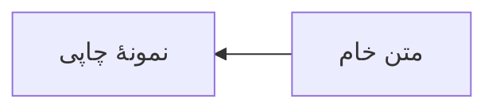

# بلوک‌های غنی راوی

```ts
const پیام = "سلام";
console.log(پیام);
```

| نام | مقدار | وضعیت |
| :--- | ---: | :---: |
| فصل نخست | ۱۲ | آماده |
| مسیر `A\|B` | ۲۴ | بازبینی |


> [!NOTE] یادداشت نمونه‌خوان
> این بلوک همچنان Markdown قابل‌حمل است.

این ادعا یک ارجاع دارد[^منبع].

[^منبع]: تعریف فارسی پاورقی.



```mermaid
flowchart RL
  A -- شکسته -->
```
